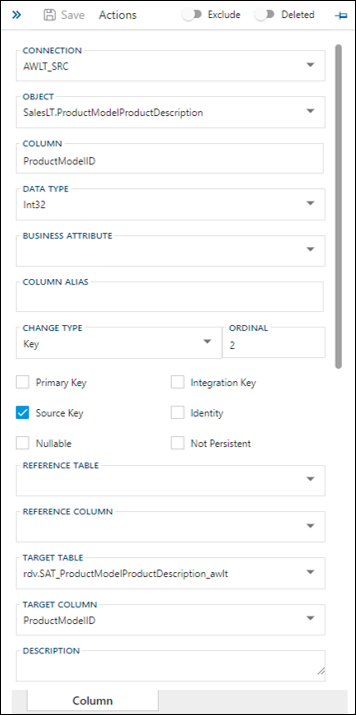

>[!NOTE]
>The editable information in the side panel is the same as per the [**Column Editor**](xref:bimlflex-column-editor). For more information on this please refer there.

The following controls are available to operate this side panel:

| Icon | Action | Description |
|----|-|--------|-------------|
| 

 | Collapse | This will hide the side panel.|
| 

 | Save | This will persist changed made to the relationship.|
| 

 | Discard | Pending changes to the relationship will be discarded.|
| N/A | Actions (menu) | Context-sensitive menu of actions. For **Object** actions, please refer to the **Object Editor**(xref:bimlflex-object-editor).|
| 

 | Pin | The side navigation panel can be pinned and unpinned from the **Business Model Diagram**, depending if the user wants to keep it visible or not.|