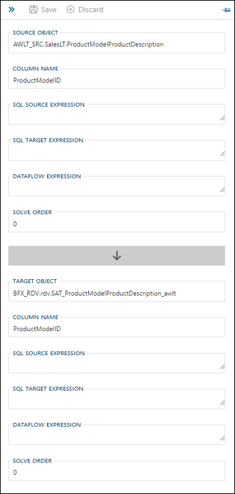

The following controls are available to operate this side panel:

| Icon | Action | Description |
|----|-|--------|-------------|
| 

 | Collapse | This will hide the side panel.|
| 

 | Save | This will persist changed made to the relationship.|
| 

 | Discard | Pending changes to the relationship will be discarded.|
| 

 | Pin | The side navigation panel can be pinned and unpinned from the **Business Model Diagram**, depending if the user wants to keep it visible or not.|

The fields visible on the relationship side panel for the source object are:

| 
Property
 | Description |
| --------- | ----------- |
|Source Object| The name of the **Object** that represents the 'source' part of the relationship at object level.|
|Column Name| The name of the **Column** for which the mapping will be created.|
|SQL Source Expression |SQL expression for this column is used to extend source queries. Generally used for source type casting and case statements. Example, `CONVERT(VARCHAR(27), @@this, 121)`.|
|SQL Target Expression |The SQL expression used to extend target queries. Generally used for source type casting and case statements. Example, `CONVERT(VARCHAR(27), @@this, 121)`.|
|Dataflow Expression|The expression used to calculate the value of the derived column via ADF.  ADF expression syntax is used.|
|Solve Order| Used for **Expressions** that need to be parsed in a specific order. An example of use would be if you want to split a very complex calculation up into multiple expressions that are derived in a specific sequence.|

They map to the target object, which can have the following properties as part of this relationship:

| 
Property
 | Description |
| --------- | ----------- |
|Target Object| The name of the **Object** that represents the 'target' part of the relationship at object level. This will be the **Target Object** visible in the **Column Editor**.|
|Column Name| The name of the **Column** against which the mapping will be created. This will be the **Target Column** visible in the **Column Editor**.|
|SQL Source Expression |SQL expression for this column is used to extend source queries. Generally used for source type casting and case statements. Example, `CONVERT(VARCHAR(27), @@this, 121)`.|
|SQL Target Expression |The SQL expression used to extend target queries. Generally used for source type casting and case statements. Example, `CONVERT(VARCHAR(27), @@this, 121)`.|
|Dataflow Expression|The expression used to calculate the value of the derived column via ADF.  ADF expression syntax is used.|
|Solve Order|Used for **Expressions** that need to be parsed in a specific order. An example of use would be if you want to split a very complex calculation up into multiple expressions that are derived in a specific sequence.|
