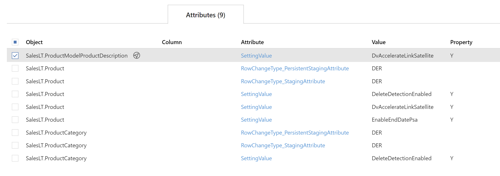

### Attributes Tab - Action Buttons

| Icon | Action | Description |
| ---- | ------ | ----------- |
| 

 | Add | **Add** will create a new **Attribute** and assign it to the current entity.  When adding an attribute via this button, *Attribute Type* and the respective linked fields, will be pre-filled on the created [Add Attribute Dialog](#add-attribute-dialog). |
| 

           | Save    | **Save** will save the currently set of staged changes.  The **Save** button is only enabled if any **Attribute** has changes staged and there are no major validation issues with the current list of **Attribute** properties.                                                                                                                                              |
| 

 | Discard | This will **Discard** any unsaved changes and revert to last saved form.|
|

|Archive|**Archive** will hard delete the selected **Attribute**.  This will result in the physical removal of the selected record from the BimlFlex database.  The data will no longer be accessible by the BimlFlex app and will require a Database Administrator to restore. Clicking **Archive** will create an [Archive Attribute Dialog](#archive-attribute-dialog).|
|

|Edit|**Edit** will open an [Edit Attribute Dialog](#edit-attribute-dialog) to edit the currently selected **Attribute**.  After edits are complete, be sure to click the **Save** button to confirm the changes.|

### Additional Dialogs  

[!include[Add Attribute Dialog](_dialog-add-attribute.md)]  

[!include[Edit Attribute Dialog](_dialog-edit-attribute.md)]  

[!include[Archive Attribute Dialog](_dialog-archive-attribute-list.md)]

### Attributes Tab - Table Descriptions  

All **Attributes** assigned to the current entity show here.  New items can be entered via the *Add* action button.  Existing items can be edited by clicking the *Value* field to select the **Attribute** and using the *Edit* action button.  Various [Navigational Transitions](#attributes-tab-navigational-transitions) are available on this form and outlined below.  

#### Attributes Tab Navigational Transitions

| Item | Action | Entity Documentation |
| ---- | ------ | -------------------- |
| Object Value | Navigate to **Object Editor**, by clicking  | [Object Documentation](objects.md) |
| Column Value | Navigate to **Column Editor**, selecting clicked **Column** | [Column Documentation](columns.md) |
| Attribute Value | Navigate to **Attribute Editor**, selecting clicked **Attribute** | [Attribute Documentation](attributes.md) |
