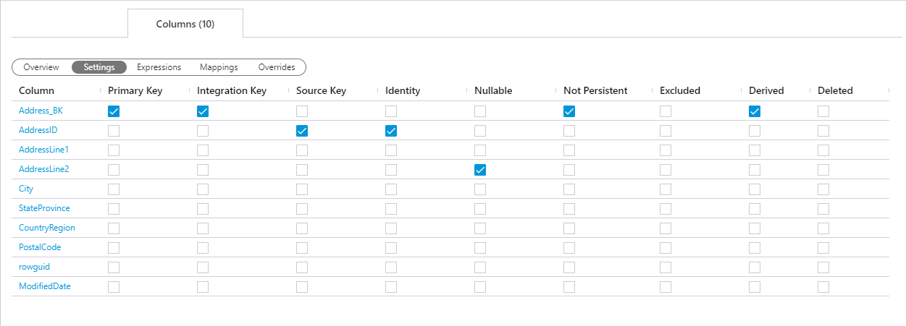
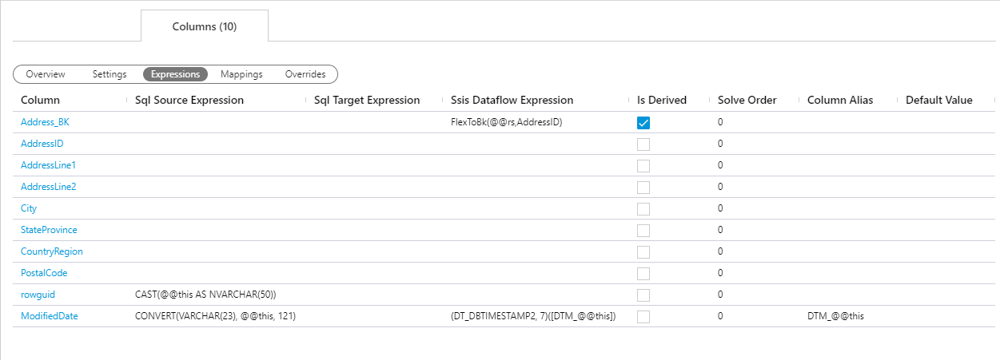
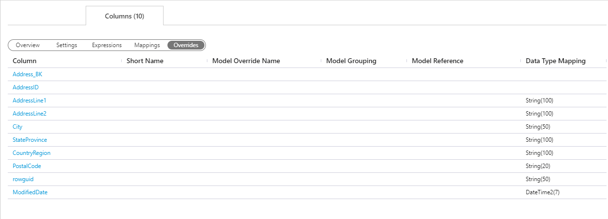

### Columns Tab - Action Buttons

|Icon|Action|Description|Additional Dialog|
|-|-|-|-|
|

|Add|[Add] will add a new `Column` and assign it to the current entity.  When adding an `Column` via this button [Connection] and [Object] will be pre-filled on the created dialog box.|[Add Column](#Add-Column-Dialog-Box)|
|

|Save||
|

|Archive|This will `hard delete` the selected `Attribute`.  This will result in the physical removal of the selected record from the metadata database.  The data will no longer be accessible by the BimlFlex app and will require a Database Administrator to restore.|[Archive Column](#Archive-Attribute-Dialog-Box)|
|

|Refresh|||
|

|Integration Key||[Generate Derived Integration Key](#Generate-Derived-Integration-Key)|

### Additional Dialogs

[!include[Add Column Dialog Box](_dialog-add-column.md)]

[!include[Archive Column Dialog Box](_dialog-archive-column-list.md)]

[!include[Generate Derived Integration Key Dialog Box](_dialog-generate-derived-integration-key.md)]

### Columns Tab - Views

All `Columns` assigned to the current entity show here.  New items can be entered entered via the [Add] action button.  Existing items can be edited by double clicking the field needing adjustment.  All the views have the same [Navigational Transitions](#Attributes-Tab-Navigational-Transitions) to the `Column`.

#### Columns Tab Navigational Transitions
|Item|Action|Entity Documentation|
|-|-|-|
|Column Value|Navigate to [Columns Editor], selecting clicked `Column`|[[Columns Documentation]](columns.md)

#### Overview View

[//]: # (TODO: Section Description)

#### Settings View

[//]: # (TODO: Section Description)

#### Expressions View

[//]: # (TODO: Section Description)

#### Mappings View

[//]: # (TODO: Section Description)

#### Overrides View

[//]: # (TODO: Section Description)

