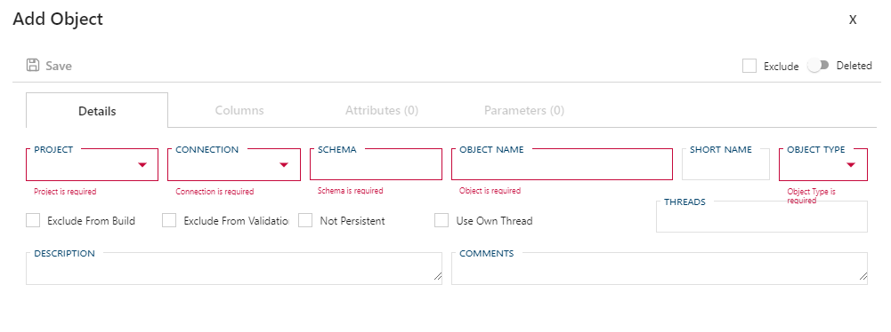
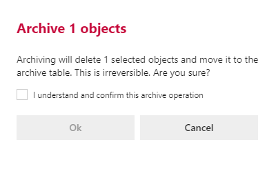

### Action Buttons

The following options are available:

| Icon| Action| Description|
| ----| ----- | ---------- |
| 

            | Add     | *Add* will create a new **Object**. Clicking *Add* will open an [Add Object Dialog](#add-object-dialog).|
| 

           | Save    | *Save* will save the currently set of staged changes. The *Save button* is only enabled if any **Object** has changes staged and when there are no validation issues.|
| 

 | Discard | This will *Discard* any unsaved changes and revert to last saved details.|

When checking a single **Object** in the overview two additional options will become visible. When selecting two or more objects only the Archive option will be visible.

| Icon| Action| Description|
| ----| ----- | ---------- |
|

|Archive| *Archive* will remove the **Object** from the active metadata repository, and move it to the metadata archive. Clicking **Archive** will create an [Archive Object Dialog](#archive-object-dialog).|
|

|Edit|**Edit** will open an Edit Object Dialog to edit the currently selected **Object**. After edits are complete, be sure to click the **Save** button to confirm the changes.|

### Additional Dialogs

#### Add Object Dialog

Creates a new **Object**. Once entry is finished ensure that the  *Save* button is clicked.

#### Archive Object Dialog

Archiving means that metadata will be physically deleted. A confirmation box warning against the dangers of archiving.  You are required to confirm by both the check box and the *Ok* button.

>[!WARNING]
> Archiving is a permanent removal of the selected entity from its associated table in the BimlFlex Database. The best practice is to first use the *Deleted* flag (soft delete) as an indication that the connection may need to be removed.

### Objects Tab Views

The **Objects Tab Views** provide different ways to review the properties of **Objects** associated with the selected entity.
 The general purpose and overview of each view will be outlined below.

> [!NOTE]
> See the [Objects Editor](xref:bimlflex-object-editor) for further details on creating or editing an **Object** along with details on individual property values.

#### Overview

The **Overview** is available to give quick access to the more physical properties of the **Objects** relating to the selected entity. Additional properties are available for bulk management such as controlling exclusions, disabling persistence, or flagging one or more **Object(s)** for deletion.

Various [navigational transitions](#navigational-transitions) are available on view form and outlined below.

##### Navigational Transitions

| Item             | Action                                                               |
| ---------------- | -------------------------------------------------------------------- |
| Project Value   | Navigate to the [**Project Editor**](xref:bimlflex-project-editor) by clicking        |
| Object Value     | Navigate to the [Object Editor](xref:bimlflex-object-editor), selecting the clicked **Object**|

> [!NOTE]
> The **Object** navigational transition is the only one provided on the additional views. As such, no further callouts will be made to this.
> Functionality on the below forms however is consistent: click the **Object** name to navigate to the selected **Object** in the [Object Editor](xref:bimlflex-object-editor).

#### Model Overrides

The **Model Overrides** view allows for quick management of metadata configured through the [Data Vault Accelerator](xref:bimlflex-data-vault-accelerator), [Business Modeling](xref:bimlflex-business-modeling) or the [Schema Diagram](xref:bimlflex-schema-diagram). This view is intended as an easy way to review, reference and maintain previously entered metadata.

> [!IMPORTANT]
> Although it is possible to manage high level metadata from this screen, it is recommended to you use the [Data Vault Accelerator](xref:bimlflex-data-vault-accelerator) for implementing changes in the design. The [Data Vault Accelerator](xref:bimlflex-data-vault-accelerator) is specifically designed to simplify and improve the experience of modeling metadata via a graphical designer as opposed to the table entry that this view provides.

#### Query Overrides

The **Query Overrides** view exposes any SQL overrides that may be defined for the **Object**. Any SQL that is commonly used to perform most ETL/ELT tasks are dynamically generated by the BimlFlex framework, and in many cases these providing SQLQ query overrides is not required. However, in cases that these are necessary this view can be used to review these across all objects.

> [!IMPORTANT]
> This is designed for developers/architects who have a strong understanding of SQL. Intellisense and code auto completing and validation are not provided in the BimlFlex App because a direct connection to the data is not supported for security reasons.
