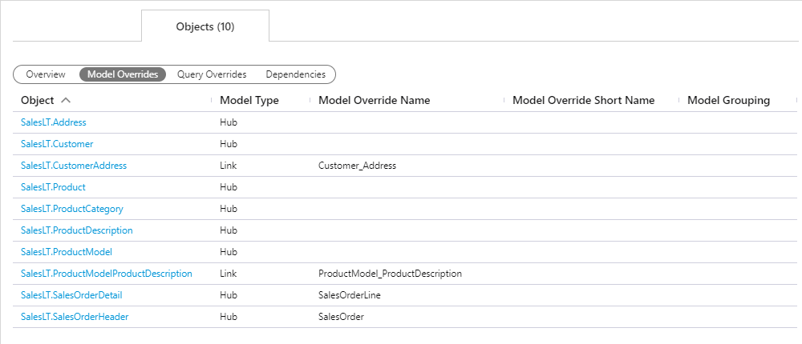
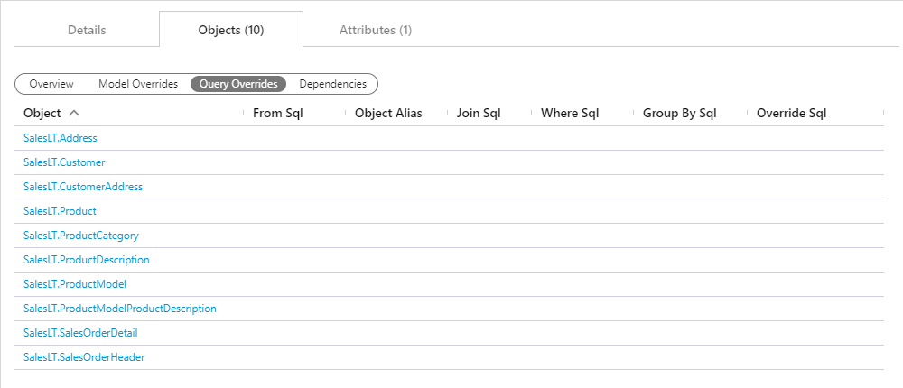
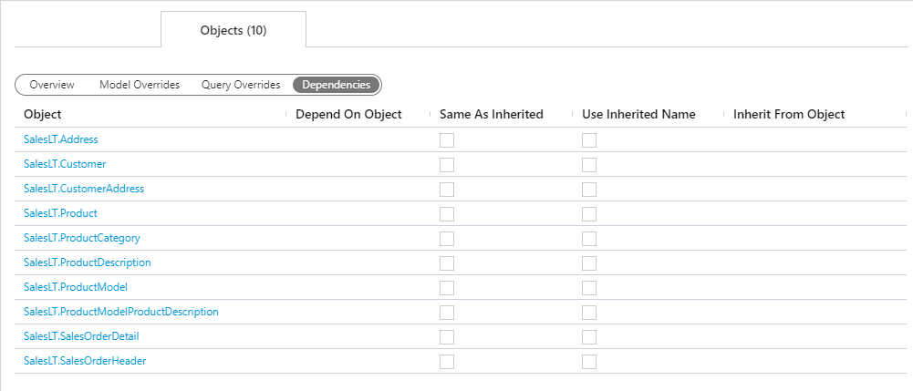

### Objects Tab - Action Buttons

| Icon                                                                              | Action                                      | Description                                                                                                                                                                                                                                                                                                                                                             |
| --------------------------------------------------------------------------------- | ------------------------------------------- | ----------------------------------------------------------------------------------------------------------------------------------------------------------------------------------------------------------------------------------------------------------------------------------------------------------------------------------------------------------------------- |
| 

            | Add     | **Add** will create a new **Object** associated with current entity. Clicking **Add** will open an [Add Object Dialog](#add-object-dialog-box).                                                                                                                                                                                                                         |
| 

           | Save    | **Save** will save the currently set of staged changes.  The **Save** button is only enabled if any **Object** has changes staged and there are no major validation issues with the current list of **Object** properties.                                                                                                                                              |
| 

 | Archive | **Archive** will hard delete the selected **Object**.  This will result in the physical removal of the selected record from the metadata database.  The data will no longer be accessible by the BimlFlex app and will require a Database Administrator to restore, if possible. Clicking **Archive** will open an [Archive Objects Dialog](#archive-object-dialog-box). |
| 

        | Refresh | **Refresh** will trigger a refresh of the metadata for the selected list of **Objects**.                                                                                                                                                                                                                                                                                |

### Additional Dialogs

[!include[Add Object Dialog Box](_dialog-add-object.md)]

[!include[Archive Object Dialog Box](_dialog-archive-object-list.md)]

### Objects Tab - Views

The **Objects Tab** provides quick and easy access to all **Objects** associated with the selected entity.
While the items in the list will not change, the views provide a quick concise view of various groupings of attributes.
General purpose and overview of each view will be outlined below.

> [!NOTE]
> See the [Objects Documentation](objects.md) for further details on creating or editing and **Object** along with details on individual property values.

#### View: Overview

The **Overview** is available to give quick access to the more physical properties of the **Objects** relating to the selected entity.
These are representations of the physical `Source System` and represent the raw definitions of the object in its original form.
Additional properties are available for bulk management such as controlling exclusions, disabling persistence, or flagging an **Object** for deletion.
Various [Navigational Transitions](#objects-tab-overview-navigational-transitions) are available on view form and outlined below.

#### Objects Tab (Overview) Navigational Transitions

| Item             | Action                                                               | Entity Documentation                        |
| ---------------- | -------------------------------------------------------------------- | ------------------------------------------- |
| Project Value    | Navigate to **Projects Editor**, selecting clicked **Project**       | [Projects Documentation](projects.md)       |
| Connection Value | Navigate to **Connections Editor**, selecting clicked **Connection** | [Connections Documentation](connections.md) |
| Object Value     | Navigate to **Objects Editor**, selecting clicked **Object**         | [Objects Documentation](objects.md)         |

> [!NOTE]
> The **Object** navigational transition is the only one provided on the additional views.
> As such, no further callouts will be made to this.
> Functionality on the below forms however is consistent: click the **Object** name to navigate to the selected **Object** in the [Objects Editor](objects.md).

#### View: Model Overrides

The **Model Overrides** view allows for quick management of modeled metadata from the [Data Vault Accelerator](../modeling-tools/accelerator.md) or the [Schema Diagram](../modeling-tools/schema-diagram.md).
This view is intended as an easy way to reference and maintain previously entered metadata.

> [!IMPORTANT]
> Although it is possible for an experienced user to manage their high level metadata from this screen, it is recommended that you use the [Data Vault Accelerator](../modeling-tools/accelerator.md) until you are strongly confident in your abilities to manually model metadata.
> The [Data Vault Accelerator](../modeling-tools/accelerator.md) is specifically designed to simplify and improve the experience of modeling metadata via a graphical designer as opposed to the table entry that this view provides.

#### View: Query Overrides

The **Query Overrides** view exposes any SQL overrides that may be required in the creation and maintenance of the **Object**.
By default the SQL required to perform most ETL/ELT task are dynamically generated and in many cases these overrides are not required.
When these cases are encounter they can be seen and managed from this view.

> [!IMPORTANT]
> Due to the BimlFlex App not requiring a connection to the raw source systems (this is done during ELT/ELT Orchestration and Integration), auto-complete and intellisense are not provided.
This is designed for developers/architects who have a strong understanding of SQL and knowledge of the Source Systems that are designing from.

#### View: Dependencies

The **Dependencies** view allows for management of an **Object's** dependencies or inheritance.
Dependencies are provided to instruct BimlFlex as to what **Objects** are required to be processed or managed before another.
Inheritance is a provided feature that allows for controlled reuse of previously entered metadata.

<!--
[//]: # (TODO: Add Links for Dependencies and Inheritance documentation.)
[//]: # (> [!NOTE])
[//]: # (> For more information about dependencies and inheritance refer to the appropriate link\(s\) below:  )
[//]: # (> [Object Dependencies]  - Links to come...  )
[//]: # (> [Object Inheritance]  - Links to come...  )
-->