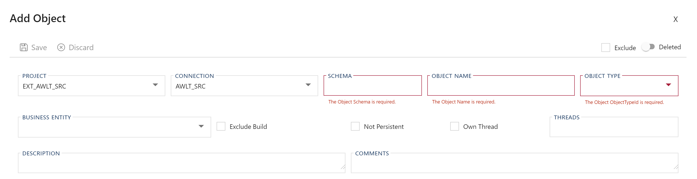
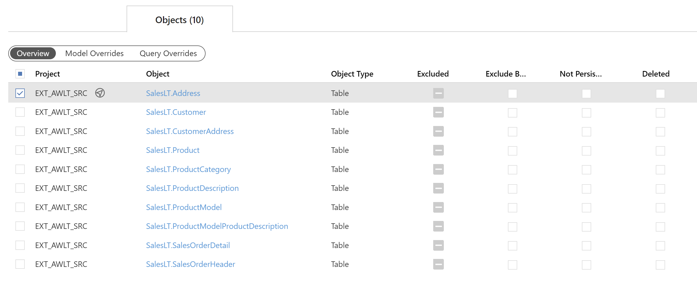
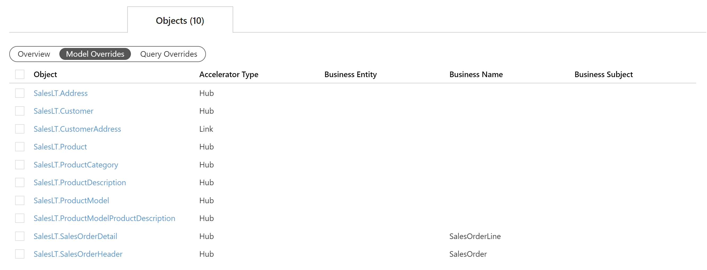
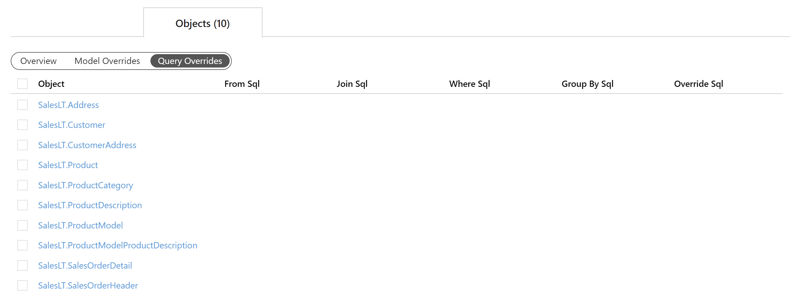

### Action Buttons

The following options are available:

| Icon| Action| Description|
| ----| ----- | ---------- |
| 

            | Add     | *Add* will create a new **Object**. Clicking *Add* will open an [Add Object Dialog](#add-object-dialog).|
| 

           | Save    | *Save* will save the currently set of staged changes. The *Save button* is only enabled if any **Object** has changes staged and when there are no validation issues.|
| 

 | Discard | This will *Discard* any unsaved changes and revert to last saved details.|

When checking a single **Object** in the overview two additional options will become visible. When selecting two or more objects only the Archive option will be visible.

| Icon| Action| Description|
| ----| ----- | ---------- |
|

|Archive| *Archive* will remove the **Object** from the active metadata repository, and move it to the metadata archive. Clicking **Archive** will create an [Archive Object Dialog](#archive-object-dialog).|
|

|Edit|**Edit** will open an Edit Object Dialog to edit the currently selected **Object**. After edits are complete, be sure to click the **Save** button to confirm the changes.|

### Additional Dialogs

#### Add Object Dialog

Creates a new **Object**. Once entry is finished ensure that the  *Save* button is clicked.

#### Archive Object Dialog

Archiving means that metadata will be physically deleted. A confirmation box warning against the dangers of archiving.  You are required to confirm by both the check box and the *Ok* button.

>[!WARNING]
> Archiving is a permanent removal of the selected entity from its associated table in the BimlFlex Database. The best practice is to first use the *Deleted* flag (soft delete) as an indication that the connection may need to be removed.

### Objects Tab Views

The **Objects Tab Views** provide different ways to review the properties of **Objects** associated with the selected entity.
 The general purpose and overview of each view will be outlined below.

> [!NOTE]
> See the [Objects Editor](xref:bimlflex-object-editor) for further details on creating or editing an **Object** along with details on individual property values.

#### Overview

The **Overview** is available to give quick access to the more physical properties of the **Objects** relating to the selected entity. Additional properties are available for bulk management such as controlling exclusions, disabling persistence, or flagging one or more **Object(s)** for deletion.

Various [navigational transitions](#navigational-transitions) are available on view form and outlined below.

#### Objects Tab (Overview) Table Components

| Component              | Type                 | Description                        |
| ---------------- | -------------------------------------------------------------------- | ------------------------------------------- |
| Project            | Value                | The current **Project** used to process the **Object**.  Must be an existing **Project**. See [Projects Documentation](xref:bimlflex-project-editor).                |
| Object             | Value                | The name of the **Objects** within the current Source **Connection**. See [Objects Documentation](xref:bimlflex-object-editor).                                     |
| Object Type        | Value                | The type of **Object** that is being extracted or created. See [Valid Object Types](_enum-object-type.md).  |
| Excluded           | Checkbox (Tri-state) | Setting to determine whether the selected entity will be built out with the rest of the solution when the BimlFlex solution is being compiled. The state of being "partially checked" is based on the selection of its child elements (below). |
| Exclude Build      | Checkbox (Y/N)       | Toggle to determine whether the **Object** is excluded from the build when the BimlFlex solution is being compiled.          |
| Not Persistent     | Checkbox (Y/N)       | Toggle to determine whether the **Object** is excluded from Persistent Staging Layer. When enables, the **Object** will not be stored in the PSA.   |
| Deleted            | Checkbox (Y/N)       | Toggle to determine whether the **Object** is soft-deleted from the build when the BimlFlex solution is being compiled.         |

##### Navigational Transitions

| Item             | Action                                                               |
| ---------------- | -------------------------------------------------------------------- |
| Project Value   | Navigate to the [**Project Editor**](xref:bimlflex-project-editor) by clicking        |
| Object Value     | Navigate to the [**Object Editor**](xref:bimlflex-object-editor), selecting the clicked **Object**|

> [!NOTE]
> The **Object** navigational transition is the only one provided on the additional views. As such, no further callouts will be made to this.
> Functionality on the below forms however is consistent: click the **Object** name to navigate to the selected **Object** in the [Object Editor](xref:bimlflex-object-editor).

#### Model Overrides

The **Model Overrides** view allows for quick management of metadata configured through the [Data Vault Accelerator](xref:bimlflex-data-vault-accelerator), [Business Modeling](xref:bimlflex-business-modeling) or the [Schema Diagram](xref:bimlflex-schema-diagram). This view is intended as an easy way to review, reference, and maintain previously entered metadata.

| Component              | Type                 | Description                        |
| ---------------- | -------------------------------------------------------------------- | ------------------------------------------- |
| Object            | Navigational Value                | The name of the **Object** within the current Source **Connection**. See [Objects Documentation](xref:bimlflex-object-editor). |
| Accelerator Type            | Value                | The distinction of what type of entity the target **Object** will be defined as. Note that this attribute is only relevant when using BimlFlex to generate a Raw Data Vault model. See [Data Vault Accelerator Documentation](xref:bimlflex-data-vault-accelerator) |
| Business Entity | Value | Displays the target definition of a pre-defined Business Entity. Use Business Modeling to define the Business Model that should be used to map source objects and columns to these targets. See [Business Modeling Documentation](xref:bimlflex-business-modeling). |
| Business Name | Value       | Displays the target definition of a pre-defined Business Name. This value will be used to drive target naming. For a source Object with Accelerator Type "Hub," the Business Name will be used for the Hub name, as well as the default Satellite name. |
| Business Subject     | Value       | Displays the target definition of a pre-defined Business Subject. A Business Subject is an additional way to classify Business Entities. A Business Subject may contain multiple Business Entities. Each Business Entity can be associated with a single Business Subject. See [Business Modeling Documentation](xref:bimlflex-business-modeling). |

> [!IMPORTANT]
> Although it is possible to manage high level metadata from this screen, it is recommended to you use the [Data Vault Accelerator](xref:bimlflex-data-vault-accelerator) for implementing changes in the design. The [Data Vault Accelerator](xref:bimlflex-data-vault-accelerator) is specifically designed to simplify and improve the experience of modeling metadata via a graphical designer as opposed to the table entry that this view provides.

#### Query Overrides

The **Query Overrides** view exposes any SQL overrides that may be defined for the **Object**. Any SQL that is commonly used to perform most ETL/ELT tasks are dynamically generated by the BimlFlex framework. In many cases providing SQL query overrides is not required. However, when necessary this view can be used to review these overrides across all objects.

| Component              | Type                 | Description                        |
| ---------------- | -------------------------------------------------------------------- | ------------------------------------------- |
| Object            | Navigational Value                | The name of the **Object** within the current Source **Connection**. See [Objects Documentation](xref:bimlflex-object-editor). |
| From Sql            | Field               | Override the FROM clause of the generated SQL statement that is used to query the **Object**. |
| Join Sql | Field | If the source select requires a JOIN this is where it can be entered. Note: This field is limited to 1,000 characters. |
| Where Sql | Field       | Utilize if the source select requires a WHERE clause. Note: Defining a **Parameter** on the **Object** will be appended to the statement. |
| Group By Sql     | Field       | Utilize if the source select requires a `DISTINCT` or `TOP N` clause. Note: This field is limited to 1000 characters. |
| Override Sql     | Field       | Overrides the complete SQL statement used to query the **Object**. This must be a complete SQL statement. Adding an override here disregards any other SQL overrides, such as FROM SQL or WHERE SQL. |

See [Objects Documentation](xref:bimlflex-object-editor) for additional information on the above fields and more.

> [!IMPORTANT]
> This is designed for developers/architects who have a strong understanding of SQL. Intellisense and code auto completing and validation are not provided in the BimlFlex App because a direct connection to the data is not supported for security reasons.
