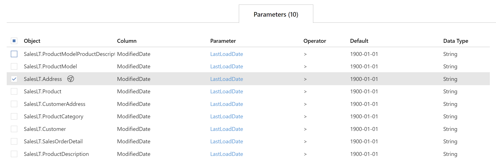

### Action Buttons

All **Parameters** assigned to the current entity show here.  New items can be entered entered via the  **Add** action button.  Existing items can be edited by clicking the `Value` field to select the **Parameters** and using the  **Edit** action button.  Various [navigational transitions](#navigational-transitions) are available on this form and outlined below.

|Icon|Action|Description|
|-|-|-|
|

|Add|**Add** will create a new **Parameter** and assign it to the current entity.  When adding an attribute via this button `Attribute Type`, along with the respective linked fields, will be pre-filled on the [Add Parameter Dialog](#add-parameter-dialog).|
| 

           | Save    | **Save** will save the currently set of staged changes.  The **Save** button is only enabled if any **Object** has changes staged and there are no major validation issues with the current list of **Object** properties.                                                                                                                                              |
| 

 | Discard | This will **Discard** any unsaved changes and revert to last saved form.|

When checking a single **Parameter** in the overview two additional options will become visible. When selecting two or more parameters only the Archive option will be visible.

| Icon| Action| Description|
| ----| ----- | ---------- |
|

|Archive|**Archive** will hard delete the selected **Parameter**.  This will result in the physical removal of the selected record from the BimlFlex database.  The data will no longer be accessible by the BimlFlex app and will require a Database Administrator to restore. Clicking **Archive** will create an [Archive Parameter Dialog](#archive-parameter-dialog).|
|

|Edit|**Edit** will open an [Edit Parameter Dialog](#edit-parameter-dialog) to edit the currently selected **Parameter**.  After edits are complete, be sure to click the **Save** button to confirm the changes.|

### Additional Dialogs

#### Add Parameter Dialog

Creates a **Parameter** and associates it with the current entity.  Once entry is finished ensure that the  **Save** button is clicked.

#### Edit Parameter Dialog

Edit the selected **Parameter**.  Once entry is finished ensure that the  **Save** button is clicked.

#### Archive Parameter Dialog

Confirmation warning against the dangers of archiving.  You are required to confirm by both the check box and the *Ok* button.

>[!WARNING]
> Archiving is a permanent removal of the selected entity from its associated table in the BimlFlex Database. The best practice is to first use the *Deleted* flag (soft delete) as an indication that the connection may need to be removed.

### Parameters Tab View

The **Parameters Tab View** provides a different way to review the properties of the **Parameters** associated with the selected entity.
#### Overview

#### Parameters Tab Table Components

| Component              | Type                 | Description                        |
| ---------------- | -------------------------------------------------------------------- | ------------------------------------------- |
| Object            | Value                | The name of the **Object** within the current Source **Connection**. See [Objects Documentation](xref:bimlflex-object-editor).                |
| Column             | Value                | The name of the **Column** within the current entity. See [Columns Documentation](xref:bimlflex-column-editor).                                     |
| Parameter        | Navigational Value                | The name of the **Parameter** that is being applied to the selected entity. See [Parameters Documentation](xref:bimlflex-parameter-editor).  |
| Operator           | Value | Operator to use in the **Parameter** when applied to the source **Column**. |
| Default      | Date       | The parameter load value to use for the first load.          |
| Data Type     | Value       | The data type to use for the **Parameter**.  Must be a valid data type. See [Valid Data Types](../metadata-editors/_enum-data-type.md) |

##### Navigational Transitions

From the **Parameters Tab**, it is possible to navigate directly to the following areas of BimlFlex:

|Item|Action|
|-|-|
|Object|Navigate to [**Object Editor**](xref:bimlflex-object-editor), by clicking  |
|Column|Navigate to [**Column Editor**](xref:bimlflex-column-editor), by clicking  |
|Name|Navigate to [**Parameter Editor**](xref:bimlflex-parameter-editor), selecting the clicked **Parameter**|
