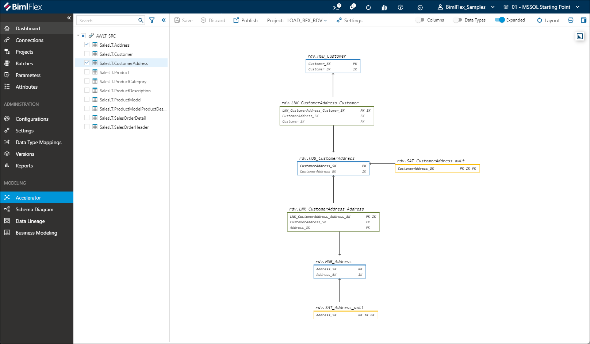

# Data Vault Accelerator

This guide provides information on using the BimlFlex Data Vault **Accelerator**, and assumes a sound understanding of the [**Data Vault**](xref:bimlflex-data-vault-index) modeling approach.

The Accelerator initially provides a quick-start and best effort, technical modeling of (raw) Data Vault constructs based on the data source metadata that can then be configured to define the final model. It is a graphical user interface in the BimlFlex app that allows the modeler to create and modify the target raw Data Vault from source objects and from other modeled entities, such as views.

The Accelerator will use the available source metadata to suggest an initial raw Data Vault. The modeler then manipulates the metadata to tweak the target Data Vault into the intended outcome. This includes using Business Names or [**Business Modeling**](xref:bimlflex-business-modeling) to create the correct names and entities in the target model, defining the target object to be created (Hub, Link, Satellite, reference etc.), and grouping and splitting entities, relationships, or attributes as needed.

Multiple relationships can be grouped together to create a single unit of work, or split back into multiple links. Attributes can be split into multiple Satellites or grouped back into a single Satellite.

It is configurable and provides a live preview of the target Data Vault while modeling. The Accelerator can be rerun as many times as necessary for incremental modeling and rapid generation and regeneration of Data Vault artifacts.

It is important to remember that the Data Vault modeling approach is based around **Core Business Concepts** (CBC) that are built upon **Integration Keys** or **Enterprise-Wide Business Keys** (EWBK) to allow for inter-system integrations. These Integration Keys are normally added to the source objects as part of the Data Vault modeling process.

The Accelerator makes it easy to get started and iterate through variations so that the analysts and subject matter experts can validate and tune the model to best match business processes using the iterative approach and the graphical representation of the model in the Accelerator.

For a quick introduction, please watch the following video:

## Starting Point

The BimlFlex Data Vault Accelerator creates the Data Vault model based on metadata existing in the App. This metadata is initially imported using the [**Metadata Importer**](xref:bimlflex-concepts-importing-metadata) or entered manually.

 The metadata importer imports source object, their key definitions, and their relationships. This can be used in the Data Vault modeling to create the initial raw Data Vault.  

 The initial metadata is generally imported from a source system, however the BimlFlex accelerator also allows direct acceleration from an object (such as an imported view) through the **Staged Query** approach.

**Source metadata decoration**

By decorating the source metadata with additional information for the Accelerator, it is possible to load the Data Vault directly from the staged data from the source. This is used when the source representation somewhat matches the Data Vault Target model. An example is a source table with Product information that should be loaded to a Product Hub and a Product Satellite. By decorating the source object metadata with additional attributes, such as the Business Name, the Accelerator can create the Data Vault straight from the source. This is a straight-forward and convenient way to model and load the Data Vault without requiring additional metadata entities.

**Staged Query metadata acceleration**

If the Data Vault modeling and load requirements are more complex, BimlFlex allows the use of a Staged Query object to load the Data Vault. This is often used when the source data needs to be manipulated before it is fit for loading to the Data Vault. Some examples where this is used could be when the data from multiple tables needs to be joined for a complete dataset for the Data Vault load, or when a source table contains multiple entities that should be split into multiple Data Vault loads.

## The Source and Target Model

The Accelerator derives the initial model information from source metadata. Based on this, a modeler with enterprise knowledge translates the data and events into a source-system agnostic Data Vault model.

Before considering the acceleration, it is important to have an understanding of the expected target model and how the data from the source model can be loaded into this target. The source model is defined by the source. In most cases, the source model is not directly transposable to the target Data Vault model, so some analysis and modeling is required.

BimlFlex supports this through the [**Business Modeling**](xref:bimlflex-business-modeling) feature. This assists the modeler to define an initial model that is agnostic of the available data soruces.

The technical implementation in the source is then tweaked to match the expected Data Vault model using either source metadata decoration or the staged query approach.

Once the target model is drafted, compare the accelerated metadata with the expected outcome and tweak accordingly.

## Prerequisites

This guide assumes that the environment has been set up and configured, source metadata has been imported and that the source to staging process has been modeled and completed. There are several sample metadata sets where a target Data Vault model has been created, and a Sample 02 - MSSQL After Import where only source metadata has been imported, that is ready for Data Vault modeling and acceleration.

## The BimlFlex Workflow

The Accelerator is part of the BimlFlex App.

The Accelerator screen in the BimlFlex App allows metadata manipulation to directly control the target Data Vault. By editing the entities, such as splitting satellites or joining relationships into units of work or renaming targets, it is possible to directly control the accelerated model.

## Accelerate the Model

Based on the available source (or staged query) metadata, the Accelerator shows a preview of the Data Vault model. It is rare that this will be enough to derive a completed Data Vault target model. 

Based on information gained from understanding the business process, a user can create a target data model that:

* Is source agnostic
* Is aligned with the business process
* Is based on Core Business Concepts
* Describes events and transactions through the relations between the Core Business Concepts

The Accelerator will use the metadata and decorations from the source to derive the target Data Vault and its Hubs, Links and Satellites. The derived Data Vault model is available to preview and refine through editing the metadata, giving the modeler a live preview of the target.

Once the Accelerator preview matches the model expectations the metadata can be published to the repository and become instantiated parts of the metadata set.

The workflow where metadata is updated and tweaked and reprocessed through the Accelerator into the Data Vault allows a rapid design cycle that can be repeated as needed.

## Sample Workflow

The following narrative will guide us through the Accelerator process end to end. It is part of the overall BimlFlex workflow described earlier.

1. Run the metadata import for the source system if not done already. For the samples, start with sample `02 - MSSQL After Import`
1. Open the Accelerator, select objects to include in the Acceleration
1. Preview the Accelerated target model
1. Review and tweak the metadata
1. Publish the model to the metadata repository
1. Refresh the metadata into the BimlStudio project
1. Build and review the database and SSIS/ADF artifacts in BimlStudio

## The Accelerator User Interface

It is possible to select only a subset of objects, or filter the objects visible in the Acceleration. This is useful where the full set of source tables have been included but the Data Vault is modeled and built in an agile, iterative process. Starting to source and persist changes from the source without having to consider the Data Vault process means the Staging part of the solution can be completed sooner.

Constraining the Data Vault Acceleration to a subset allows for a more agile delivery where valuable parts of the solution can be put to good use as soon as they are done.

The Accelerator shows available source objects in the left-hand tree view and a preview of the target Data Vault model in the content pane. The page has a toolbar with several interaction options available

| Icon | Description |
| ---- | ----------- |
| Search | Search through entities in the tree view |
| Filter funnel | Filter Funnel allows filtering contents in the tree view based on Integration Stage and Record Source |
| Save | Save the current model view for later acceleration |
| Discard | Discard any changes being made to the model that has not yet been saved |
| Publish | Publish the previewed model to the repository to instantiate the entities into the metadata, allowing them to be used in load processes |
| Project | Select which Data Vault load project should be used when publishing |
| Settings | Quick View access to settings related to the Data Vault Accelerator |
|  Columns | Toggle to show all columns on the source or preview panes. |
|  Data Types | Toggle to show all data types in the source or preview panes. |
|  Expanded | Toggle to show expanded view (including Satellites) or the backbone of the model (only Hubs and Links) |
| Refresh Layout | Re-layout the diagram in the content pane |
| 

 | Download the diagram shown in the contents pane in `svg` format |

### Content mini-map

The content pane has an overview mini-map that shows the visible area in relation to the full model.

### Content layout

The objects in the preview can be laid out automatically or arranged manually by dragging the entities. The refresh layout button allows applying an automated layout to the contents.

To move the viewport perspective in the diagram pane, hold the `ctrl` or `space` button while clicking and dragging. To select multiple entities in the preview pane, click and drag a selection area with the mouse.

### Beginning Acceleration from the Objects Screen

Users may accelerate models for specific objects from the **Objects** Action Bar in BimlFlex, as opposed to navigating to the Accelerator option in the main navigation.

## Updating the Model to Meet Requirements

There are numerous options for manipulating the source metadata so that the Accelerator will produce the desired Data Vault model. Some of the common requirements include:

* Choosing the Integration Key used for the Hubs. By analyzing business processes and the source data it is possible to identify any Enterprise Wide Business Keys that aren't the technical source keys.
* Pulling disparate information stored in complex relationships in the source into a Satellite connected to the relevant Hub. For descriptive attributes, such as addresses, there is normally no need to maintain complex relationships from the source. An address could instead be modeled as an attribute of the entity with a location.
* Adjusting the grain in a Unit of Work, so that the correct Hubs are included in Links.
* Separating data into different Satellites based on rate of change, storage requirements or similar.
* Reviewing Driving Key relationships for Links.

## Model the target using the Accelerator

The BimlFlex Data Vault Accelerator applies the existing source metadata to create the target model. The modeler adds and updates the information in the Accelerator to allow the Accelerator to create the expected target model.

### Object Accelerator Type

Each source object in the model has a target Accelerator Type:

* Satellite
* Link
* Hub
* Link Satellite
* Reference
* Reference Satellite
* Exclude DV
* Same As Link
* Hierarchy Link

By default, each source table will be defined as a Hub Accelerator Type.

### Satellite Accelerator Type

An object that has a set of descriptive attributes for another Hub object can be defined and accelerated to a Satellite. The source object needs a defined Integration Key that has a relationship defined to the main Hub source object through the reference table/column metadata attribute.

### Link Accelerator Type

An object that mainly is used to describe relationships can be defined and accelerated to a Link table. The source object needs a defined primary Integration Key that will be the primary key of the Link table. The source object also needs columns defining each relationship to other source tables describing the related Hubs. Any attribute in the Link source table that is not a primary/relationship Integration Key will be accelerated to a default Link Satellite attached to the Link.

### Hub Accelerator Type

An object that describes a Core Business Concept can be defined and accelerated to a Hub table. The source object needs a defined primary Integration Key that will be the integration key of the Hub table. Any outgoing relationship from the source table to other tables can be defined using reference columns and will allow the Accelerator to create a Link table defining the relationship. Two or more relationships can be grouped together to form a single Link relationship instead of multiple separate Link tables. Any attributes that are not defining the Hub or relationships will be accelerated to a default Satellite attached to the Hub.

### Link Satellite Accelerator Type

An object that has a set of descriptive attributes for another Link object can be defined and accelerated to a Link Satellite. The source object needs a defined Integration Key that has a relationship defined to the main Link source object through the reference table/column metadata attribute.

### Reference Accelerator Type

An object that holds disconnected reference data can be Accelerated to a Reference table. The reference table does not contain a hashed primary key, instead relying on the defined Integration Key as the primary key.

### Reference Satellite Accelerator Type

An object that describes a Core Business Concept where no relationships should be instantiated can be defined and accelerated to a Reference Satellite table. The source object needs a defined primary Integration Key that will be the integration key of the Hub table. Any outgoing relationship from the source table to other tables will be ignored.Any attributes that are not defining the Hub will be accelerated to a default Satellite attached to the Hub.

### Exclude DV Accelerator Type

Any source object that should not be included in the Data Vault can be defined to be excluded from the Data Vault Accelerator.

### Same As Link Accelerator Type

An object that is used to describe a same-as relationship can be defined and accelerated to a Same As Link table. The source object needs a defined primary Integration Key that will be the primary key of the Link table. The source object also needs columns defining the two relationships to the source table describing the related Hub. Any attribute in the source table that is not a primary/relationship Integration Key will be accelerated to a default Link Satellite attached to the Link.

### Hierarchy Link Accelerator Type

An object that is used to describe a hierarchical relationship can be defined and accelerated to a Hierarchy Link table. The source object needs a defined primary Integration Key that will be the primary key of the Link table. The source object also needs columns defining the two relationships to the source table describing the related Hub. Any attribute in the source table that is not a primary/relationship Integration Key will be accelerated to a default Link Satellite attached to the Link.

## Acceleration Settings

All acceleration uses behaviors derived from the DataVault Settings. These settings are available in the Settings pages and can also be directly accessed from the Accelerator through the Settings Dialog

## Context Actions

There are modeling actions available on most of the tables and columns in the preview pane. By clicking on the header for an object or the on the column BimlFlex shows an ellipsis button that allows a context menu to be shown.

### Context Action for Satellite Objects

When clicking the object header for a Satellite the following actions might be available:

**Remove RecordSource**

When a Satellite has an automatic name that includes the connection Record Source, this action will remove the Record Source code from the Satellite name. Using the Record Source in the name allows for automatic source agnosticism in the Data Vault, removing it is a modeling choice.

**Revert Split**

If a source object has been split to load several Satellites, then split Satellites can have the slit reverted from the object context menu. This will restore the columns into the original Satellite.

### Context Action for Satellite Columns

When clicking a column for a Satellite the following actions might be available:

**Exclude From DV**

Choose this to exclude the column from the Data Vault load. The column will still be loaded from source to staging/persistent staging if applicable, but will be excluded from the Data Vault load.

**Split Satellite**

Choose this to slit one or more columns into its own Satellite. This allows maintaining multiple Satellites loaded from the same source object. Splitting Satellites allows control over different rates of change, different storage locations for target tables and context management.

### Context Action for Link Objects

When clicking the object header for a Link the following actions might be available:

**Split Link**

When two or more Links have been joined, it is possible to revert that action and 'split' the Links into individual relationships.

### Context Action for Satellite Columns

## Drag and Drop Actions

When dropping a Link object on top of another Link object that is created from the same source object, it is possible to join them together into a single Link, or Unit of Work. When joining the objects, the new Link name is specified in the dialog.

## Adjusting Model behavior

The **Model** attributes for Source Objects and Columns are used by the Data Vault Accelerator.

Updating this with target model information allows the Accelerator to generate the correct Data Vault model.

There are overrides for Objects as well as Columns

### Object Overrides

Double-clicking on a Data Vault Object in the preview opens a details pane that shows details about the target as well as about any source object mapping to the target.

It is possible to manage details about the target object, such as the related Business Entity.

It is possible to manage details about the source object, such as the related Business Entity as well as control the Business Name, Business Short Name and Business Grouping. These Business attributes control the behavior of the Accelerator and allows easy control of the generated target model.

### Object Business Entity

Allows the Accelerator to use a pre-defined Business Entity as the target definition. Use Business Modeling to define the Business Model that should be used and map source objects and columns to these targets to allow the Accelerator to use names and attribute definitions in the target model.

More detailed information on the Business Modeling is available here: [Business Modeling](xref:bimlflex-business-modeling)

### Object Business Name

When not using Business Modeling, add the expected target Business Name here. This will be used to drive target names. For a source object with Accelerator Type Hub, the Business Name will be used for the Hub name as well as the default Satellite name

Example: If a source system has an entity name of "GL002" and the actual business name is "GeneralLedger" the Accelerator will convert this to "HUB_GeneralLedger" and "SAT_GeneralLedger_<rs>" when the Business Name for the source object is defined as GeneralLedger.

### Object Business Short Name

The Business Short Name is used when naming Links from a Hub source object. The default 2-way Link Name is based on the 2 Hub source Objects Business names, or if present, Business Short Names. For a source Object with an outgoing relationship, the Accelerator will create a Link instantiating the relationship. For the AdventureWorksLT Product source object and its relationship to the Product Category, the default Link name generated is: `LNK_Product_ProductCategory`. Using a Business Short Name `Prd` for the Product will generate the shorter Link name `LNK_Prd_ProductCategory`.

The second part of the Link Name is generated from the Business Grouping or Business Reference attribute of the column generating the relationship. This is normally the relationship Integration Key that has the reference set to the related table. For the SalesLT.Product source table it is the `ProductCategory_BK` column for the relationship to the ProductCategory Hub source object.

Edit the related columns Business Reference or Business Grouping to reflect the expected name. The Business Reference attribute controls both the column name in the Link table and the Link Object name, the Business Grouping controls the Object name.

### Object Business Grouping

The Business Grouping is used to group related Objects together for Acceleration. The Filtering option in the tree view allows the user to filter on defined Business Groupings. This allows for iterative modeling where a team works on a grouping at a time.

## Saving the Model

Saving the Accelerator Model will persist the layout and current state to the repository.

## Publishing the Model

Publishing the Accelerator Model will create the Data Vault Objects and instantiate the source to target mappings for each defined source object. The model must be published before the entities can be built and used in the Data Warehouse.
