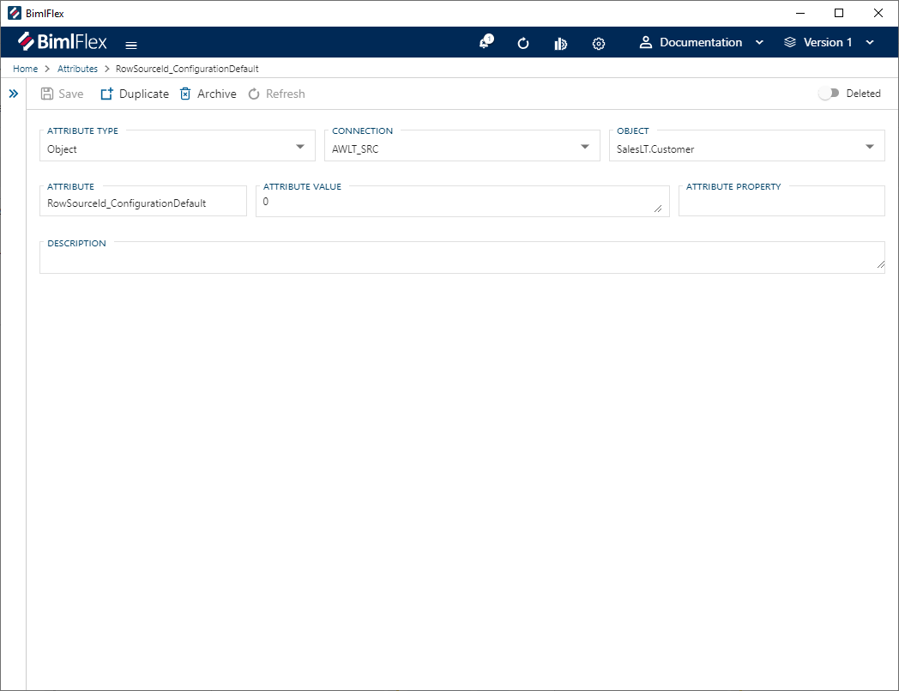
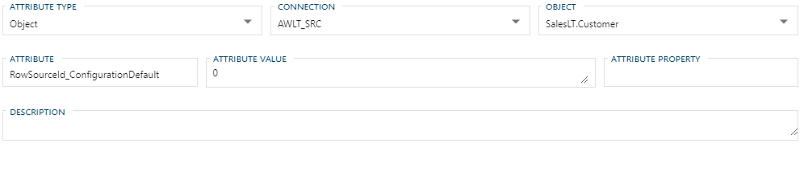

# Attributes Editor

The **Attributes Editor** is used to manage **Attributes** in the BimlFlex application. **Attributes** are used to conditionally override **Configurations** and **Settings**. They can also be used to extend the metadata model for bespoke coding requirements.

## Action Buttons

| Icon | Action | Description |
|-|-|-|
| 

 | Validate | This will trigger validation to be run on all **Attributes** in the application. It will display  if all validation passes, or  if there errors and add those errors to the global validation list. |
| 

 | Save | Saves any changes made in the form. The **Save** button is will only enabled if there are unsaved changes in the form and no major validation errors. |
| 

 | Duplicate | This will create a duplicate of the selected **Attribute**.  A [Duplicate Attribute dialog](#Duplicate-Attribute-Dialog) will appear asking for a new name. A new **Attribute** will be created using all of the selected **Attribute's** properties. |
| 

 | Archive | This will hard delete the selected **Attribute**.  This will result in the physical removal of the selected record from the metadata database.  The data will no longer be accessible by the BimlFlex app and will require a Database Administrator to restore, if possible. Clicking **Archive** will create an [Archive Attribute Dialog](#Archive-Attribute-Dialog). |
| 

 | Refresh | This will trigger a refresh of the metadata for the selected **Attribute**. All unsaved changes will be lost. |
| 

 | Deleted | This will soft delete the currently selected **Attribute**.  This will remove the **Attribute** from processing and validation. |

[!include[Restore Entities Tip](_tip-restore-entities.md)]

## Attributes Editor Fields

The fields available in the **Attribute** form change depending on the selected [Attribute Type](#Attribute-Types). The `Attribute Type` defines the scope of the BimlFlex process that the **Attribute** is applied to.

### Defining Attribute Scope

These are the different fields required to define the scope of the **Attribute** in BimlFlex.

| Attribute Type (Scope) | Required Fields |
|-|-|
| Batch | Batch |
| Column | Connection, Object, Column |
| Connection | Connection |
| Customer | |
| Object | Connection, Object |
| Project | Project |

### Attribute Field Definitions

|Field|Description|Validation|
|-|-|-|
| Attribute Type | Defines the scope of the BimlFlex process that the **Attribute** is applied to. Attribute Type is required and must be a valid [Attribute Type](#attribute-types)|
| Batch | Sets the scope of the **Attribute** application to the selected **Batch**. Required if Attribute Type is Batch.|
| Column | Sets the scope of the **Attribute** application to the selected **Column**. Required if Attribute Type is Column.|
| Connection | Sets the scope of the **Attribute** application to the selected **Connection**. Required if Attribute Type is Column, Connection, or Object.|
| Object | Sets the scope of the **Attribute** application to the selected **Object**. Required if Attribute Type is Column or Object. |
| Project | Sets the scope of the **Attribute** application to the selected **Project**. Required if Attribute Type is Project. |
| Attribute Name | Unique name for the **Attribute** in the BimlFlex app. Attribute Name is required. Attribute name must be unique. |
| Attribute Value | The value to be returned when the custom attribute accessed by the framework. Attribute Value is required. |
| Attribute Property | The default value for the custom attribute if it is not specified in the AttributeValue. |
| Description | The **Attribute** described in business context. |

### Additional Dialogs

[!include[Archive Attribute Dialog](_dialog-archive-attribute-single.md)]

[!include[Duplicate Attribute Dialog](_dialog-duplicate-attribute.md)]

### Allowed Values

[!include[Attribute Types](_enum-attribute-type.md)]
