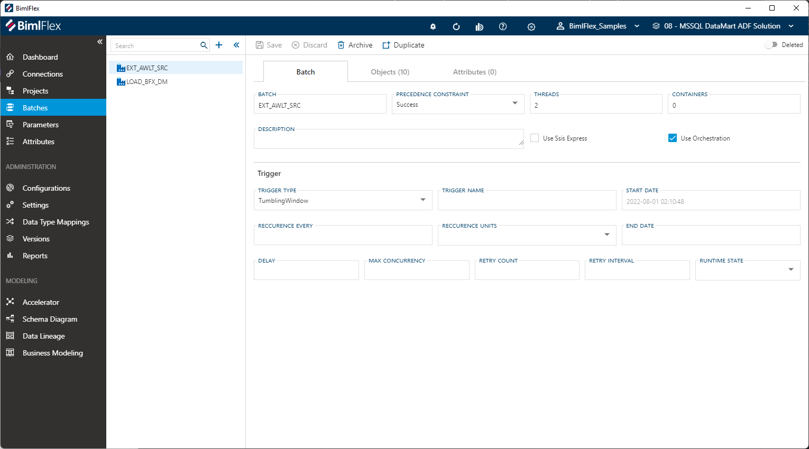

# Batch Editor

[!include[Connections](_incl-header-batch.md)]

## Overview

The following sections describe the User Interface elements of the Batch Editor and how they are used to author and manage BimlFlex **Batches**.

> [!NOTE]
> Detailed descriptions of all **Batch Editor** fields and options are available in the [Reference Documentation](xref:bimlflex-app-reference-documentation-Batches).

## Batch Tab

The **Batch Tab** is the first tab in the **Batch Editor**, and it is selected by default. The batch tab focuses on general batch information and configuration. This tab is used to define and create the batch itself.

### Action Buttons  

|Icon|Action|Description|
|-|-|-|
| 

| Save | This will save the current set of staged changes.  The **Save** button is will only enable if the **Batch** has changes staged and there are no major validation issues with the current **Batch** properties. |
| 

| Discard | This will **Discard** any unsaved changes and revert to last saved form. |
| 

 | Archive | This will hard delete the selected **Batch**.  This will result in the physical removal of the selected record from the metadata database.  The data will no longer be accessible by the BimlFlex app and will require a Database Administrator to restore, if possible. Clicking **Archive** will create an [Archive Batch Dialog](#archive-batch-dialog). |
| 

 | Duplicate | This will create a duplicate of the selected **Batch**. A Duplicate Batch Dialog will appear asking for a name for the new **Batch**. A new **Batch** will be created using all of the selected **Batch's** current properties. |
|

|Deleted|This will soft delete the currently selected **Batch**. This will remove the **Batch** and all associated entities from processing and validation. For information on how to add excluded or deleted items back to the scope, please read our [tips and tricks section](xref:bimlflex-tips-and-tricks-overview#restoring-an-excluded-or-deleted-entity).|

> [!NOTE]
> A **Batch** itself can not be excluded, only deleted. If certain parts of the data solution should be excluded, then this should be applied at **Project** level in the **Project Editor**.

<!--
### Triggers

Azure Data Factory **Triggers** are supported in BimlFlex, for Projects that are configured to generate Azure Data Factory or Mapping Data Flows output. When a Project has either the `Azure Data Factory (ADF)` or `Azure Mapping Data Flows (ADF)` **Integration Template**, the  option to specify triggers will become available in the **Batch Editor** for the batch that is associated with the project.

The generated trigger will be associated with the (batch-level) ADF Execute Pipeline for which they are specified.

The Trigger feature supports `Tumbling Window` and `Scheduled` triggers to be created in ADF. Additional configurations that can be applied in the same editor are:

* Name
* Start- and End Date (timestamps)
* Recurrence
* Delay
* Concurrency
* Retry configuration
* Runtime state

Additional information on trigger fields are found in the [batch reference documentation](xref:bimlflex-app-reference-documentation-Batches).
-->

### Additional Dialogs

[!include[Archive Batch Dialog](_dialog-archive-batch-single.md)]

### Allowed Values

#### Precedence Constraints

| Value      | Description          |
| ---------- | -------------------- |
| Success    | Automatically create precedence constraints so that tasks will run only run one after the other if the prior tasks are successful.|
| Completion | Automatically create precedence constraints so that tasks will run one after the other after they are completed regardless of whether they succeed or fail. |

## Objects Tab

The **Objects Tab** provides quick access to all **Objects** included in the **Batch**.  

[!include[Objects Tab](_tab-objects.md)]

## Attributes Tab

The **Attributes Tab** provides a view of any **Configurations** or **Setting** overrides that have been applied to the selected **Batch**.  

>[!NOTE]
> This is exclusive to the **Batch** level.  Additional overrides may be present on any grains higher or lower than the **Batch**.

[!include[Attributes Tab](_tab-attributes.md)]
