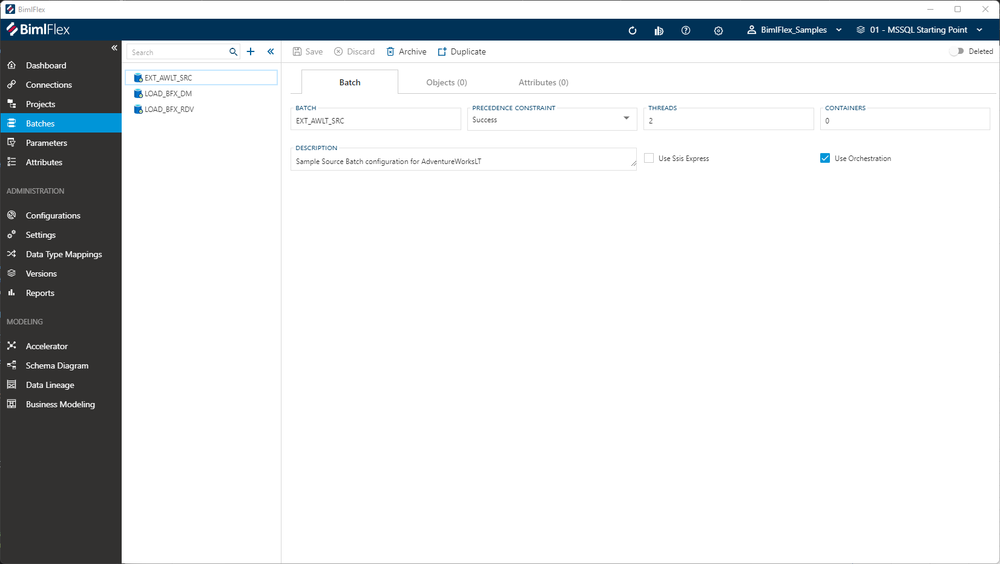

# Batch Editor

BimlFlex **Batches** group and help to define an ETL/ELT workload.  They are used by **Projects** to set execution grouping.

> [!IMPORTANT]
> Detailed descriptions of all **Batch** fields and options are available in the [Reference Documentation](xref:bimlflex-app-reference-documentation-Batches).

## Overview

The following sections describe the UI elements of the Batch Editor and how they are used to author and manage BimlFlex **Batches**.

## Details Tab

The **Details Tab** focuses on general batch information and configuration.  This tab is used to define and create the **Batch** itself.

### Details Tab - Action Buttons  

|Icon|Action|Description|
|-|-|-|
| 

| Save | This will save the current set of staged changes.  The **Save** button is will only enable if the **Batch** has changes staged and there are no major validation issues with the current **Batch** properties. |
| 

| Discard | This will **Discard** any unsaved changes and revert to last saved form. |
| 

 | Archive | This will hard delete the selected **Batch**.  This will result in the physical removal of the selected record from the metadata database.  The data will no longer be accessible by the BimlFlex app and will require a Database Administrator to restore, if possible. Clicking **Archive** will create an [Archive Batch Dialog](#archive-batch-dialog). |
| 

 | Duplicate | This will create a duplicate of the selected **Batch**. A Duplicate Batch Dialog will appear asking for a name for the new **Batch**. A new **Batch** will be created using all of the selected **Batch's** current properties. |
|

|Deleted|This will soft delete the currently selected **Batch**. This will remove the **Batch** and all associated entities from processing and validation. For information on how to add excluded or deleted items back to the scope, please read our [tips and tricks section](xref:bimlflex-tips-and-tricks-overview#restoring-an-excluded-or-deleted-entity).|

> [!NOTE]
> A **Batch** itself can not be excluded, only deleted. If certain parts of the data solution should be excluded, then this should be applied at **Project** level in the **Project Editor**.

### Additional Dialogs

[!include[Archive Batch Dialog](_dialog-archive-batch-single.md)]

### Details Tab - Fields

|Field|Description|
|-|-|
| Batch | The name of the BimlFlex **Batch**.  This is the value that will be appended by "_Batch" and used in the naming of the batch DTSX (SSIS) or Pipeline (ADF). |
| Precedence Constraint | BimlFlex **Batches** execute packages and the Precedence Constraint can be changed from Success to Completion to continue loading in case of individual failures. Must be a valid [Precedence Constraint](#precedence-constraints). |
| Threads | The default number of packages that can be executed in parallel within the **Batch**. Based on the topological sort and dependencies packages are grouped into execution layers. Within each layer (Sequence Container) multiple control flows pipelines can be executed in parallel. |
| Containers | The default number of sequence containers that can be executed within the **Batch**. Based on the topological sort and dependencies packages are grouped into execution layers. Within each layer (Sequence Container) multiple control flows pipelines can be executed in parallel. |
| Description | Optional metadata to provide description. |
| Use Ssis Express | Set this value to `true` when extracting data from a source that only has SQL Server Express installed. Note that with SSIS Express there is limited functionality. |
| Use Orchestration | BimlFlex comes with an orchestration framework that will control the ability to restart a failed batch. Set this attribute to `false` if you would like to bypass the default behavior. |

### Allowed Values

[!include[Precedence Constraints](_enum-precedence-constraint.md)]

## Objects Tab

The **Objects Tab** provides quick access to all **Objects** included in the **Batch**.  

[!include[Objects Tab](_tab-objects.md)]

## Attributes Tab

The **Attributes Tab** provides a view of any **Configurations** or **Setting** overrides that have been applied to the selected **Batch**.  

>[!NOTE]
> This is exclusive to the **Batch** level.  Additional overrides may be present on any grains higher or lower than the **Batch**.

[!include[Attributes Tab](_tab-attributes.md)]
