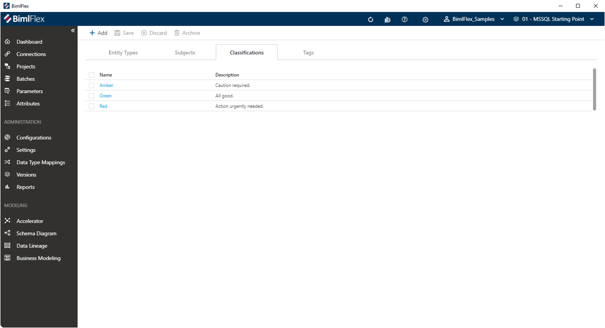
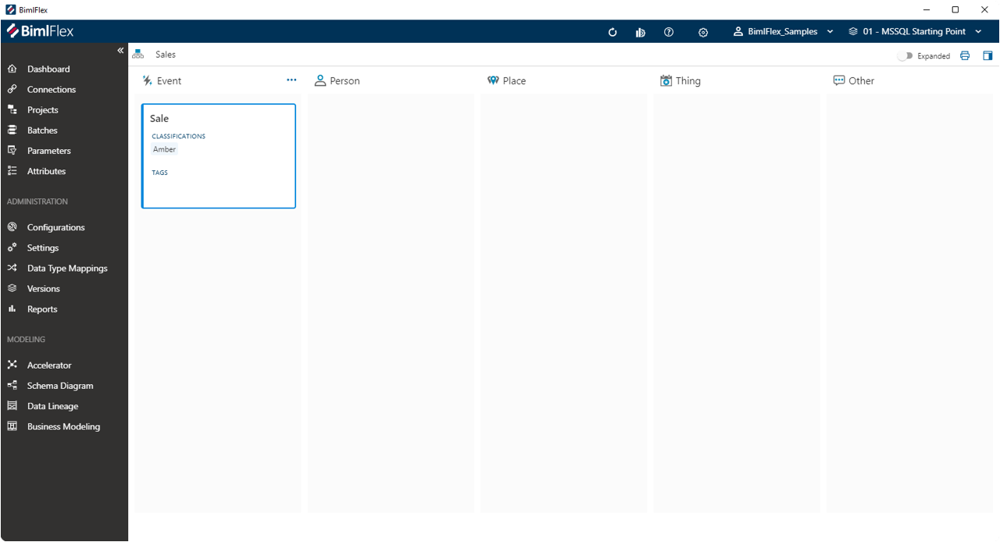
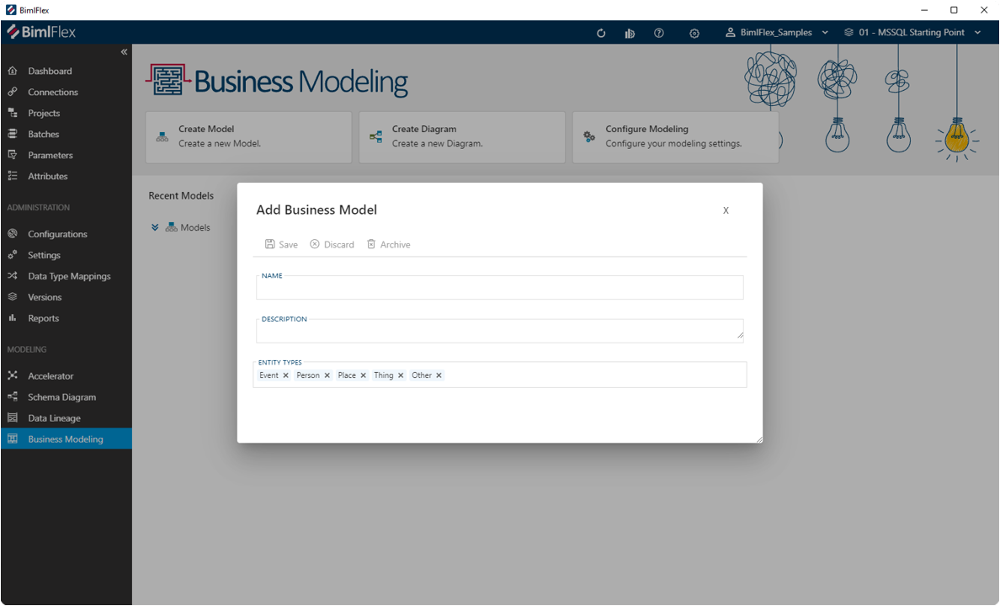
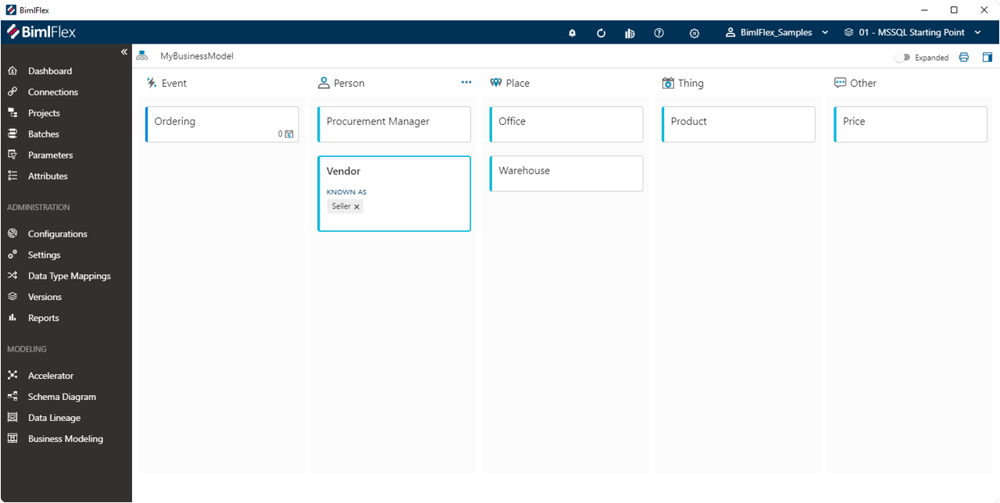
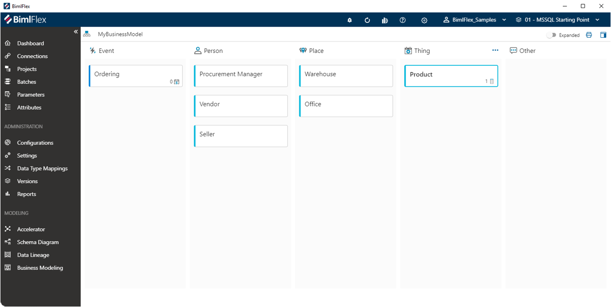

# Business Modeling

The BimlFlex **Business Modelling** feature supports designing a holistic model that describes the business' data, while avoiding bias from already existing systems and data structures.

Traditionally, this process involves a team of IT and business representatives collaborating in a series of workshops to define the business' Core Business Concepts (CBC), how they are described and how they interact with each other.

Business Models can be created using predefined Ensemble Logical Modeling (ELM) or Party & Party Role (PPR) approaches, or by defining a custom set of classifications and labels. For example, by defining types such as Subjects, People, Events or Places. These types of Business Model objects are represented as 'cards' on the model design board.

While working on a Business Model, these cards can be rearranged, detailed and updated on the model design board with minimal effort in a way that is similar to reorganizing Post-It notes on a whiteboard.

The **Business Modeling** feature is accessible from the main BimlFlex side menu, under the 'Modeling' section.

## Business Modeling Configuration

When you use the **Business Modelling** feature for the first time, you will be asked to select a **Modeling Configuration**. This sets the default that is used as template for creating new Business Models.

The **Modeling Configuration** provides a number of predefined Entity Types that will allow the various Business Entities to be organized on the **Business Model Canvas**. The Entity Types will represent 'swimlanes' on the **Business Model Canvas** where individual Business Entities can be placed.

After the initial selection, the default configuration can be adjusted using the **Configure Modeling** button.

### Entity Types

 On the first tab of the **Configure Modeling** screen, new Entity Types can be added and existing ones removed.

Here, the following Entity Type details can be changed:

* Name - the name or label of the Entity Type
* Is Event - an indicator if the Entity Type is considered an Event. This will allow an **Event Matrix** to be created from a Business Entity that has been classified as this Entity Type
* Color - a specification of the color a Business Concept will be presented with on the **Business Model Canvas** when classified as this Entity Type
* Icon - the assigned icon for an Entity Type provides a visual cue in the **Treeview**, where all Business Entities are visible. Also, this icon appears next to the Entity Type name on the **Business Model Canvas**

It is also possible to direct the **Business Model Canvas** to create a second row of swimlanes. This can be implemented by dragging an Entity Type to the second row, following the 'Drop here to place in bottom row' cue.

For example, moving the default 'Person' Entity Type to the second row will visualize the swimlanes on the **Business Model Canvas** as follows:

### Business Subjects

A **Business Subject** provide an additional way to classify Business Entities. Each Business Entity can be associated with a single **Business Subject**, and a **Business Subject** can contain multiple Business Entities.

This feature is intended to provide a grouping of related Business Entities.

Business Entities can be created from the **Configure Modeling** screen (shown below), or alternatively directly from the Business Entity selection.

### Classifications

**Classifications** can be defined as part of the modeling configuration defaults. They can be added to an existing Business Entity to provide a categorization that is different from the Entity Type. This assists in organizing the Business Entities in different ways, by being able to organize them according to classification - or to simply notify other modelers of a specific function or intent.

**Classifications** are visible on a Business Entity Tile once assigned. It is possible to add additional **Classifications** directly to a Business Entity, after which they will also appear on the **Configure Modeling** screen.

### Tags

Like **Classifications**, **Tags** can be added to an existing Business Entity to provide additional context. **Tags** also appear directly on the Business Entity Tile on the **Business Model Canvas**.

**Tags** can be created from the **Modeling Configuration** screen as shown below, or directly by adding one or more tags to an existing Business Entity on the **Business Canvas**.

Defining **Tags** as part of the **Modeling Configuration** creates a central reusable library of **Tags**.

## Creating a Business Model

After deciding on the best **Modeling Configuration**, a **Business Model** can be created by clicking the **Create Model** button. This will open a dialog box requiring a _Name_ and optional _Description_.

The default Entity Types from the **Modeling Configuration** are also displayed here, and it is possible to add and remove Entity types. The selected Entity Types will appear as swimlanes on the **Business Model Canvas**.

This is all that is required to proceed with building out a model.

## Business Model Canvas

After creating a Business Model and opening it, users are presented with the interface to build their Business Model - the **Business Model Canvas**.

The **Business Model Canvas** allows the creation of Business Entities by clicking on one of the swimlanes visible on the canvas, where each swimlane corresponds to an Entity Type.

When doing so, an empty Business Entity tile will be created in the corresponding swimlane and a _name_ for the new Business Entity can be entered.

The **Business Model Canvas** encourages collaboration between business- and technical teams to workshop a model of how the business operates and on what terms and definitions to standardize. This process prevents models from being to influenced by how operational (IT) systems are used, and attempts to define the more generic terms that capture the business process instead.

The canvas can be restructured by moving tiles across to different swimlanes, or by dragging tiles to other tiles. The changes made on the canvas will save automatically.

### Business Model Canvas Action Bar

| Icon | Action | Description |
|----|-|--------|-------------|
| 

 | Edit | This icon will appear when hovering over the Business Model _name_. The edit screen for the Business Model can be opened from here.|
| 
 | Expanded | Toggle to show smaller tiles with less visible details, allowing more tiles on the screen. The expanded view will also show **Classifications** and **Tags**.|

### Editing or Archiving a Business Model

A Business Model can be edited by hovering over the Business Model _name_ and clicking either the name or the 'Edit' icon.

In the **Edit Business Model** dialog the Business Model _name_, _description_ and in-scope Entity Types can be modified. Also, the model can be archived (discarded) altogether.

### Managing Synonyms

It is a common practice in Business Modeling workshop to first capture all involved Business Entities (concepts) and process steps on the **Business Model Canvas**, and to organize these by Event Type.

In the course of capturing all involved concepts, it is common to find Business Entities that actually mean the same thing but have different names. Understanding these nuances and selecting the 'right' name for a Business Entity is a key outcome of the Business Modeling process. The collective team will together define which name for the Business Entity will be used, and why this is the case.

BimlFlex supports this approach with the **Known As** feature. Business Entities that are synonymous can simply be dragged onto one another, and this will present the user with a dialog to instruct BimlFlex to manage this as a **Known As** (synonym) or **Attribute** (column or property).

For example, the 'Vendor' and 'Seller' Business Entities are synonyms of each other. By dragging the 'Seller' Business Entity to the 'Vendor' Business Entity and selecting **Known As** this will be recorded and visible on the **Business Model Canvas**.

If alterations are needed, clicking the `X` next to any **Known As** will association that this Business Entity has and return it to the canvas as an individual Business Entity.  

>[!TIP]
>Defining synonyms in the Business Model records the outcomes of the Business Modeling workshops, and serves as a reminder on what the agreed terms and definitions are to organize data in the target data solution.

In BimlFlex, Business Entities can be mapped to **Objects** in the **Object Editor** or the **Accelerator**.

### Managing Attributes

As part of organizing the Business Entities on the **Business Model Canvas**, it may be found that certain Business Entities are not really (core) business concepts but rather descriptive properties of other Business Entities.

BimlFlex allows dragging a Business Entity on to another one to declare it an **Attribute**. This works the same way as defining one Business Entity to be a synonym another one, but here the **Attribute** feature should be used if the user wants declare the dragged Business Entity as a property of the target Business Entity.

Once the Business Entity has been attributed this way, it will appear as a Business Attribute to the Business Entity.

For example, the 'Price' Business Entity can become a Business Attribute to the 'Product' Business Entity by dragging the 'Price' tile to the 'Product' tile. After selecting **Attribute** the 'Product' tile will show an indicator that this Business Entity has one (1) Business Attribute.

### Viewing and Editing Business Entity Details

There are two ways to view and edit the details of a Business Entity.

* Double-clicking on the Business Entity tile. This will open the **Business Entity Editor**
* Hovering over the tile will show the details ellipsis, this will display a menu for further navigation

This this menu the following options are available:

* `Remove` will disconnect the Business Entity from the Business Model and withdraw it from the canvas. The Business Entity still exists, but is not associated with the visible Business Model anymore
* `Details` will display the side navigation panel of the **Business Model Canvas**, which will allow for direct editing of Business Entity details that directly apply
* `Edit` will open the **Business Entity Editor**

#### Business Entity Editor

#### Business Entity Side Panel

The side panel can be opened by clicking on the panel icon () on the **Business Model Canvas**, or by selecting `Details` from the Business Entity tile ellipsis menu.

The following controls are available to operate the side panel:

| Icon | Action | Description |
|----|-|--------|-------------|
| 

 | Collapse | This will hide the side panel.|
| 

 | Save | This will persist changed made to the Business Entity.|
| 

 | Discard | Pending changes to the Business Entity will be discarded.|
| 

 | Archive | Archive will remove the Business Entity from the active metadata repository, and move it to the metadata archive.|
| 

 | Pin | The side navigation panel can be pinned and unpinned from the **Business Model Canvas**, depending if the user wants to keep it visible or not.|

The side panel enables editing of the main Business Entity properties:

| 
Property
 | Description |
| --------- | ----------- |
|`Name`| The name of the Business Entity.|
|`Short Name`| An abbreviated name for the Business Entity that can serve as alias.|
|`Definition`| A brief formal definition of the Business Entity.|
|`Description`| A meaningful overview of the Business Entity in a few words or sentences.|
|`Entity Type`| The **Event Type** of the Business Entity|
|`Business Subject`| The **Business Subject** to which the Business Entity is part of.|
|`Classifications`| The **Classifications** that are applied to the Business Entity.|
|`Tags`| The **Tags** that are applied to the Business Entity|

### Creating an Event Matrix from the Business Model Canvas

Clicking the **Event Details** button () in the lower-right corner of a Business Entity that has been classified as an `Event` Entity Type will navigate to the **Event Matrix** for that Business Entity. If no **Event Matrix** exists yet one will be created.

## Event Matrix Canvas

The **Event Matrix** is a specialized **Business Model Canvas**. However, the **Event Matrix** only displays Business Entities that are related to the Event.

The intent of the Event Matrix is to capture which Business Entities relate to a specific Event. From the **Event Matrix**, users can manually remove and edit Business Entities that only relate to that Event.

Any edits that are made to Business Entity tiles in this view will also apply to the **Business Model Canvas**. This allows edits to maintain parity between the **Business Model Canvas** and each individual **Event Matrix**.

>[!TIP]
>Workshopping an **Event Matrix** assist in clarifying relationships between Business Entities.
