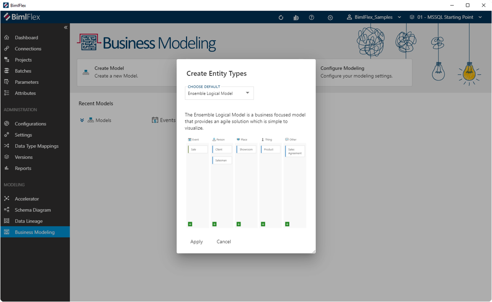
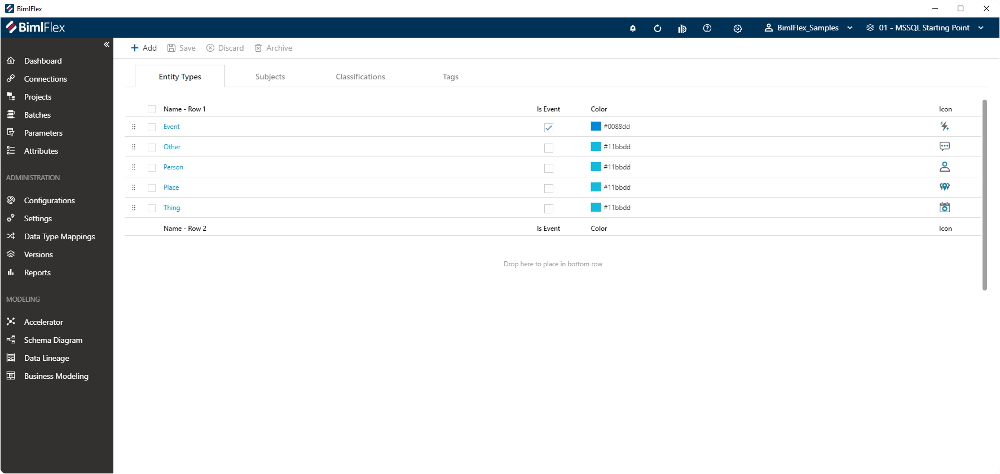
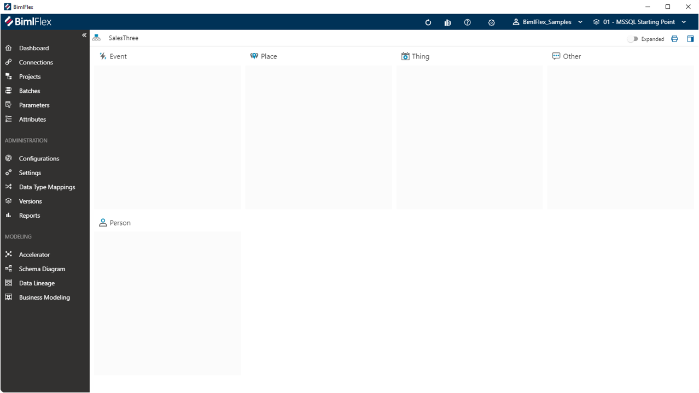
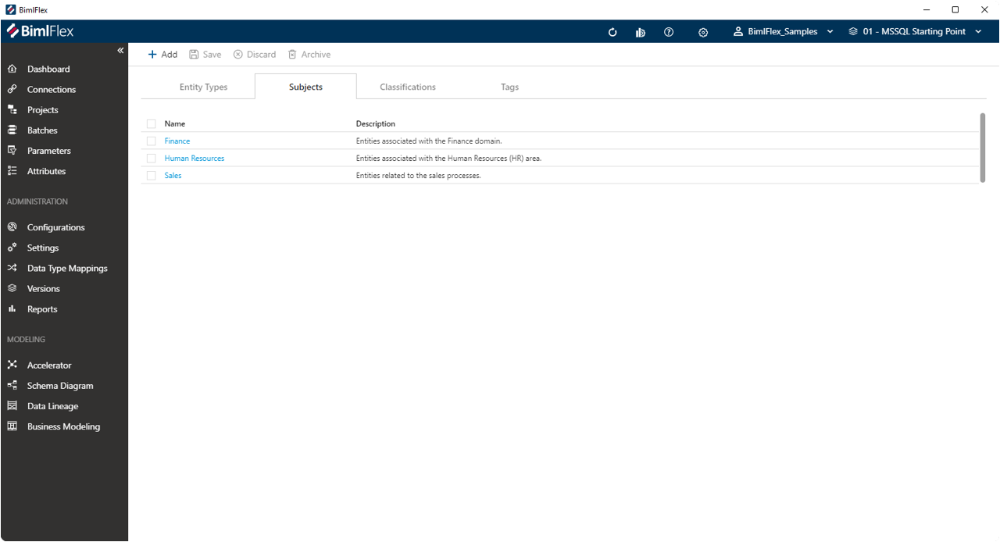

# Business Modeling

The BimlFlex **Business Modelling** feature supports designing a holistic model that describes the business' data, while avoiding bias from already existing systems and data structures.

Traditionally, this process involves a team of IT and business representatives collaborating in a series of workshops to define the business' Core Business Concepts (CBC), how they are described and how they interact with each other.

Business Models can be created using predefined Ensemble Logical Modeling (ELM) or Party & Party Role (PPR) approaches, or by defining a custom set of classifications and labels. For example, by defining types such as Subjects, People, Events or Places. These types of Business Model objects are represented as 'cards' on the model design board.

While working on a Business Model, these cards can be rearranged, detailed and updated on the model design board with minimal effort in a way that is similar to reorganizing Post-It notes on a whiteboard.

The **Business Modeling** feature is accessible from the main BimlFlex side menu, under the 'Modeling' section.

## Business Modeling Configuration

When you use the **Business Modelling** feature for the first time, you will be asked to select a **Modeling Configuration**. This sets the default that is used as template for creating new Business Models.

The **Modeling Configuration** provides a number of predefined Entity Types that will allow the various Business Entities to be organized on the **Business Model Canvas**. The Entity Types will represent 'swimlanes' on the **Business Model Canvas** where individual Business Entities can be placed.

After the initial selection, the default configuration can be adjusted using the **Configure Modeling** button.

### Configuring Event Types

 On the first tab of the **Configure Modeling** screen, new Event Types can be added and existing ones removed.

Here, the following Entity Type details can be changed:

* Name - the name or label of the Entity Type
* Is Event - an indicator if the Entity Type is considered an Event. This will allow an **Event Matrix** to be created from a Business Entity that has been classified as this Entity Type
* Color - a specification of the color a Business Concept will be presented with on the **Business Model Canvas** when classified as this Entity Type
* Icon - the assigned icon for an Entity Type provides a visual cue in the **Treeview**, where all Business Entities are visible. Also, this icon appears next to the Entity Type name on the **Business Model Canvas**

It is also possible to direct the **Business Model Canvas** to create a second row of swimlanes. This can be implemented by dragging an Entity Type to the second row, following the 'Drop here to place in bottom row' cue.

For example, moving the default 'Person' Entity Type to the second row will visualize the swimlanes on the **Business Model Canvas** as follows:

### Configuring Business Subjects

A **Business Subject** provide an additional way to classify Business Entities. Each Business Entity can be associated with a single **Business Subject**, and a **Business Subject** can contain multiple Business Entities.

This feature is intended to provide a grouping of related Business Entities.

Business Entities can be created from the **Configure Modeling** screen (shown below), or alternatively directly from the Business Entity selection.

### Configuring Classifications

**Classifications** are visible on a Business Entity Tile once assigned.

### Configuring Tags

Like **Classifications**, **Tags** can be added to an existing Business Entity to provide additional context. **Tags** also appear directly on the Business Entity Tile on the **Business Canvas**.

**Tags** can be created from the **Modeling Configuration** screen as shown below, or directly by adding one or more tags to an existing Business Entity on the **Business Canvas**.

Defining **Tags** as part of the **Modeling Configuration** creates a central reusable library of **Tags**.

## Creating a Business Model

Models may be created either by adding Subjects (People, Place, or Things) or from a top-down perspective by creating an overall model (Sales, Lawsuit, etc.) and adding subjects and events subsequently.

After deciding on the best basic model settings, the process can be started by clicking `Add Model` (or `Add Subject` alternatively).
A dialog box requiring a Name and Subject is all that is required to proceed with building out a model. 

Next, users are presented with the interface to build their Business Model.

Events are the primary relationships and interactions between business entities.
Events will be modeled as a Link.  
Entities such as Person, Place, Thing, and Other will be modeled as Hubs.
Entities added to the overview are not categorized in any methodical method.  
The overview is simply a place for teams to add all of the individual parts of their model, with organization to follow.

### Business Modeling Action Bar

| Icon | Action | Description |
|----|-|--------|-------------|
| 

 | Save | Save any staged changes to the model |
| 

 | Discard | Revert any unsaved changes to the model |
| 

 | Archive | Remove any selected entity from the model entirely. This option cannot be undone. |
|  | Details | Toggle to show or hide any details from the Entity cards, including any entered Business Names, Short Names, Descriptions, or Tags |
|  | Attributes | Toggle to show or hide any attributes added to any Entity cards. There is no limit to the attributes that can be added to the Entities.
|  | Known As | Toggle to show or hide any "Known As" elements to any Entity cards. Any number of entities may be dragged into another. |
|  | Compact | Toggle to show smaller cards with less visible details to show more entity cards on screen |

### Attributes and "Known As" Fields

Similar entities may simply be dragged onto one another, for grouping and tracking different entities under one uniform Entity.

>[!NOTE]
> In the above example, "Plaintiff" and "Defendant" are both a "Party" to the accident. However, they could be tracked in the same Hub as "Party." As such, "Plaintiff" and "Defendant" were combined with "Party," as that Hub would track the two entities independently.

If alterations are needed, clicking the `X` next to any "Known As" will remove the entity from the grouping and return it to the overview as an individual entity.  
Clicking the `X` next to any attribute will remove it from that card.  
Clicking the `...` will allow users to Edit the card's details, or remove the card from the overview entirely.

### Creating an Event Matrix

Clicking the `Generate Event Matrix` button in the lower-right corner of an Event will take users to the Matrix for that Event only.
From here, users will manually remove and edit Entities that only relate to that Event.

Any edits that are made to Entity cards in a Matrix view will be match in the Overview.
This allows edits to be made "across the board," and to maintain parity between the Business Model overview and individual Event matrices.

As users go through all of the created events, edits and alterations to each Matrix should be performed to only have relevant Entities exist within that Matrix.
As changes are made, metadata relating to the model may be easily shared with team members for approval or subsequent edits.

### Relationship Modeling

Relationship Modeling is the next step of the Business Modeling process, though not included in the application features currently.  

From the Relationship Modeling screen, users will be able to drag Hubs and Links, while indicating relationship interactions between entities, as well as create additional relationships that may or may not have been intended or recognized from the initial model creation.