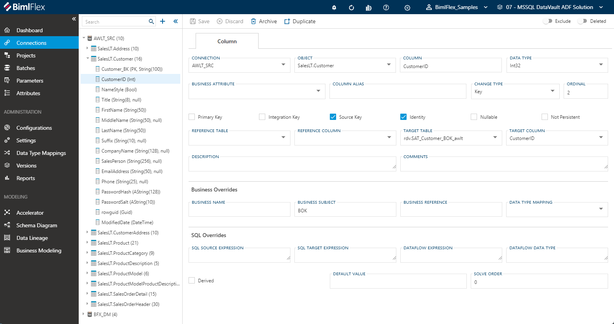
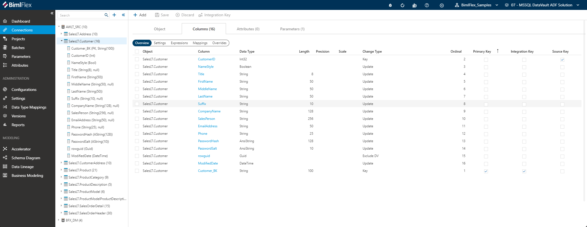

# Column Editor

The **Column Editor** is used to manage how BimlFlex interacts with all **Columns** in the BimlFlex design process. The column editor provides a fine-grained means of configuring specific data logistics behavior.

Mappings from source to target are defined at column level in BimlFlex, and the column editor provides various ways to influence how this design metadata is translated into data logistics artifacts.

## Overview

**Columns** within BimlFlex are displayed in the [**Treeview**](xref:bimlflex-treeview) on the left side-navigation menu. Columns belong to an [**Object**](xref:bimlflex-object-editor), and can be access by opening the object in the treeview or by navigating to the columns tab in the **Object Editor** .

> [!NOTE]
> Detailed descriptions of all **Column** fields and options are available in the [Reference Documentation](xref:bimlflex-app-reference-documentation-Columns).

From any editor, any instance of the  icon will serve as a Global Navigation Transition. Clicking this icon will navigate the user directly to the referenced **Project**, **Connection** or **Object**.

### Accessing the Column Editor from the Treeview

Selecting any column from the treeview will display the column editor.

### Accessing the Column Editor via the Object Editor

The column editor can also be accessed via the object editor, from various locations in the App. When an object is selected, the columns tab is visible in the  editor. Navigating to the columns tab will show a grid view of all the columns belonging to the object.

The user may navigate to any column by selecting it from the displayed list.

## Action Buttons

| Icon | Action | Description |
|-|-|-|
| 

 | Save | Saves any changes made in the form. The **Save** button will only enabled if there are unsaved changes in the form and no major validation errors. |
| 

 | Discard | This will **Discard** any unsaved changes and revert to last saved form. |
| 

 | Archive | This will hard delete the selected **Column**. This will result in the physical removal of the selected record from the BimlFlex Database. The data will no longer be accessible by the BimlFlex app and will require a Database Administrator to restore, if possible. Clicking **Archive** generates an [Archive Column Dialog](#archive-column-dialog).|
| 

 | Duplicate | This will create a duplicate of the selected **Column**. Clicking the **Duplicate** button will cause a [Duplicate Column Dialog](#duplicate-column-dialog) to appear. The new **Column** will be created using all of the selected **Column**'s current properties. |
| 

 | Excluded | This will determine if the **Column** will be excluded from processing and validation along with the rest of the solution. This is designed to be paired with the `Use My Exclusions (Locally)` global setting to allow for multiple developers to work on different functional areas without deleting or globally excluding entities. |
|

|Deleted|This will soft delete the currently selected **Column**. This will remove the **Column** and all associated entities from processing and validation. For information on how to add excluded or deleted items back to the scope, please read our [tips and tricks section](xref:bimlflex-tips-and-tricks-overview#restoring-an-excluded-or-deleted-entity).|

## Column Details

Detailed reference documentation on each of the fields in the column editor is found in the [Reference Documentation](xref:bimlflex-app-reference-documentation-Columns). A brief overview will be provided here.

The column editor is organized in three different groups.

### Column Specification

The main column details capture the technical specifications of the column. This includes the way the column is used in the physical model. The (Foreign Key) references to another object and the mapping to the target column (and object) are also administered here.

### Business Overrides

The Business Overrides section contains information from the business model. Please refer to the [**Business Modeling**](xref:bimlflex-business-modeling) feature for more information about the definition of a business model. This section also specifies the data type conversion that must be applied to a column when propagating it through the data solution architecture. For example, when deriving the Staging Area or Data Vault columns.

### SQL Overrides

Lastly, the SQL Overrides section allows for detailed modification of the way the column is used. This is where custom transformation logic at column level can be defined using the various override fields available.

### Additional Dialogs

[!include[Archive Column Dialog](_dialog-archive-column-single.md)]

[!include[Duplicate Column Dialog](_dialog-duplicate-column.md)]

### Allowed Values

#### Change Types

[!include[Change Types](../reference-documentation/static-data/_enum-change-type.md)]

#### Data Types

[!include[Data Types](../reference-documentation/static-data/_enum-data-type.md)]
