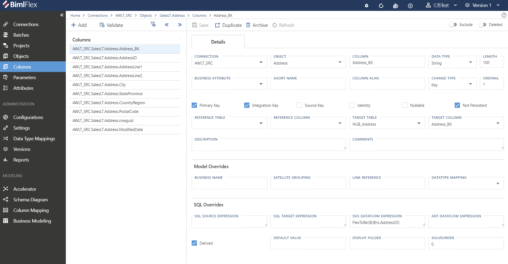
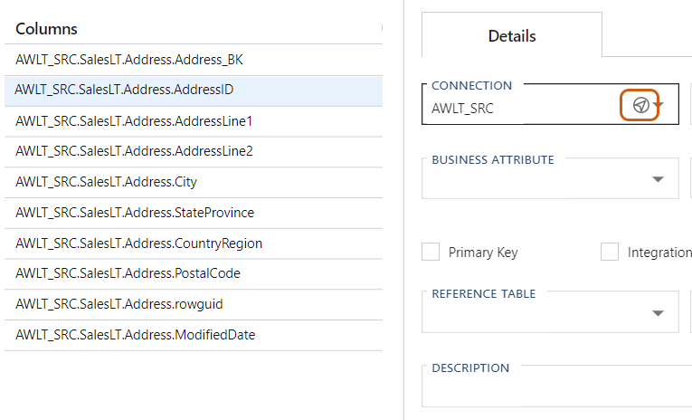
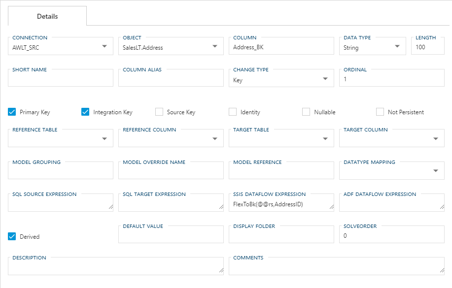
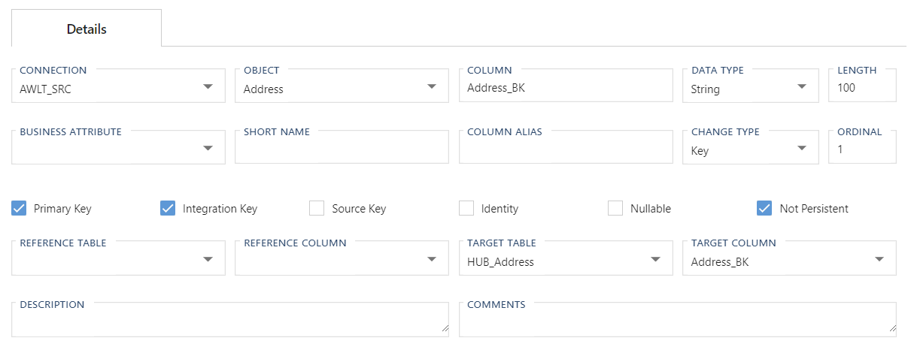
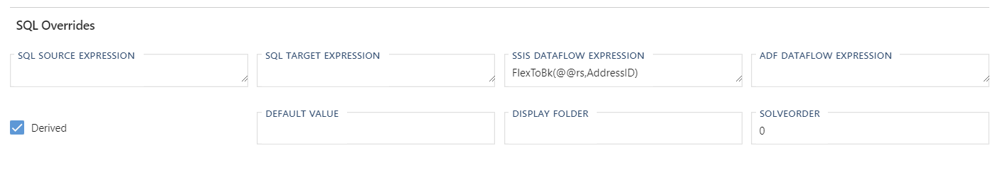

# Columns Editor  

The **Columns** Editor is used to manage how BimlFlex interacts with all **Columns** in the BimlFlex process.  

<!--

-->

**Columns** within BimlFlex are displayed in a hierarchical tree view on the left sidenav menu.
The number of **Columns** within an **Object** will be displayed next to the Object names in parentheses.

Selecting an **Object** with a single **Column** will immediately navigate the user to the **Column** edit screen.

Selecting an **Object** with multiple **Columns** will display a secondary list of all editable **Columns** within.
The user may navigate to any **Column** by selecting from the displayed list.

<!--
TO DO: Add Column "LIST VIEW" image
-->

The tree view for **Columns** is expandable/collapsible by clicking the `<<` icon.

Any instance of the `'Compass'` icon will serve as a Global Navigation Transition.
Clicking this icon will navigate the user directly to the referenced **Connection, Object,** or **Column.**

Toggling `Descendants` will enable or disable all parameters for both the currently selected node and all of its descendant nodes.
This option is enabled by default.

The Search field is contained within the tree view menu, and will be hidden when collapsed.
The Search field will return results in realtime, only presenting Parameters containing the term being searched.

<!--
TO DO: ADD SEARCH FIELD FOR COLUMNS 
-->

<!--
**Columns** within BimlFlex are displayed organized by Connection, by default.
Selecting a Column will navigate the user to a list of all Columns within that same Object.
The user can navigate to any Column within that same Object by selecting it from the displayed list.

Any field with the 'Compass' icon will serve as a Global Navigation Transition.
Clicking this icon will navigate the user directly to the referenced Connection or Object.

-->

## Action Buttons  

<!--

-->
| Icon | Action | Description |
|-|-|-|
| 

 | Save | Saves any changes made in the form. The **Save** button will only enabled if there are unsaved changes in the form and no major validation errors. |
| Discard | Discard | This will **Discard** any unsaved changes and revert to last saved form. |
| 

 | Archive | This will hard delete the selected **Column**.  This will result in the physical removal of the selected record from the metadata database.  The data will no longer be accessible by the BimlFlex app and will require a Database Administrator to restore, if possible. Clicking **Archive** generates an [Archive Column Dialog](#archive-column-dialog).|
| 

 | Duplicate | This will create a duplicate of the selected **Column**.  Clicking the **Duplicate** button will cause a [Duplicate Column Dialog](#duplicate-column-dialog) to appear. The new **Column** will be created using all of the selected **Column**'s current properties. |
|  | Exclude | This will remove the **Column** from processing and validation.  This is designed to be paired with the `Use My Exclusions (Locally)` global setting to allow for multiple developers to work on different functional areas without deleting or globally excluding entities. |
|  | Deleted | This will soft delete the currently selected **Column**.  This will remove the **Column** from processing and validation. |

[!include[Restore Entities Tip](_tip-restore-entities.md)]

## Columns Editor Fields  

<!--

-->

| Field | Description |
|-|-|
| Connection | The **Connection** the **Column** is associated with. Connection is Required. |
| Object | The **Object** or table that the **Column** is associated with. Object is Required. |
| Column | The name of the Column. Column Name is Required. Column Name must be unique for the **Object**. |
| Data Type | The type of the data stored in this column using the unified type system. Additional logic is required to cater for data types with a CustomType like hierarchyid. Data Type is required. Must be a valid [Data Type](#data-types). |
| Length | The length parameter for the column type associated with this column. This property applies only to column types that support a length specification, such as String and Binary types. Set to `-1` to indicate MAX length. Length is required. Length cannot be less than -1. |
| Business Attribute | xxx |
| Short Name | Business friendly name for the column. |
| Column Alias | Alias for the column. Generally used in conjunction with SqlSourceExpression. |
| Change Type | This value specifies the slowly changing dimension type for the column. Change Type is Required. Must be a valid [Change Type](#change-types). |
| Ordinal | Defines the order of the **Columns** in the target **Object**. It is recommended that the Business and Primary Keys is defined as the top ordinals. Ordinal is used in ascending order. Ordinal is Required. Ordinal cannot be less than zero. |
| Primary Key | Defines if the **Column** is the Primary Key for the **Object**. The primary key uniquely identifies each record in a database table. Primary keys must contain UNIQUE values. A primary key column cannot contain NULL values. A Primary Key is required for each **Object**. |
| Integration Key | Defines if the **Column** is the Integration Key for the **Object**. Note that the framework allows only one integration key per object. If the object has multiple columns that makes up the integration key define a derived concatenated column. An Integration Key is required for each **Object**. There can only be one Integration Key for the **Object**. |
| Source Key | Defines if the **Column** is the Source Primary Key for the **Object**. This is generally defined if the object has multiple columns as the integration key and a derived concatenated integration key has been defined. |
| Identity | Defines if the **Column** is the Identity Column for the **Object**. |
| Nullable | Defines if the **Column** is nullable. |
| Not Persistent | Defines an Override to the Persistent Staging Connection defined as part of the **Project** entity. A good example of usage would be where derived columns should not be persisted. Note that setting it to true will exclude the column from being persisted. |
| Reference Table | The source **Object** for this **Column**. |
| Reference Column | The **Column** on the source object used for this **Column**. The **Column** cannot reference itself. |
| Target Table | The target **Object** for this **Column**. |
| Target Column | The **Column** on the target **Object** used for this **Column**. The **Column** cannot target itself. |
| Description | The **Column** described in business context. Often referred to as business metadata. |
| Comments | Generic comments for use by the Analyst and Modelers to keep notes related to the **Column**. |

### Model Overrides Fields 

| Field | Description |
|-|-|
| Business Name | This is the name that will be used for the **Column** after the solution is deployed. An example of use would be if you have a source **Column** with a cryptic name like GL002 and the actual business name is GeneralLedgerCode; by defining a [Business Name] and generating a Data Vault using the BimlFlex Accelerator the resulting column will be [GeneralLedgerCode]. |
| Satellite Grouping | This attribute is used to group columns into their own satellites. All columns with the same ModelGrouping will be generated into separate satellites. It is also used to define a Unit Of Work on Links. Example would be if you have a customer table that has a column "LastLoginDate" that changes very frequently you might want to model this in a separate satellite.  |
| Link Reference | This attribute is used multiple table references. This attribute is auto-generated by our schema import and can be overridden. An example of use would be the SalesOrder table with a ShippingAddress and BillingAddress reference to the Address table. Two links will be created with the Link Reference forming part of the name. |
| Datatype Mapping | The BimlFlex `Data Type Mappings` to use with this **Column**. Must be a [Data Type Mapping](data-type-mappings.md) defined in BimlFlex. |

### SQL Overrides Fields

|Field|Description|
|-|-|
| SQL Source Expression | SQL expression for the **Column** that is used to extend source queries. Generally used for source type casting and case statements. Example: CONVERT(VARCHAR(27), @@this, 121) |
| Sql Target Expression | SQL expression for the **Column** that is used to extend target queries. Generally used for type casting and case statements. Example: CONVERT(VARCHAR(27), @@this, 121) |
| SSIS Dataflow Expression | This value specifies the expression used to calculate the value of the derived column. The SSIS expression syntax is used. Utilize the same syntax as the Derived Column. |
| Adf Dataflow Expression | This value specifies the expression used to calculate the value of the derived column. The ADF Dataflow expression syntax is used. Utilize the same syntax as the Derived Column. |
| Derived | Defines if the value in this **Column** is derived during the ETL process. This is generally set in conjunction with the *SSIS Dataflow Expression* field. |
| Default Value | The default value for the **Column**. Uses Transact-SQL constant expression syntax. |
| Display Folder | xxx |
| Solve Order | Used when defining SSIS Dataflow Expressions that need to be parsed in a specific order. An example of use would be if you want to split a very complex calculation up into multiple expressions that are derived in a specific sequence. |

<!--
| Model Grouping | This attribute is used to group columns into their own satellites. All columns with the same ModelGrouping will be generated into separate satellites. It is also used to define a Unit Of Work on Links. Example would be if you have a customer table that has a column "LastLoginDate" that changes very frequently you might want to model this in a separate satellite. |
| Model Reference | This attribute is used multiple table references. This attribute is auto-generated by our schema import and can be overridden. An example of use would be the SalesOrder table with a ShippingAddress and BillingAddress reference to the Address table. Two links will be created with the ModelReference forming part of the name. |
-->

### Additional Dialogs  

[!include[Archive Column Dialog](_dialog-archive-column-single.md)]

[!include[Duplicate Column Dialog](_dialog-duplicate-column.md)]

### Allowed Values  

[!include[Change Types](_enum-change-type.md)]

[!include[Data Type](_enum-data-type.md)]
