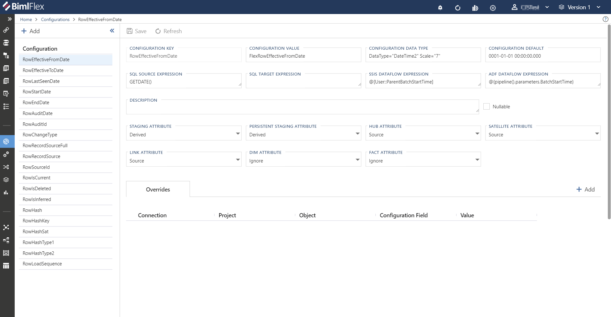
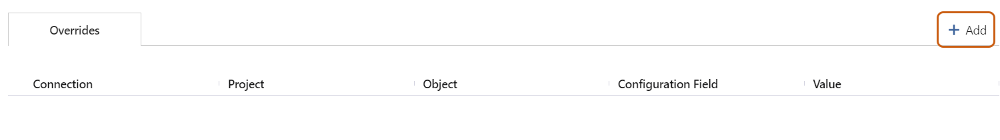
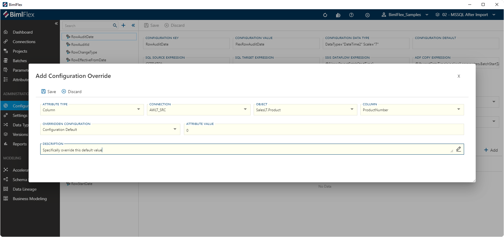
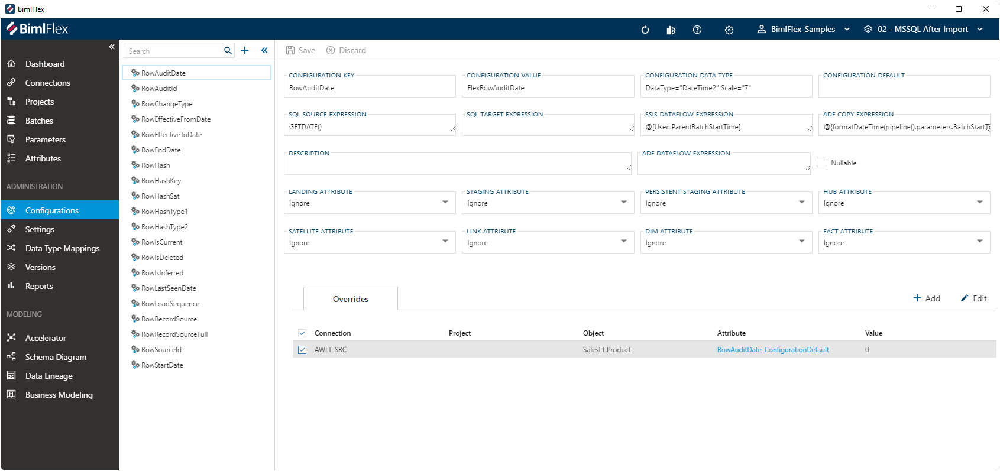

# Configuration Editor

The **Configuration Editor** is used to manage standard **Columns** and how, when and where these are added to **Objects**. These standard columns can be configured to drive the behavior of the output that BimlFlex generates.

Configurations can be used to support requirements for file locations, naming conventions, data conventions and standard system columns.

The defaults for the configurations that are set as part of the BimlFlex installation are the Varigence recommended values. There is no need to change or configure unless there is a requirement to change specific behaviors. Align these settings with the organization's best practices and environmental requirements.

## Overview

 **Configurations** can be found under Administration in the BimlFlex App menu.

> [!TIP]
> The [Configurations Reference Documentation](../reference-documentation/metadata-configurations.md) serves as a complete guide for all configurations available in the BimlFlex App.

## Action Buttons

The action buttons modify the **Configuration** that is active in the editor.

| Icon | Action | Description |
| ---- | ------ | ----------- |
| 

 | Save | This will save any changes displayed in the **Configurations** editor.  The **Save** button is only enabled if there are changes in the editor.|
| 

 | Discard | **Discard** any unsaved changes and revert to last saved form.|

## Configuration Editor Overview

The **Configuration Editor** is used to manage all **Configurations**. The fields in the editor are defined in this table along with the validation rules.

### Configuration Value Properties

| 
Field
| Description |
|------------------------------------ | ----------- |
| Configuration Key            | The Configuration Key is the internal unique key BimlFlex refers to for the given **Configuration**. This value cannot be changed.|
| Configuration Value          | The Configuration Value corresponds to the name of the **Column** that will be created for the **Object** this configuration will be applied to. This can be modified to support a different pattern or behavior.|
| Configuration Data Type      | The data type the  **Configuration** uses. This needs to be a valid data type definition.|
| Configuration Default        | The value that will be inserted by default when a NULL value is encountered for the **Configuration**.|
| SQL Source Expression        | SQL to be used by the **Configuration** when being applied to source data.|
| SQL Target Expression        | SQL to be used by the **Configuration** when being applied to the target data.|
| SSIS Dataflow Expression     | The SSIS Expression that will be applied to the column to derive a specific value. Needs to be a valid SSIS Expression. The  shorthand `@@this` to define the current entity.|
| ADF Copy Expression          | The expression that will be used in an ADF Copy activity to derive a specific value. Needs to be a valid ADF expression. The  shorthand `@@this` to define the current entity.|
|ADF Dataflow Expression      | Used to derive a value when using an ADF Dataflow. Adf Dataflow Expression is required with a derived Staging Attribute setting for Adf: Source -> Target Projects.|
| Description                  | An optional description for custom attributes or definitions. The default configurations are described in this document.|
| Nullable                     | Defines If the attribute is nullable Valid Enumeration {`Empty`, `Y`, `N`}|

### Configuration Application Properties

The definition of each configuration can be seen as a *Global Configuration*, and will apply to specific **Objects** based on their design. The configuration properties below control where each configuration applies.

| 
Field
| Description |
|------------------------------------ | ----------- |
| Landing Attribute            | Determines if the configuration is applied to objects in a `Landing` connection, and how this is done.|
| Staging Attribute            | Determines if the configuration is applied to objects in a `Staging` connection, and how this is done.|
| Persistent Staging Attribute | Determines if the configuration is applied to objects in a `Persistent Staging` connection, and how this is done.|
| Hub Attribute                | Determines if the configuration is applied to objects that have the `Hub` object type, and how this is done.|
| Satellite Attribute          | Determines if the configuration is applied to objects that have the `Satellite` object type, and how this is done.|
| Link Attribute               | Determines if the configuration is applied to objects that have the `Link` object type, and how this is done.|
| Dim Attribute                | Determines if the configuration is applied to objects that have the `Dimension` object type, and how this is done. If any Dimension objects in the project have `Type 2` columns, *Dim Attribute* must be set to `Derived`.|
| Fact Attribute               | Determines if the configuration is applied to objects that have the `Fact` object type, and how this is done.|

Each property will allow a list of values to be selected, which impacts how the configuration is applied to the in-scope objects.

| Value   | Description| Short Code |
| ------- | ---------- | ---------- |
| Ignore  | Ignore the configuration for the assigned object or layer.| IGN |
| Derived | Derive the configuration using the value specified in the appropriate *Expression* column. This is dependent on the **Integration Template** used.| DER |
| Source  | Use the value as is available from the source object. This column will need to be named as specified by the *Configuration Value* column for the **Configuration** in the source object. | SRC |
| Default | Use the value specified in the *Configuration Default* field for the **Configuration**.|
| Target  | Defined by the Target.| TGT |
| Hash    | Apply hashing logic when loading the value.|

## Configuration Overrides

**Configuration Overrides** are used to override how configurations values are applied for selected areas of the design. For example, to implement a configuration for all columns except for the ones in a specific project. Overrides allow highly granular control of exceptions that need to be implemented in the solution.

All overrides that apply to the selected configuration are listed in the **Overrides** section of the editor.

### Adding a Configuration Override

To add a **Configuration Override**, click `+ Add` on the Overrides tab. This will open the **Configuration Override Editor**.

The **Configuration Override Editor** allows the override to apply at various levels of abstraction, for example at **Column** level, **Object** level, **Project** level or even for the entire **Connection** or **Customer**. This is specified by the `Attribute Type`. Depending on the selected type different options will be shown to specify the exact item the override needs to apply for.

> [!NOTE]
> The **Configuration Override Editor** will apply to the selected configuration.

The example below shows an override that applies to a specific **Column**, and overrides the `Configuration Default` that otherwise would apply based on the global configurations.

The fields that are visible in the editor depend on the selected `Attribute Type`, but the following fields will always be shown:

| Field Name               | Description                                         |
| -------------------------| --------------------------------------------------- |
| Attribute Type           | Defines the scope to which the override is applied. Depending of the selection option more detailed fields will shown as relevant for the selected scope.|
| Overridden Configuration | Defines the **Configuration** that will be overridden.|
| Attribute Value          | The value with which the **Configuration** will be replaced for the selected scope.|
| Description              | Allows to add a meaningful description explaining the purpose of the override.|

Depending on the selected Attribute Type, the following options will be made available for more granular control of the scope. All fields will be mandatory for the selected scope option.

| Attribute Type           | Options | More Information |
| -------------------------| --------------------------------------------------- | --------------------------------- |
| Column                   | Adds **Connection**, **Object** and **Column** fields.| [Column Editor](xref:bimlflex-column-editor)|
| Object                   | Adds **Connection** and **Object** fields.| [Object Editor](xref:bimlflex-object-editor)|
| Project                  | Add the **Project** selector field.| [Project Editor](xref:bimlflex-project-editor)|
| Connection               | Add the **Connection** selector field.| [Connection Editor](xref:bimlflex-connection-editor)|
| Customer                 | Does not add any fields, the override will apply to all content in the active **Customer**.| [Customer Overview](xref:bimlflex-concepts-customer)|
| Batch                    | Add the **Batch** selector field.| [Batch Editor](xref:bimlflex-batch-editor)|

When saving the override, BimlFlex will assign a unique name for the override. This will be a combination of the *Configuration Key* and the property to which the override applies.

### Editing or Archiving a Configuration Override

#### Using the Configuration Override Editor

In the **Configuration Editor**, the overrides that apply to the selected configuration are listed in the **Overrides** section.

To edit or remove the override, select the designated override and click on the `Edit` button. This will open the **Configuration Override Editor** where editing and archiving is possible.

Compared to adding a new override there are additional options when editing an existing override. The options are as follows:

| Icon | Action | Description |
|----|-|--------|-------------|
| 

 | Save | This will persist changed made to the override.|
| 

 | Discard | Pending changes to the override will be discarded.|
| 

 | Archive | Archive will remove the override from the active metadata repository, and move it to the metadata archive.|
| 

 | Duplicate | Allows to make a copy of the selected override. A new dialog will be shown to provide a new unique name for the new override and modify its details.|

### Using the Attribute Editor

**Configuration Overrides** are managed as **Attributes** in BimlFlex. The [Attributes Documentation](xref:bimlflex-attribute-editor) provides information on **Attributes** and how to manage them.

This means that all overrides that are created will also be visible in the [**Attribute Editor**](xref:bimlflex-attribute-editor) , and it is possible to edit and/or remove them here as well.

From the **Configuration Override Editor** it is possible to directly navigate to the corresponding **Attribute** by clicking on the attribute link in the overrides section. This will open the **Attribute Editor** and show the details of the selected override displayed as an **Attribute**.
