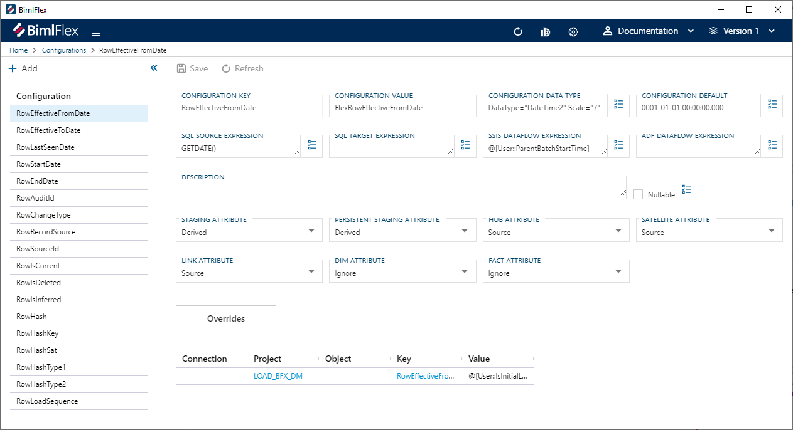
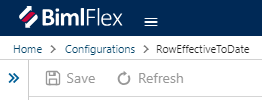

# Configurations

The **Configurations** module is used to manage configurations which drive the behavior of the BimlFlex product. By changing them the produced artifacts can adapt to support requirements for file locations, naming conventions, data conventions etc. The **Configuration** defaults are the Varigence recommended values and there is no need to change or configure unless there is a requirement to change specific behaviors. Align these settings with the organization's best practices and environmental requirements.

 **Configurations** can be found under Administration in the application menu.

> [!TIP]
> The [Configurations Reference Document](../reference-documentation/metadata-configurations.md) serves as a complete guide for all configurations available in the BimlFlex App.

## Action Buttons

The action buttons modify the **Configuration** that is active in the editor.

|Icon|Action|Description|
|-|-|-|
| 

 | Save | This will save any changes displayed in the **Configurations** editor.  The **Save** button is only enabled if there are changes in the editor. |
| 

 | Refresh | This will refresh the currently displayed **Configuration**. Any pending changes will be removed. |

## Configuration Editor

The **Configurations Editor** is used to manage all **Configurations**. The fields in the editor are defined in this table along with the validation rules.

|Field|Description|
|-|-|
| Configuration Key | A unique name for the **Configuration**. This value cannot be changed. Configuration Key must be unique. Configurating Key is required. |
| Configuration Value | The value to be used for the **Configuration**. Configuration Value is required. |
| Configuration Data Type | The data type the configuration uses. Must be a valid data type definition |
| Configuration Default | The default value to be applied be the **Configuration** |
| Sql Source Expression | SQL to be used by the **Configuration** when being applied to source data. |
| Sql Target Expression | Sql to be used by the **Configuration** when being applied to the target data. |
| SSIS Dataflow Expression | The SSIS Expression used to derive the value. Needs to be a valid SSIS Expression. Uses the shorthand @@this to define the current entity |
| ADF Dataflow Expression | Used to derive a value when using an ADF Dataflow. Adf Dataflow Expression is required with a derived Staging Attribute setting for Adf: Source -> Target Projects.  |
| Description | An optional description for custom attributes or definitions. The default configurations are described in this document |
| Nullable | Defines If the attribute is nullable Valid Enumeration |
| Staging Attribute | Should the configuration be included in the staging layer, and if so, how should it be created. Must be a valid [Configuration Attribute Type](#configuration-attribute). |
| Persistant Staging Attribute | Should the configuration be included in the persistent staging layer, and if so, how should it be created. Must be a valid [Configuration Attribute Type](#configuration-attribute). |
| Hub Attribute | Should the configuration be included in Hubs, and if so, how should it be created. Must be a valid [Configuration Attribute Type](#configuration-attribute). |
| Satellite Attribute | Should the configuration be included in Satellites, and if so, how should it be created. Must be a valid [Configuration Attribute Type](#configuration-attribute). |
| Link Attribute | Should the configuration be included in Links, and if so, how should it be created. Must be a valid [Configuration Attribute Type](#configuration-attribute). |
| Dim Attribute | Should the configuration be included in Dimensions, and if so, how should it be created. Must be a valid [Configuration Attribute Type](#configuration-attribute). If any Dimension objects in the project have Type 2 columns, Dim Attribute must be Derived. |
| Fact Attribute | Should the configuration be included in Facts, and if so, how should it be created. Must be a valid [Configuration Attribute Type](#configuration-attribute). |

## Configuration Overrides

**Configuration Overrides** are used to override Configuration fields. Configuration Overrides can be added and referenced in the **Configurations Editor**. All overrides applied to the **Configuration** are listed in the Overrides section of the editor. **Configuration Overrides** can be applied to any of the fields that have an  [Override Configuration] button associated with it.

Configuration Overrides are saved in BimlFlex as **Attributes**. The [Attributes Documentation](attributes.md) provides information on **Attributes** and how to manage them.

### Add a Configuration Override

To add a **Configuration Override**, click  **Override Configuration** next to the field you would like to override and fill out the Add Attribute form.

[!include[Add Attribute Dialog](_dialog-add-attribute.md)]

The Attribute fields are used as the Configuration Override as defined in this table.
|Attribute field Name|Configuration Field Name|Description|
|-|-|-|
| Attribute Type || Defines the scope for when the override is applied. |
| Attribute | ConfigurationKey_ConfigurationField | Defines the Configuration field that will be overridden in this format: ConfigurationKey_ConfigurationField |
| Attribute Value || The value to be used as the override. |
| Attribute Property |||
| Description || Description of the Configuration Override. |

### Edit or Delete a Configuration Override

**Configuration Overrides** are managed as **Attributes** in BimlFlex. To manage a configuration override, click the value in the Key column of the Overrides table. The [Attributes Documentation](attributes.md) provides information on **Attributes** and how to manage them.

[!include[Configuration Attribute Types](_enum-configuration-attribute.md)]