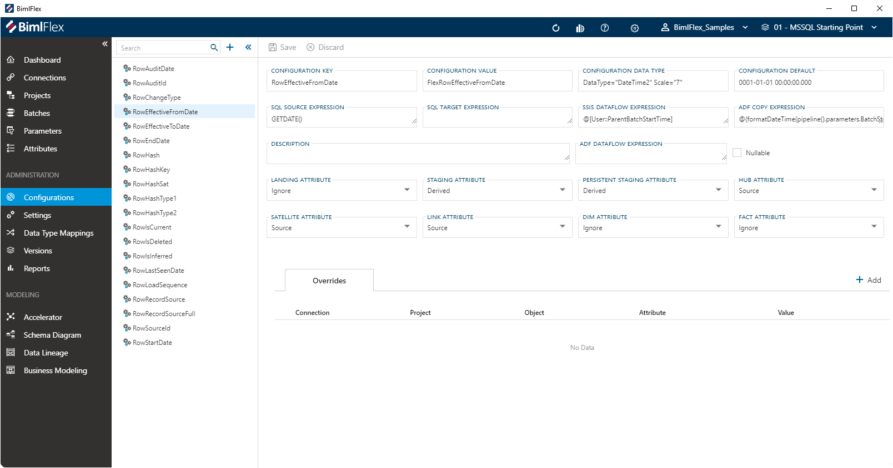
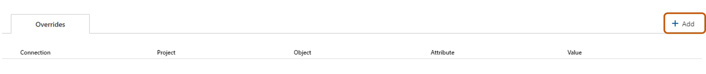

# Configuration Editor

The **Configuration Editor** is used to manage configurations which drive the behavior of the BimlFlex product.
By changing them the produced artifacts can adapt to support requirements for file locations, naming conventions, data conventions etc.
The **Configuration** defaults are the Varigence recommended values and there is no need to change or configure unless there is a requirement to change specific behaviors.
Align these settings with the organization's best practices and environmental requirements.

 **Configurations** can be found under Administration in the application menu.

> [!TIP]
> The [Configurations Reference Document](../reference-documentation/metadata-configurations.md) serves as a complete guide for all configurations available in the BimlFlex App.

## Action Buttons

The action buttons modify the **Configuration** that is active in the editor.

| Icon                                                                                               | Action  | Description                                                                                                                                     |
| -------------------------------------------------------------------------------------------------- | ------- | ----------------------------------------------------------------------------------------------------------------------------------------------- |
| 

 | Save | This will save any changes displayed in the **Configurations** editor.  The **Save** button is only enabled if there are changes in the editor. |
| 

 | Discard | **Discard** any unsaved changes and revert to last saved form.                                                                                  |

## Configuration Editor

The **Configuration Editor** is used to manage all **Configurations**.
The fields in the editor are defined in this table along with the validation rules.

| Field                        | Description |
|----------------------------- | ----------- |
| Configuration Key            | The Configuration Key is the internal unique key BimlFlex refers to for the given **Configuration**. This value cannot be changed.|
| Configuration Value          | The Configuration Value corresponds to the name of the **Column** that will be created for the **Object** this configuration will be applied to. This can be modified to support a different pattern or behavior.|
| Configuration Data Type      | The data type the  **Configuration** uses. This needs to be a valid data type definition.|
| Configuration Default        | The value that will be inserted by default when a NULL value is encountered for the **Configuration**.|
| SQL Source Expression        | SQL to be used by the **Configuration** when being applied to source data.|
| SQL Target Expression        | SQL to be used by the **Configuration** when being applied to the target data.|
| SSIS Dataflow Expression     | The SSIS Expression that will be applied to the column to derive a specific value. Needs to be a valid SSIS Expression. The  shorthand `@@this` to define the current entity.|
| ADF Copy Expression          | The expression that will be used in an ADF Copy activity to derive a specific value. Needs to be a valid ADF expression. The  shorthand `@@this` to define the current entity.|
|ADF Dataflow Expression      | Used to derive a value when using an ADF Dataflow. Adf Dataflow Expression is required with a derived Staging Attribute setting for Adf: Source -> Target Projects.|
| Description                  | An optional description for custom attributes or definitions. The default configurations are described in this document.|
| Nullable                     | Defines If the attribute is nullable Valid Enumeration {`Empty`, `Y`, `N`}|
| Landing Attribute            | Determines if the configuration is applied to objects in a `Landing` connection, and how this is done. Must be a valid [Configuration Attribute Type](#configuration-attributes).|
| Staging Attribute            | Determines if the configuration is applied to objects in a `Staging` connection, and how this is done. Must be a valid [Configuration Attribute Type](#configuration-attributes).|
| Persistent Staging Attribute | Determines if the configuration is applied to objects in a `Persistent Staging` connection, and how this is done. Must be a valid [Configuration Attribute Type](#configuration-attributes).|
| Hub Attribute                | Determines if the configuration is applied to objects that have the `Hub` object type, and how this is done. Must be a valid [Configuration Attribute Type](#configuration-attributes).|
| Satellite Attribute          | Determines if the configuration is applied to objects that have the `Satellite` object type, and how this is done. Must be a valid [Configuration Attribute Type](#configuration-attributes).|
| Link Attribute               | Determines if the configuration is applied to objects that have the `Link` object type, and how this is done. Must be a valid [Configuration Attribute Type](#configuration-attributes).|                                                                                                 |
| Dim Attribute                | Determines if the configuration is applied to objects that have the `Dimension` object type, and how this is done. Must be a valid [Configuration Attribute Type](#configuration-attributes). If any Dimension objects in the project have `Type 2` columns, *Dim Attribute* must be set to `Derived`.|
| Fact Attribute               | Determines if the configuration is applied to objects that have the `Fact` object type, and how this is done. Must be a valid [Configuration Attribute Type](#configuration-attributes).|

## Configuration Overrides

**Configuration Overrides** are used to override Configuration fields.
Configuration Overrides can be added and referenced in the **Configurations
All overrides applied to the **Configuration** are listed in the Overrides section of the editor.
**Configuration Overrides** can be applied to any of the fields that have an  [Override Configuration] button associated with it.

Configuration Overrides are saved in BimlFlex as **Attributes**.
The [Attributes Documentation](attributes.md) provides information on **Attributes** and how to manage them.

### Add a Configuration Override

To add a **Configuration Override**, click `+ Add` on the Overrides tab.

[!include[Add Attribute Dialog](_dialog-add-attribute.md)]

The Attribute fields are used as the Configuration Override as defined in this table.
Required fields will be outlined in red.

> [!NOTE]
> It is now possible to override the configuration attribute values as needed.

| Attribute Field Name     | Configuration Field Name                   | Description                                         |
| ------------------------ | ------------------------------------------ | --------------------------------------------------- |
| Attribute Type           |                                            | Defines the scope for when the override is applied. |
| Connection               |                                            | Defines the **Connection** for which the attribute applies.                                                |
| Object                   |                                            | Defines the **Object** for which the attribute applies.                                                 |
| Column                   |                                            | Defines the **Column** for which the attribute applies.                                                 |
| Overridden Configuration |                                            | Defines the Overridden Configuration to which the attribute applies.                                                 |
| Attribute Value          | The value to be used as the override.      |
| Description              | Description of the Configuration Override. |

### Edit or Delete a Configuration Override

**Configuration Overrides** are managed as **Attributes** in BimlFlex.
To manage a configuration override, click the value in the Key column of the Overrides table.
The [Attributes Documentation](attributes.md) provides information on **Attributes** and how to manage them.

[!include[Configuration Attribute Types](_enum-configuration-attribute.md)]
