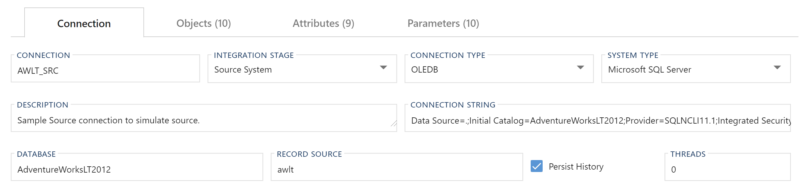

# Connection Editor

**Connections** provide the information required to connect to data sources. It also acts as containers for objects and allows setting overrides. Additionally, it has metadata to identify the integration stage along with package execution settings.

## Editor Overview

The following sections describe the UI elements of the **Connection Editor** and how they are used to author and manage BimlFlex **Connections**.

### Cloud Based Linked Services

**Connections** can be enabled to work with cloud based linked services. For information on linked service connections and setup see [Configuring a Linked Service Connection](xref:create-linked-service-connection).

## Details Tab

The **Details Tab** focuses on general **Connection** information and configuration.  This tab is used to define and create the **Connection** itself.

### Details Tab - Action Buttons

<!--

-->

| Icon | Action | Description |
|--- |--- |--- |
| 

 | Save | This will save the currently set of staged changes.  The **Save** button is will only enable if the **Connection** has changes staged and there are no major validation issues with the current **Connection** properties.  `Ctrl+S` shortcut available. |
| 

 | Discard | This will **Discard** any unsaved changes and revert to last saved form. |
|

 | Archive | This will hard delete the selected **Connection**.  This will result in the physical removal of the selected record from the metadata database.  The data will no longer be accessible by the BimlFlex app and will require a Database Administrator to restore, if possible. Clicking **Archive** creates an [Archive Connection Dialog](#archive-connection-dialog-box). |
| 

 | Duplicate | This will create a duplicate of the selected **Connection**.  A [Duplicate Connection Dialog](#duplicate-connection-dialog-box) will appear asking for a *Connection Name* and a new **Connection** will be created using all of the selected **Connection**'s current properties. |
| 

 | Import Metadata | Import Metadata from Source Database - [More info](../concepts/importing-metadata.md). |
|  | Cloud | This is only required if using ADF.  When enabled allows the configuration of Linked Services and shows the Linked Service fields. |
|  | Exclude | This will remove the **Connection** and all associated entities from processing and validation.  This is designed to be paired with the `Use My Exclusions (Locally)` global setting to allow for multiple developers to work on different functional areas without deleting or globally excluding entities. |
|  | Deleted | This will soft delete the currently selected **Connection**.  This will remove the **Connection** and all associated entities from processing and validation. |

[//]: # (TODO: Connection String Editor document an link from Connection String Field)

### Additional Dialogs

[!include[Archive Connection Dialog Box](_dialog-archive-connection-single.md)]

[!include[Duplicate Connection Dialog Box](_dialog-duplicate-connection.md)]

### Details Tab - Fields

| Field | Description |
|-|-|
| Connection | The name of the connection. Must be unique. |
| Integration Stage | Integration Stage may include Source, Staging, Raw Data Vault, Data Mart etc.  Must be a valid [Integration Stage](#integration-stages). |
| Connection Type | Connection type to be used to connect to database.  If SQL Based ELT is supported for the *Integration Stage*, a `<Connection Type> SQL Based ELT` will show as an alternate option from the standard `<Connection Type>`.  Must be a valid [Connection Type](#connection-types). |
| System Type | Connection type of the data source.  Must be a valid [System Type](#system-types). |
| Description | Optional metadata to provide description. |
| Connection String | Connection String to be used to connect to database. |
| File Path | Only available for File Connection Types. |
| File Pattern | Only available for File Connection Types. |
| Database | Only available for MSSQL System Type. |
| Catalog | For all non-MSSQL System Types. |
| Record Source | Only available for Source Integration Stage. |
| Provider | Only available for ADONET Connection Type (ConnectionType : `ADONET`). |
| Landing Connection | Only available for Cloud Enabled Source Integration Stage. |
| Persist History | Only available for Source Integration Stage. |
| Threads | The number of threads to use during SSIS package execution.  Zero means no limit. |

> [!NOTE]
> **SQL Based ELT:**  
> 
> When enabled the bulk of the transformation logic will be handled via a SQL Stored Procedure.  The selected platform in the *Integration Template* will then be primarily used for orchestration purposes only.
>  
> If using SQL Based ELT on **Connection** with the *Integration Stage* of `Staging Area`, reloading from the PSA is not supported.
>  
> **ADF Project Connections:**  
> 
> A **Project** with the *Integration Template* of `ADF: Source -> Target` requires the **Connection** to be using SQL Based ELT.

### Allowed Values

[!include[Integration Stages](_enum-integration-stage.md)]

[!include[Connection Types](_enum-connection-type.md)]

[!include[System Types](_enum-system-type.md)]

## Tab Details

## Objects Tab

The **Objects Tab** provides quick access to all **Objects** included in the **Connection**.

[!include[Objects Tab](_tab-objects.md)]

## Attributes Tab

The **Attributes Tab** provides a view of any **Configurations** or **Settings** overrides that have been applied to the selected **Connection**.  

[!include[Attributes Tab](_tab-attributes.md)]

## Parameters Tab

The **Parameters Tab** provides a view of any **Parameters** overrides that are associated with the selected **Connection**.  

[!include[Parameters Tab](_tab-parameters.md)]
