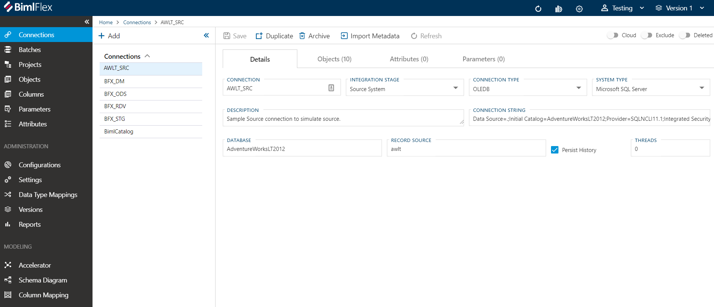

# Connections

Connections provide the information required to connect to data sources. It also acts as containers for objects and allow setting overrides plus it has metadata to identify the integration stage along with package execution settings. 

## Action Buttons

||||
|--- |--- |--- |
|

| Save | Save changes. Ctrl+S shortcut available.|
|

| Duplicate | Duplicate connection.|
|

| Archive | Archive Connection.|
|

| Import Metadata | Import Metadata from Source Database - [More info](../concepts/importing-metadata.md).|
|

| Refresh | Refresh clears all changes.|

[//]: # (TODO: Connection String Editor document)

## Field Descriptions
* Connection - The name of the connection
* Integration Stage - Integration Stage may include Source, Staging, Raw Data Vault, Data Mart etc.  [More info](_enum-integration-stage.md).
* Connection Type - Connection type to be used to connect to database  [More info](_enum-connection-types.md).
* System Type - Connection type of the datasource  [More info](_enum-system-type.md).
* Description - Free text
* Connection String - Connection String to be used to connect to database - [More info about Connection String Editor](connection-string-editor.md).
* File Path - Only availabe for File Connection Types
* File Pattern - Only availabe for File Connection Types
* Database - Only availabe for MSSQL System Type
* Catalog - For all non-MSSQL System Types
* Record Source - Only availabe for Source Integration Stage
* Provider - Only availabe for ADONET Connection Type (ConnectionType : ADONET)
* Landing Connection - Only availabe for Cloud Enabled Source Integration Stage 
* Persist History - Only availabe for Source Integration Stage
* Threads - The number of threads to use during SSIS package execution. Zero means no limit.

## Tab Details

## Objects Tab

The [Objects Tab] provides quick access to all `Objects` included in the `Connection`.

[!include[Objects Tab](_tab-objects.md)]

## Attributes Tab

The [Attributes Tab] provides a view of any `Configurations` or `Settings` overrides that have been applied to the selected `Connection`.  

[!include[Attributes Tab](_tab-attributes.md)]

[//]: # (TODO: Include Parameters Tab)
