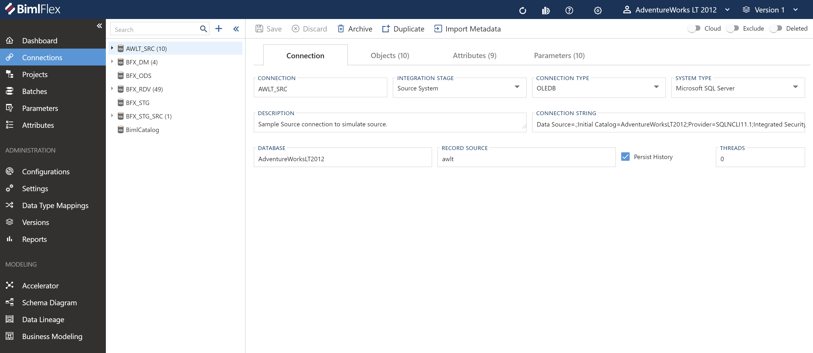

# Connection Editor

BimlFlex **Connections** provide the information required to connect to data sources. They also acts as containers for [**Objects**](xref:bimlflex-object-editor) and allow [**Setting Overrides**](xref:bimlflex-settings#setting-overrides).

Additionally, a connection definition includes metadata to identify the *Integration Stage* along with package execution settings.

Connections are used in [**Projects**](xref:bimlflex-project-editor) to direct BimlFlex in generating the overall intended flow of data.

## Overview

The following sections describe the User Interface elements of the **Connection Editor**, and how they are used to author and manage BimlFlex **Connections**. Detailed descriptions of each component is also available in the [reference documentation covering connections](xref:bimlflex-app-reference-documentation-Connections).

The **Connection Editor** contains four main tabs that can be used to modify connection details, as well as various properties and settings related to the **Objects** that are associated with the selected connection.

## Connection Tab

The **Connection Tab** is the first tab in the **Connection Editor**, and it is selected by default. The connection tab focuses on general connection information and configuration. This tab is used to define and create the **Connection** itself.

### Action Buttons

| Icon | Action | Description |
|--- |--- |--- |
| 

 | Save | This will persist changed made to the **Connection** modified in the designer. `Ctrl+S` can also be used as a shortcut.|
| 

 | Discard | This will Discard any unsaved changes and revert to last saved form.|
|

 | Archive | This will hard delete the selected **Connection**.  This will result in the physical removal of the selected record from the metadata database.  The data will no longer be accessible by the BimlFlex app and will require a Database Administrator to restore, if possible. Clicking **Archive** creates an [Archive Connection Dialog](#archive-connection-dialog). |
| 

 | Duplicate | This will create a duplicate of the selected **Connection**.  A [Duplicate Connection Dialog](#duplicate-connection-dialog) will appear asking for a *Connection Name* and a new **Connection** will be created using all of the selected **Connection**'s current properties. |
| 

 | Import Metadata | Import Metadata from Source Database - [More info](../concepts/importing-metadata.md). |
|  | Cloud | When enabled, this allows the configuration of Linked Services. This only applies to Azure Data Factory (ADF) deployments.|
|  | Exclude | This will remove the **Connection** and all associated entities from processing and validation.  This is designed to be paired with the `Use My Exclusions (Locally)` global setting to allow for multiple developers to work on different functional areas without deleting or globally excluding entities. |
|  | Deleted | This will soft delete the currently selected **Connection**.  This will remove the **Connection** and all associated entities from processing and validation. |

### Linked Services

**Connections** can be configured to be `cloud enabled` by modifying the *Cloud selection* button on the top-right of the connection screen. This will show (or hide) the Linked Services detailsEnablinenabled to work with cloud based linked services. For information on linked service connections and setup see [Configuring a Linked Service Connection](xref:create-linked-service-connection).

### Additional Dialogs

[!include[Archive Connection Dialog](_dialog-archive-connection-single.md)]

[!include[Duplicate Connection Dialog](_dialog-duplicate-connection.md)]

### Connection Tab - Fields

| Field | Description |
|-|-|
| Connection | The name of the connection. Must be unique. |
| Integration Stage | Integration Stage may include Source, Staging, Raw Data Vault, Data Mart etc.  Must be a valid [Integration Stage](#integration-stages). |
| Connection Type | Connection type to be used to connect to database.  If SQL Based ELT is supported for the *Integration Stage*, a `<Connection Type> SQL Based ELT` will show as an alternate option from the standard `<Connection Type>`.  Must be a valid [Connection Type](#connection-types). |
| System Type | Connection type of the data source.  Must be a valid [System Type](#system-types). |
| Description | Optional metadata to provide description. |
| Connection String | Connection String to be used to connect to database. |
| File Path | Only available for File Connection Types. |
| File Pattern | Only available for File Connection Types. |
| Database | Only available for MSSQL System Type. |
| Catalog | For all non-MSSQL System Types. |
| Record Source | Only available for Source Integration Stage. |
| Provider | Only available for ADONET Connection Type (ConnectionType : `ADONET`). |
| Landing Connection | Only available for Cloud Enabled Source Integration Stage. |
| Persist History | Only available for Source Integration Stage. |
| Threads | The number of threads to use during SSIS package execution.  Zero means no limit. |

> [!NOTE]
> **SQL Based ELT:**  
> 
> When enabled the bulk of the transformation logic will be handled via a SQL Stored Procedure.  The selected platform in the *Integration Template* will then be primarily used for orchestration purposes only.
>  
> If using SQL Based ELT on **Connection** with the *Integration Stage* of `Staging Area`, reloading from the PSA is not supported.
>  
> **ADF Project Connections:**  
> 
> A **Project** with the *Integration Template* of `ADF: Source -> Target` requires the **Connection** to be using SQL Based ELT.

### Allowed Values

[!include[Integration Stages](_enum-integration-stage.md)]

[!include[Connection Types](_enum-connection-type.md)]

[!include[System Types](_enum-system-type.md)]

## Objects Tab

The **Objects Tab** provides quick access to all **Objects** included in the **Connection**.

[!include[Objects Tab](_tab-objects.md)]

## Attributes Tab

The **Attributes Tab** provides a view of any **Configuration** or **Setting** overrides that have been applied to the selected **Connection**.  

[!include[Attributes Tab](_tab-attributes.md)]

## Parameters Tab

The **Parameters Tab** provides a view of any **Parameters** overrides that are associated with the selected **Connection**.  

>[!NOTE]
> This is exclusive to the **Connection** level.  Additional overrides may be present on any grains higher or lower than the **Connection**.

[!include[Parameters Tab](_tab-parameters.md)]
