# Dashboard 

## Overview

The dashboard provides a quick view of the metadata in the version and contains the most common tasks and navigation options.

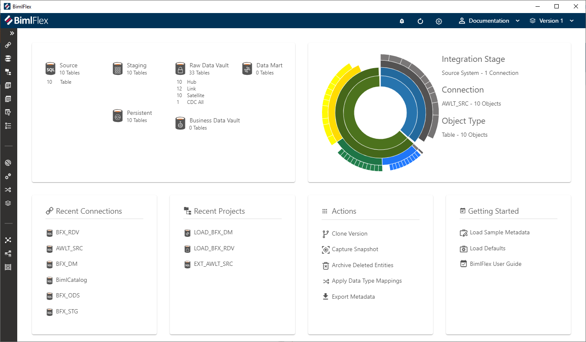

## Sunburst

The Sunburst Graph gives users a quick graphical overview of their Metadata and provides a convenient way to browse to specific tables from from the dashboard.

The default view of the Sunburst shows us concentric circles with:
1. `Integration Stages` layer in the center
1. `Connections` layer next layer out from the center
1. `Object Types` the third layer
1. `Objects` outer layer

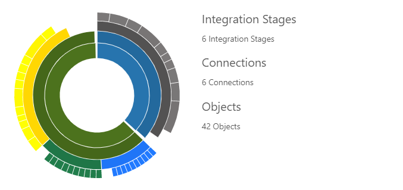

### Sunburst Zooming and Hovering

By clicking a slice of a layer the Sunburst zooms into that slice's information.

When a user hovers over a slice of a layer the information on the right will dynamically update the show the contextual data for that slice.

In the image below the sunburst is zoomed into the Raw Data Vault `Integration Stage` and the mouse is hovering over the Hub `Object Type`.

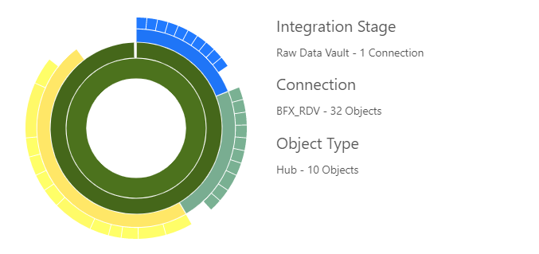

In the image below the sunburst is zoomed into the Link `Object Type` and the mouse is hovering over the LNK_Product_ProductCategory `Table`.

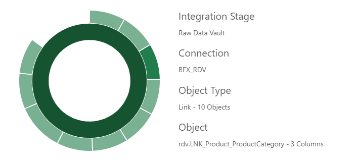

By clicking in the center of the Sunburst users can zoom back out to the full Sunburst view.

### Sunburst Navigation

Users can navigate to an Entity's Editor Screen by clicking on the object slice in the Sunburst.

## Recent Connections

The Recent Connections pane on the dashboard will display the most recently updated **Connections**. It can be found in the bottom left of the dashboard window.

## Recent Connections Pane Overview

The **Recent Connections** pane displays the most recently updated **Connections** to allow for quick access and modification of **Connections**.

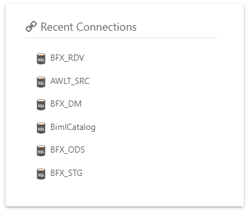

- The type of **Connection** is represented by the **Connection** icon
- Click the name of the **Connection** to navigate to the **Connections** page
- Hovering over a **Connection** name will show when the most recent change was made
- Hover over a **Connection** and click the ellipses for the quick menu options

## Connections Quick Menu

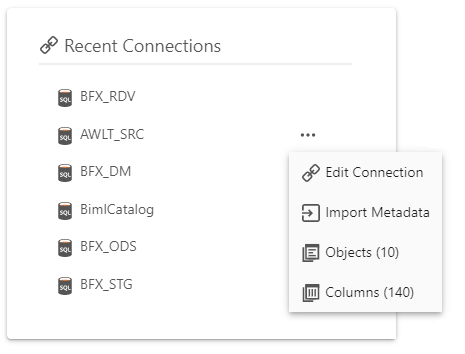

- Click  **Edit Connection** to navigate to the **Connections Editor**
- Click  **Import Metadata** to navigate to the Import Metadata screen for your Source Connection. This link will only appear for **Connections** with a Source System Integration Stage.
- Click  **Objects** to navigate to the **Objects** page filtered to **Objects** associated with the **Connection**. The number displayed is the number of **Objects** related to the **Connection**
- Click  **Columns** to navigate to **Columns** related to the **Connection**. The number displayed in parentheses is the number of **Columns** related to the **Connection**

## Recent Projects

The Recent Projects pane on the dashboard will display the most recently updated **Projects**. It can be found in the bottom left of the dashboard window.

## Recent Projects Pane Overview

The Recent Projects pane displays the most recently updated **Projects** to allow for quick access and modification of **Projects**.

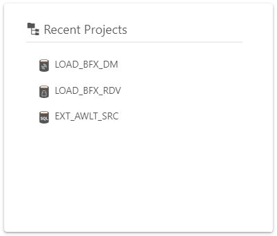

- The type of **Project** is represented by the Project icon
- Click the name of the **Project** to navigate to the **Projects Editor**
- Hovering over a **Project** name will show when the most recent change was made
- Hover over a **Project** and click the ellipses for the quick menu options

## Projects Quick Menu

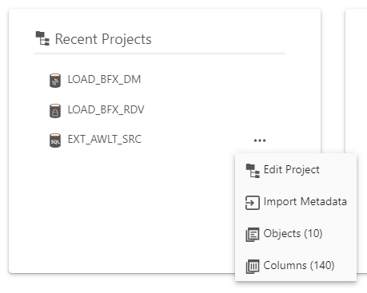

- Click  **Edit Projects** to navigate to the **Projects Editor**
- Click  **Import Metadata** to navigate to the Import Metadata screen for the **Source Connection**. This link will appear for **Projects** with a **Connection** that has a `Source System` Integration Stage.
- Click  **Objects** to navigate to **Objects** related to the **Project**. The number displayed is the number of **Objects** related to the **Project**
- Click  **Columns**  to navigate to **Columns** related to the **Project**. The number displayed is the number of **Columns** related to the **Project**

## Action Buttons

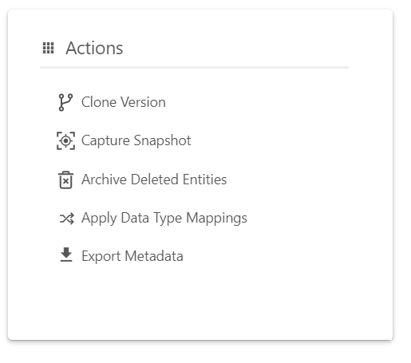

### Clone Version

Clone the current version to a new version.

### Snapshots

Hover over **Capture Snapshot** and click the ellipses for more options.

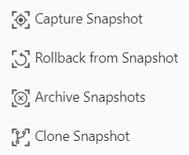

* Capture - Capture a snapshot of the current version's metadata.
* Rollback - Rollback this version from a previous metadata snapshot.
* Archive - Archive (delete) snapshot based on snapshot type and age.
* Clone - Clone a snapshot to a Customer and Version. Create a new version or override an old version.

### Archive Deleted Entities

Archive deleted entities of the selected types. Be aware that this action cannot be undone.

### Apply Data Type Mappings

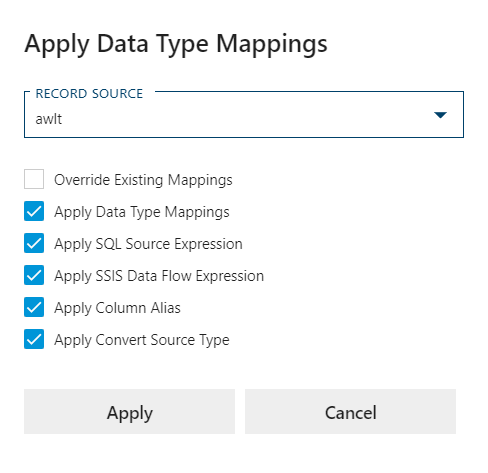

The Data Type Mappings are added to all columns for a specific `Record Source`

See [More info](data-type-mappings.md).

## Export Metadata

Export metadata creates a zipped file which includes the current version's metadata and an info file. This is especially useful for support purposes.

## Getting Started

Getting Started contains info and complete sets of Metadata examples to quickly get you up and running with the BimlFlex App.

### Load Sample Metadata

Contains complete sets of Metadata to serve as an example for users to refer to. These examples are also useful when following along with the Getting Started Videos.

[More info](../getting-started/sample-metadata.md) about the various Sample Metadata sets.

### Load Defaults

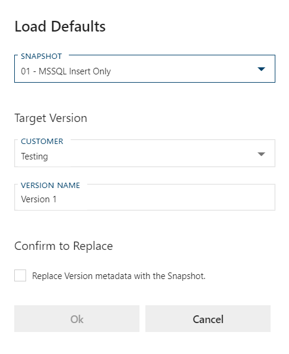

Set the specified defaults on the selected target version. Unlike the Load Sample Metadata this does not override the target version metadata.

### BimlFlex User Guide

Link to this documentation from within the dashboard.
