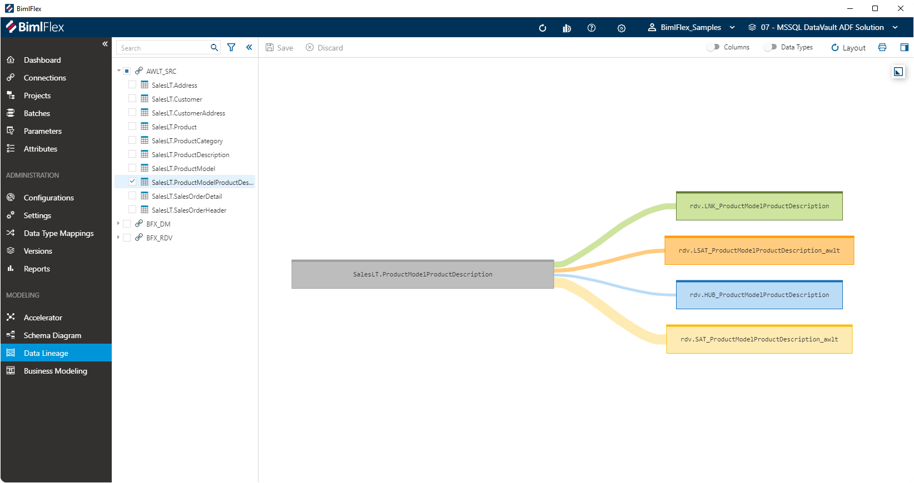

# Data Lineage

The **Data Lineage Designer** can be used to review and update your **Column Mappings** in an easy graphical interface.

The designer provides an view of one or more relationships between **Columns**, referred to as source-target mappings or simply 'mappings'. This designer allows a modeler to get a quick view of mappings in a graphical interface, as well as making it easy to add or remove mappings using column drag and drop. Common actions in the context of data mapping are also supported.

The screenshot above shows the mapping from a source Object to the various target Data Vault objects.

## Action Bar

| Icon | Action | Description |
|----- |--------|-------------|
| 

 | Save | This will persist changed made to the **Objects** and **Columns** modified in the designer.|
| 

 | Discard | Pending changes made to the **Objects** and **Columns** will be discarded.|
| 
 | Columns | Toggle to show the **Columns** for all **Objects** on the canvas.|
| 
 | Data Types | Toggle to show the **Columns** for all **Objects** on the canvas.|
| 
 | Layout | Reset the way the diagram is rendered on the screen to its default.|
| 
 | Print | Creates printable image from the diagram, and opens the Windows print dialog.|
| 
 | Expand Side Panel | Opens the Side Panel that enables editing of selected **Objects**, **Columns** and **Relationships**. This is context-aware, visible fields will depend on the selected item on the canvas.

## Overview

It is possible to show a smaller **Overview** when working with large models. You can open this overview by clicking the `Expand Overview` icon ()in the top-right corner of the canvas. The **Overview** can be used to navigate the model quickly by dragging and zooming in the **Overview**.|

## Treeview Interaction

Selecting **Objects** in the **Treeview** will add these objects to the canvas, including the objects they are receiving data from or where they themselves act as a source for a data mapping.

* If you select **Objects** from a **Connection** with a `Source System` **Integration Stage** the upstream (outgoing) objects will be displayed on the canvas
* If you select **Objects**  where the associated **Connection** has the **Integration Stage** of `Raw Data Vault` or `Data Mart`, then the downstream (incoming) objects will be made visible

The context-aware actions that the Data Lineage Designer allows will sometimes also check or un-check objects in the Treeview to produce the right visual.

## Context-Specific Actions

Depending on whether you select an **Object**, **Column** or **Relationship** there are various convenience actions that become available.

### Object Action Menu

By clicking on a ellipsis on the object, the designer will be presented with the object-level actions.

The following options are available:

| Icon | Action | Description |
|----- |--------|-------------|
| 

 | Object Details | This open the [Object Side Panel](xref:bimlflex-data-lineage#object-side-panel), which will allow modification of various **Object** details.|
| 

 | Show All Mappings | Add the **Objects** to the canvas that have a mapping to, or from, the selected **Object**. If incoming or outgoing related objects are added depends on the **Integration Stage** of the **Connection** that the selected object is associated with. Please refer to [Treeview Interaction](xref:bimlflex-data-lineage#treeview-interaction) for more details. |

### Object Side Panel

The side panel that contains **Object** details can be opened by double-clicking on the **Object** or by using the **Object Details** button in the [**Object Action Menu**](xref:bimlflex-data-lineage#object-action-menu).

### Column Action Menu

Clicking on the ellipsis for any column will show the column-level action options:

## Drag and Drop Actions

**Objects** can be moved on the canvas to make the layout easier to view. This can be done by hovering over the object name until the Arrow Cross mouse pointer appears.

At **Column** level, drag-and-drop operations can be used to create new mapping relationships between columns.

## Filtering Tables

Use filtering in the Selection pane to see only specific tables in your view. There are two Selection Panes in the Column Mapping diagram. The Source and Target selection panes are related and have certain rules which are enforced:

1. The target pane can not show source **Integration Stages**.
1. The target pane has to have a **Integration Stage** that is down-stream from the source **Integration Stage**, i.e. if the source is an RDV, then the target cannot be RDV, but can be Data Mart.

## Auto Selection of Mapped Tables

The Column Mapping auto selects all the direct mapped tables when a user makes a selection. This can be utilized by users to easily select the views they are interested in.

Examples:

* When a user selects a source table in a SRC => RDV schema it will automatically select the HUB, LINK(s) and SAT(s).
* To view only SRC => HUBs a user can select the Hubs in the target pane.
* To view only SRC => LNKs a user can select the Links in the target pane.
* To view only SRC => SATs a user can select the Satellites in the target pane.
* To view only SRC => HUBs and LNKs a user can select the Hubs and Links in the target pane.

The example above shows Source to Hub mappings.

## Auto De-Selection of Mapped Tables

When a user de-selects a table the Column Mapping diagram will also remove the mapped table if it is the last mapping.

When a user de-selects a table the Column Mapping diagram which is not the last mapping the mapped table will not be removed.

To illustrate this, see the image below.

* If a user de-selects the HUB it will only remove the HUB, but if he de-selects the HUB and the SAT it will also remove the Source table.
* If a user de-selects the Source table it will also remove the HUB and the SAT tables.

