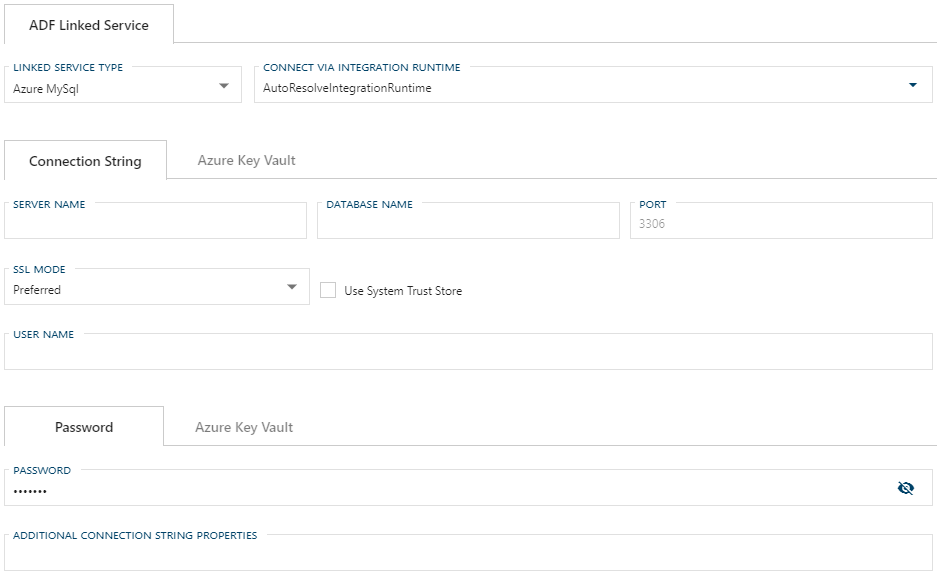

# Configuring an ADF Linked Service Connection for Azure Database for MySQL

> [!NOTE]
> For information on how to enable a connection for use with linked services, see [Configuring a Linked Service Connection](create-linked-service-connection.md).

After selecting `Azure MySQL` from the Linked Service Type dropdown, the form required for creating an Azure Database for MySQL Linked Service will appear.

## Required Fields

The required fields are:

- [Configuring an ADF Linked Service Connection for Azure Database for MySQL](#configuring-an-adf-linked-service-connection-for-azure-database-for-mysql)
  - [Required Fields](#required-fields)
    - [Connect via Integration Runtime](#connect-via-integration-runtime)
    - [Connection String](#connection-string)
    - [User Name](#user-name)
    - [Password](#password)
    - [SSL Mode](#ssl-mode)
    - [Use System Trust Store](#use-system-trust-store)
    - [Additional Connection String Properties](#additional-connection-string-properties)
    - [Azure Data Factory Linked Services Additional Information](#azure-data-factory-linked-services-additional-information)

Optional fields are:

+ Port
+ [Additional Connection String Properties](#additional-connection-string-properties)

### Connect via Integration Runtime

Connect via Integration Runtime is required for an Azure MySQL Linked Service connection.
The default value is `AutoResolveIntegrationRuntime`.
To use a custom runtime, type the name into the editable dropdown or select from the Azure Integration Runtimes saved in BimlFlex settings.
The custom values that appear in this dropdown can be maintained in Settings under Azure - AzureIntegrationRuntime.

### Connection String

A connection to an Azure MySQL linked service requires a Connection String.
The required properties for the Connection String are Server Name, Database Name, User Name, and Password.
The Linked Service connection form will provide text boxes for these values and will use them to construct the connections string.

> [!NOTE]
> It is suggested that [Azure Key Vault](linked-service-azure-key-vault.md) be used in place of manually entering Connection String details.

### User Name

User Name is will be used by the Linked Service form for authentication with the Azure MySQL Linked Service.
User Name is required - except when using Azure Key Vault in place of a manually entering a Connection String.

### Password

Password is will be used by the Linked Service form for authentication with the Azure MySQL Linked Service.
Password is required - except when using Azure Key Vault in place of a manually entering a Connection String.

> [!NOTE]
> It is suggested that [Azure Key Vault](linked-service-azure-key-vault.md) be used in place of manually entering the Password.

### SSL Mode

SSL Mode specifies encryption and verification when connecting to Azure MySQL.
The values are represented as:

+ Disabled (0)
+ Preferred (1) (Default)
+ Required (2)
+ Verify_ca (3)
+ Verify_identity (4)

### Use System Trust Store

If selected, a CA certificate will be used from the System Trust Store or PEM file.
`Use System Trust Store` is required except when SSL Mode is set to Disabled.

### Additional Connection String Properties

Any additional properties entered here will be included in the Connection String.
These properties should be entered the same way you want them to appear in the Connection String and separated by a semicolon, e.g. `key=value;secondKey=secondValue`.

Values entered in the Additional Connection String Properties textbox will be maintained when changing linked service types.
If a required property from one service type does not have a corresponding text box in the newly selected linked service type, it will appear as an additional property.

### Azure Data Factory Linked Services Additional Information

For additional information on ADF Linked Service types and their connection requirements see the [Azure Data Factory Azure MySQL Connector documentation](https://docs.microsoft.com/en-us/azure/data-factory/connector-azure-database-for-mysql).
