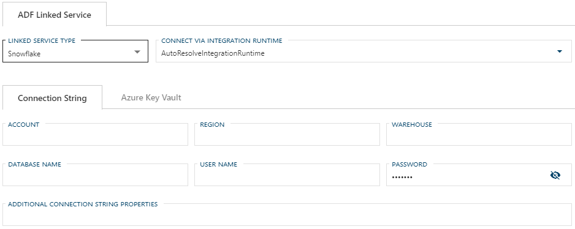

# Configuring a Linked Service Connection for Snowflake Data Warehouse

> [!NOTE]
> For information on how to enable a connection for use with linked services, see [Configuring a Linked Service Connection](create-linked-service-connection.md).

[//]: # (TODO List of stages, connection types, and system types that can use Snowflake)

After selecting `Snowflake` from the Linked Service Type dropdown, the form required for creating a Snowflake Linked Service will appear.

### Required Fields

The required fields are:

+ [Connect via Integration Runtime](#connect-via-integration-runtime)
+ [Connection String](#connection-string) (or [Azure Key Vault](create-linked-service-connection.md))
  + Account
  + Region
  + Warehouse
  + Database Name
  + User Name
  + Password

Optional fields are:

+ [Additional Connection String Properties](#additional-connection-string-properties)

#### Connect via Integration Runtime

Connect via Integration Runtime is required for a Snowflake Linked Service connection. The default value is `AutoResolveIntgrationRuntime`. To use a custom runtime, type the name into the editable dropdown or select from the Azure Integration Runtimes saved in BimlFlex settings. The custom values that appear in this dropdown can be maintained in Settings under Azure - AzureIntegrationRuntime.

#### Connection String

A connection to a Snowflake linked service requires a connection string. The required properties for the connection string are Server Name, Database Name, User Name, and Password. The Linked Service connection form will provide text boxes for these values and will use them to construct the connections string.

> [!TIP]
> It is suggested that [Azure Key Vault](linked-service-azure-key-vault.md) be used in place of manually entering Connection String details.

#### Additional Connection String Properties

Any additional properties entered here will be included in the Connection String. These properties should be entered the same way you want them to appear in the connection string and separated by a semicolon, e.g. `key=value;secondKey=secondValue`.

Values entered in the Additional Connection String Properties textbox will be maintained when changing linked service types. If a required property from one service type does not have a corresponding text box in the newly selected linked service type, it will appear as an additional property.

### Snowflake Additional Documentation

For additional information on Snowflake and its connection requirements see the [Snowflake User Guide](https://docs.snowflake.net/manuals/user-guide-connecting.html).
