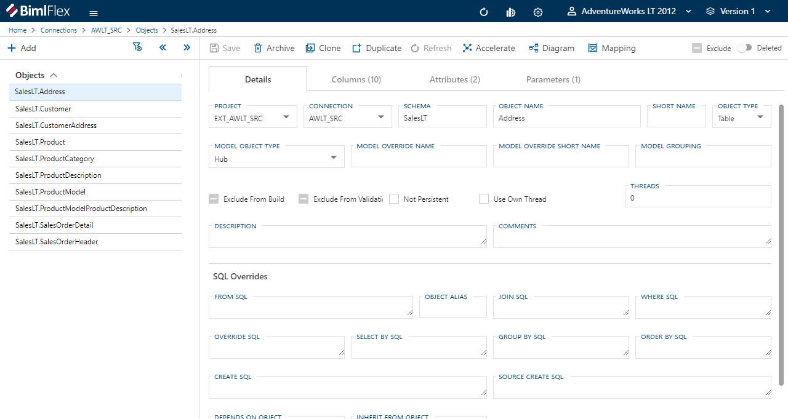
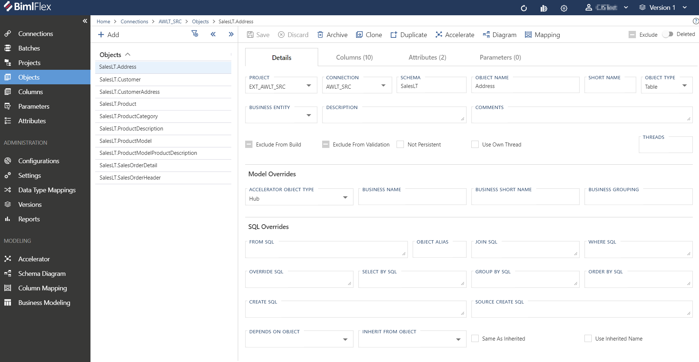
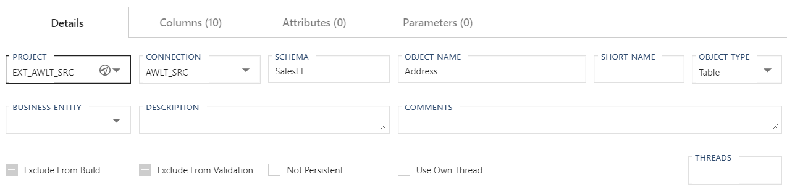
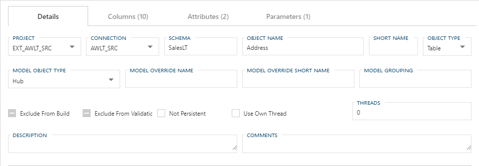
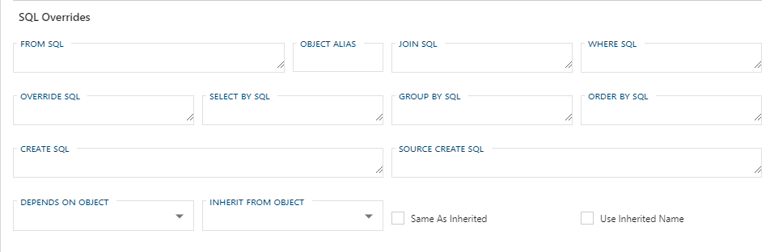

# Objects Editor

BimlFlex **Objects** closely mirror a Relational Database table, though not every **Object** will translate as a table 1 for 1 due to  BimlFlex having the ability to process flat files, Excel documents and, via use of Extensions Points, APIs calls.  Instead of using multiple entity types to handle these scenarios BimlFlex uses managed metadata and the *Object Type* field to annotate what type of **Object** is being referenced.  

## Editor Overview

The following sections describe the UI elements of the **Objects Editor** and how they are used to author and manage BimlFlex **Objects**.

<!--
**Objects Editor**  

-->

**Objects** within BimlFlex are displayed in hierarchical tree view on the left sidenav menu.
The number of Objects will be displayed next to the Object name in parentheses.

Selecting a single Object will immediately navigate the user to the Parameter edit screen.

Selecting multiple Objects will display a list of all objects available. The user may navigate to any Object by selecting from the displayed list.

## Details Tab

The **Details Tab** focuses on general **Object** information and configuration.  This tab is used to define and create the **Object** itself.

### Details Tab - Action Buttons

|Icon|Action|Description|
|-|-|-|
| 

 | Save | This will save the current set of staged changes.  The **Save** button is will only enable if the **Object** has changes staged and there are no major validation issues with the current **Object** properties. |
| 

 | Archive | This will hard delete the selected **Object**.  This will result in the physical removal of the selected record from the metadata database.  The data will no longer be accessible by the BimlFlex app and will require a Database Administrator to restore, if possible. Clicking **Archive** creates an [Archive Object Dialog](#archive-object-dialog-box). |
| 

 | Clone | This will bring up [Clone Table Dialog](#clone-table-dialog-box) that is used primarily in the creation and loading of a Data Mart. |
| 

 | Duplicate | This will create a duplicate of the selected **Object**.  A [Duplicate Table Dialog](#duplicate-table-dialog-box) will appear asking for a *Target Table Name* and a new **Object** will be created using all of the selected **Object**'s current properties. |
| 

 | Refresh | This will trigger a refresh of the metadata for the selected **Object**. |
| 

 | Accelerate | This will transition to the [Data Vault Accelerator](../modeling-tools/accelerator.md) and select the current active **Object**.  See the annotated link for details on use and function.|
| 

 | Diagram | This will transition to the [Schema Diagram](../modeling-tools/schema-diagram.md) and select the current active **Object**.  See the annotated link for details on use and function.|
| 

 | Mapping | This will transition to the [Column Mapping Tool](../modeling-tools/column-mapping.md) and select the current active **Object**.  **Column Mapping** provides and insight to the data linage of the target **Object**.  See the annotated link for details on use and function. |
| | Exclude | This will remove the **Object** and all associated entities from processing and validation.  This is designed to be paired with the `Use My Exclusions (Locally)` global setting to allow for multiple developers to work on different functional areas without deleting or globally excluding entities. |
|   | Deleted | This will soft delete the currently selected **Object**.  This will remove the **Object** and all associated entities from processing and validation. |

[//]: # (TODO: Find a switch SVG to use for Deleted)

[!include[Restore Entities Tip](_tip-restore-entities.md)]

### Additional Dialogs

[!include[Archive Object Dialog Box](_dialog-archive-object-single.md)]

[!include[Clone Table Dialog Box](_dialog-clone-table.md)]

[!include[Duplicate Table Dialog Box](_dialog-duplicate-table.md)]

### Details Tab - Standard Fields

The standard fields hold the bulk of the metadata that will be used to integrate the **Object**.  Additional fields to manage the modeling and the ability to toggle **Object** level persistence is provided.  

<!--

-->

|Field|Description|
|-|-|
| Project | The **Project** used to process the **Object**.  Must be an existing **Project**. |
| Connection | The **Connection** to the source for the **Object**.  Must be an existing **Connection**. |
| Schema | The schema assigned to the current **Object**.  |
| Object Name | The name of the **Object**.  On an [Object Type] that does not recognize the schema concept this still used in the generation of naming patterns depending on what **Settings** are being used.|
| Short Name | The name to be used when performing ETL/ELT in an integration environment that does not support the full string of the concatenated name. |
| Object Type | The type of **Object** that is either being extracted or created, depending on the *Integration Stage* of the **Connection** associated with the **Object**.  Must be a valid [Object Type](#object-types) (filtered for appropriate *Integration Stage*). |
| Business Entity | xxx | 
| Description | xxx |
| Comments | xxx |
| Exclude From Build | This will flag the **Object** to not generate an output artifact and be removed from the build process. |
| Exclude From Validation | This will flag the **Object** to be ignored by the validation engine.  This is used for **Objects** that have metadata generated dynamically in a downstream process and would otherwise cause validation issues.  Note that this is not a fix to a validation error as all the downstream dependencies are still required.  This is only for entities that have late generating assets (Point In Time (PIT) and Bridge (BRG) tables mostly). |
| Not Persistent | If this is `true` then this **Object** will not have a `Persistent Stage Area` (PSA) table created. |
| Use Own Thread | When set to `true` the **Object** will be executed in its own thread at the start of the respective execution container.  When set to `false` the default logic has the **Objects** executed within a **Batch** based on Topological sort order and then sorted alphabetically. |
| Threads | For SSIS it is used to control the parallelization of Dataflow tasks during package execution.  Depending on the *Integration Stage* of the associated **Connection**, this number corresponds to how many tasks, when possible, will run in parallel when loading or extracting the table. |

### Model Overrides - Standard Fields

  

|Field|Description|
|-|-|
| Accelerator Object Type | The type of **Object** that you are designing to load.  Must be a valid [Object Type](#object-types) (filtered for appropriate *Integration Stage*). |
| Business Name | The name of the Business Concept or Target Object you are modeling.  This is only the name of the concept itself and not the name of the final desired [Object Name].  If loading a Customer HUB, **Customer** would be entered here and not HUB_Customer.  Suffix or prefix values are all configured via the use of **Settings** and are generated dynamically depending on entered metadata. |
| Business Short Name |If populated, the value to be used when a 'Short Name' is applicable.  This is generally used in the generation and naming of Link Tables (LNKs), and other entities whose names are dynamically generated from a concatenation of entity names. |
| Business Grouping | This column categorizes objects per subject area. This grouping can be used in the [Data Vault Accelerator] for constrained acceleration. |

### Allowed Values

[!include[Object Types](_enum-object-type.md)]

[!include[Model Object Types](_enum-model-object-type.md)]

### Details Tab - SQL Overrides Fields

The majority of the SQL Overrides are provided to handle the various scenarios where overrides to the default SQL generated out of the box by BimlFlex.  These fields are to be consider more advanced than the standard use cases and should only be used by a DBA or Architect that is familiar with the SQL required should use the SQL properties.  The ability to inherit **Columns** or other properties are also provide along with the ability to annotate a dependant on another **Object**.

|Field|Description|
|-|-|
| From SQL | Optional alternative `FROM` clause to be used during generation of the SQL statement. |
| Object Alias | Defines an alias (short name) for the **Object**. This is relevant in conjunction with the `JOIN` and/or `Where` SQL properties. |
| Join SQL | Optional additional `JOIN` clause(s) to be used during generation of the SQL statement.  Commonly used when data needed to generate a complete **Integration Key** requires the use of a Foreign Key or additional relationship. |
| Where SQL | Optional additional `WHERE` clause to be used during generation of the SQL statement.  Used to generate an filter that otherwise could not be generated by the use of a standard parameter. |
| Override SQL | Optional alternative SQL statement to be used.  This needs to be an entire SQL statement and it will ignore any dynamically generated logic by BimlFlex.  This should only be used as a last resort and only if there is no way to dynamically generate the statement required. |
| Select By SQL | Optional `DISTINCT` or `TOP N` `SELECT` clause.  This field is limited to 1000 characters. |
| Group By SQL | Optional `GROUP BY` clause to be used during generation of the SQL statement.  Used when the source **Object** requires a condensing of grain.  Prior to using this clause, ensure that the generated SQL statement will not generate any unwanted results and that the grain can actually be condensed with the designed statement with issue. |
| Order By SQL | Optional `ORDER BY` clause to be used during generation of the SQL statement. |
| Create SQL | Optional alternative SQL statement to be used for the creation of the database artifact.  As with [Override SQL] this is should be the complete DDL statement and should only be used if the result can not be generated dynamically. |
| Source Create SQL | Optional alternative SQL statement to be used for the creation of the database artifact on it's source system.  As with *Override SQL* this is should be the complete DDL statement and should only be used if the result can not be generated dynamically. |
| Depends On Object | When an **Object** is selected, ensures that the linked **Object** must be processed prior to the processing of the current **Object**.  This is only used for **Objects** that can not have their dependencies generated dynamically.  BimlFlex maintains and enforces dependency trees for **Objects** generated through the tool. |
| Inherit From Object | When an **Object** is selected, uses the columns from the entered **Object**, similar to a Roleplaying Dimension.  Used when the same table is used to process multiple business concepts.  Only additional **Columns** unique to the current **Object** will show on the **Columns** list.  Inherited **Columns** will only show in the *Inherit From Object*. |
| Same As Inherited | Defines if the *Inherit From Object* is the same **Object**. When set to `true` this will instruct BimlFLex to reuse the inherited tables for loading. |
| Use Inherited Name | Defines if the *Inherit From Object* has the same **Object**. When set to `true` this will instruct BimlFlex to reuse the inherited tables *Object Name* for loading. |

[//]: # (TODO: Add an example column for the required/expected syntax for each field.)

## Columns Tab

The **Columns Tab** provides quick access to all **Columns** included in the **Object**.

[!include[Columns Tab](_tab-columns.md)]

## Attributes Tab

The **Attributes Tab** provides a view of any **Configurations** or **Settings** overrides that have been applied to the directly to the selected **Object**.  

> [!NOTE]
> This is exclusive to the **Object** level.  Additional overrides may be present on any grains higher or lower than the **Object**.

[!include[Attributes Tab](_tab-attributes.md)]

## Parameters Tab

The **Parameters Tab** provides a view of any **Parameters** that have been applied to the directly to the selected **Object**.  

> [!NOTE]
> This is exclusive to the **Object** level.  Additional overrides may be present on any grains higher or lower than the **Object**.

[!include[Parameters Tab](_tab-parameters.md)]
