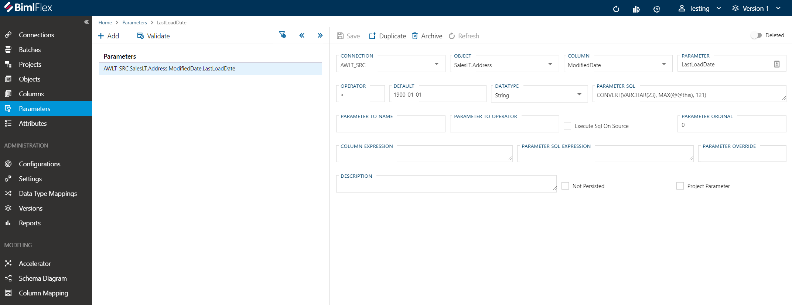
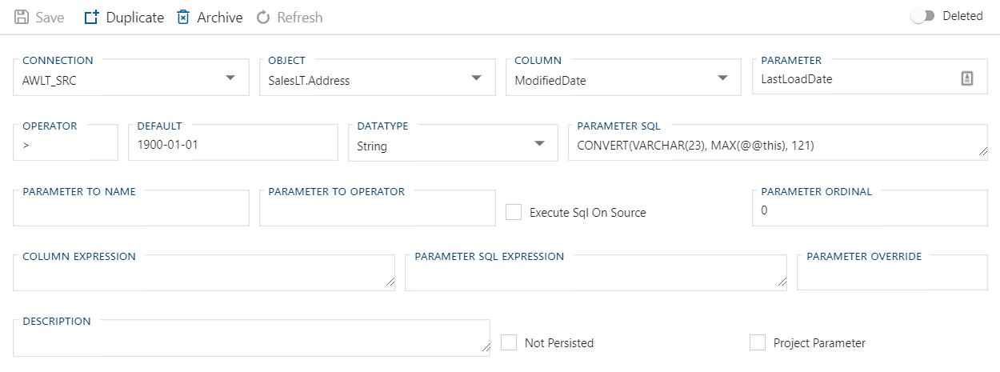

# Parameters

Parameters for load queries are added either as metadata in the Parameters sheet or via Extension Points. For high watermark delta loads and similar simple parameters adding the Parameter to the metadata will generate and include all required logic to the load process.

Extension Points can be added for more complex parameters that require custom logic.

Parameters added to a project, batch package or regular package can be used as any other SSIS parameter. BimlFlex applies standard practices for using parameters but supports any custom use of added parameters.

[More info about Parameters](../concepts/load-parameters.md).

## Action Buttons

|Icon|Action|Description|
|-|-|-|
|

|Save|This will save the currently set of staged changes.  The [Save] button is will only enable if the `Parameter` has changes staged and there are no major validation issues with the current `Parameter` properties.|
|

|Duplicate|This will create a duplicate of the selected `Parameter`.|
|

|Archive|This will `hard delete` the selected `Parameter`.  This will result in the physical removal of the selected record from the metadata database.  The data will no longer be accessible by the BimlFlex app and will require a Database Administrator to restore, if possible.|
|

|Refresh|This will trigger a refresh of the metadata for the selected `Parameter`.|
|

|Deleted|This will `soft delete` the currently selected `Parameter`.  This will remove the `Parameter` and all associated entities from processing and validation.|

## Field Descriptions

* Connection - The connection this parameter is associated with. Parameters can be associated with Connections, Objects and Columns
* Object - The object this parameter is associated with 
* Column - The column this parameter is associated with.
* Parameter - The name of the parameter.
* Operator - This defines the operator used in the `WHERE` clause in the source select query. For a high watermark load pattern, the `>` is commonly used to load data with a higher value than the last time.
* Default - The parameter load value to use the first load
* Data Type - The Data Type to use for the parameter. For Dates, this is commonly defined as `String` as SSIS sometimes finds it easier to deal with string representations. [More info](_enum-data-type.md)
* Parameter Sql - The SQL Query to use to derive the new parameter value, commonly used to get the max value from the loaded data and use that as the from parameter value in the next load.
* Parameter To Name - Useful for windowed loads or when it is not possible to derive the new parameter from the destination. When loading to Blob files it is not possible to query the created file to get the new parameter value, so this allows the from and to to be derived and applied in the source query using only the source data.
* Parameter To Operator - The Parameter To Operator - see above.
* Execute Sql On Source - Whether to execute the Sql on the source
* Parameter Ordinal - The order of the parameter
* Column Expression - Used to override the column part of the WHERE clause in the source query to tweak the column expression. Useful when extra logic is required for the filter.
* Parameter Sql Expression - The Parameter Sql Expression
* Parameter Override - Used to override the parameter part of the WHERE clause in the source query to tweak the column expression. Useful when extra logic is required for the filter.
* Description - Free text description
* Not Persisted - Whether the parameter should be persisted to `[BimlCatalog].[ssis].[ConfigVariable]`
* Project Parameter - Project level Parameters that are commonly available in all packages in the project.

[More details about Parameter Fields](../concepts/load-parameters.md).