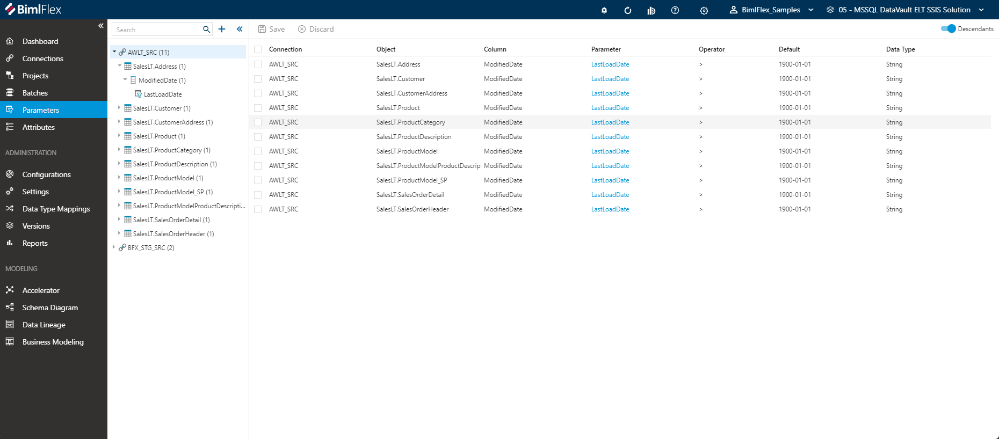

# Parameter Editor

Parameters for load queries are added either as metadata in the Parameters sheet or via Extension Points.
For high watermark delta loads and similar simple parameters adding the **Parameter** to the metadata will generate and include all required logic to the load process.

Extension Points can be added for more complex parameters that require custom logic.

Parameters added to a SSIS project, batch package, regular package, or ADF pipeline can be used as parameter normally would in the respective system.
BimlFlex applies standard practices for using parameters but supports any custom use of added parameters.

> [!NOTE]
> For information on how these use and configure **Parameters** in BimlFlex see associated link below.  
> BimlFlex Documentation: [Load Parameters](xref:bimlflex-concepts-metadata-parameters)

## Editor Overview  

The following sections describe the UI elements of the **Parameter Editor** and how they are used to author and manage BimlFlex **Parameters**.

**Parameters** within BimlFlex are displayed in a hierarchical tree view on the left side-navigation menu.
The tree view is organized by **Connections** > **Objects** > **Columns** > **Parameters**.

The total number of **Parameters** will be displayed in parenthesis next to the **Connection** in the menu.
The individual number of **Parameters** assigned to each **Object** or **Column** will also be displayed in parenthesis.

Selecting a **Connection** with multiple **Parameters** will display a secondary list of all editable options within.
The user may navigate to the Parameter Editor Screen by selecting any **Parameter** from the displayed list.

Selecting a **Connection** with a single **Parameter** will immediately navigate the user to the Parameter editor screen.

The tree view for **Parameters** is expandable/collapsible by clicking the  / icons.

Selecting the checkbox(es) icon will enable users to bulk archive multiple **Parameters** at one time.

Any instance of the   icon will serve as a Global Navigation Transition.
Clicking this icon will navigate the user directly to the referenced **Connection, Object,** or **Column.**

Toggling `Descendants` will enable or disable all parameters for both the currently selected node and all of its descendant nodes.
This option is enabled by default.

The Search field is contained within the tree view menu, and will be hidden when collapsed.
The Search field will return results in realtime, only presenting Parameters containing the term being searched.

## Action Buttons  

|Icon|Action|Description|
|-|-|-|
| 

 | Save | This will save the currently set of staged changes.  The **Save** button is will only enable if the **Parameter** has changes staged and there are no major validation issues with the current **Parameter** properties.|
| 

 | Discard | This will **Discard** any unsaved changes and revert to last saved form. |
|

 | Archive | This will hard delete the selected **Parameter**.  This will result in the physical removal of the selected record from the BimlFlex Database.  The data will no longer be accessible by the BimlFlex app and will require a Database Administrator to restore, if possible. Clicking **Archive** creates an [Archive Parameter Dialog](#archive-parameter-dialog-box). |
| 

 | Duplicate | This will create a duplicate of the selected **Parameter**.  A [Duplicate Parameter Dialog](#duplicate-parameter-dialog-box) will appear asking for a *Parameter Name* and a new **Parameter** will be created using all of the selected **Parameter**'s current properties. |
|  | Deleted | This will soft delete the currently selected **Parameter**.  This will remove the **Parameter** and all associated entities from processing and validation. |

## Additional Dialogs  

[!include[Archive Parameter Dialog Box](_dialog-archive-parameter-single.md)]

[!include[Duplicate Parameter Dialog Box](_dialog-duplicate-parameter.md)]

## Fields  

|Field|Description|
|-|-|
| Connection | The **Connection** this parameter is associated with. Parameters can be associated with Connections, Objects and Columns.  Must be an existing **Connection**. |
| Object | The **Object** this parameter is associated with.  Must be an existing **Object**. |
| Column | The **Column** this parameter is associated with.  Must be an existing **Column**. |
| Parameter | The name of the parameter. |
| Operator | This defines the operator used in the `WHERE` clause in the source select query. For a high watermark load pattern, the `>` is commonly used to load data with a higher value than the last time. |
| Default | The parameter load value to use for the first load. |
| Data Type | The Data Type to use for the parameter. For Dates, this is commonly defined as `String` as SSIS sometimes finds it easier to deal with string representations.  Must be a valid [Data Type](#data-types). |
| Parameter Sql | The SQL Query to use to derive the new parameter value, commonly used to get the max value from the loaded data and use that as the from parameter value in the next load. |
| Parameter To Name | Useful for windowed loads or when it is not possible to derive the new parameter from the destination. When loading to Blob files it is not possible to query the created file to get the new parameter value, so this allows the from and to to be derived and applied in the source query using only the source data.  Cannot be same as Parameter Name. |
| Parameter To Operator | The Parameter To Operator - see above. |
| Execute Sql On Source | Execute Sql On Source - Whether to execute the Sql on the source. |
| Parameter Ordinal | The order of the parameter. |
| Column Expression | Used to override the column part of the WHERE clause in the source query to tweak the column expression. Useful when extra logic is required for the filter. |
| Parameter Sql Expression | The Parameter Sql Expression. |
| Parameter Override | Used to override the parameter part of the WHERE clause in the source query to tweak the column expression. Useful when extra logic is required for the filter. |
| Description | Free text description. |
| Not Persisted | Whether the parameter should be persisted to `[bfx].[ConfigVariable]` in the BimlCatalog. |
| Project Parameter | Project level Parameters that are commonly available in all packages in the project. |

> [!NOTE]
> For information on how these use and configure **Parameters** in BimlFlex see associated link below.  
> BimlFlex Documentation: [Load Parameters](xref:bimlflex-concepts-metadata-parameters)

## Allowed Values  

[!include[Data Types](_enum-data-type.md)]  
