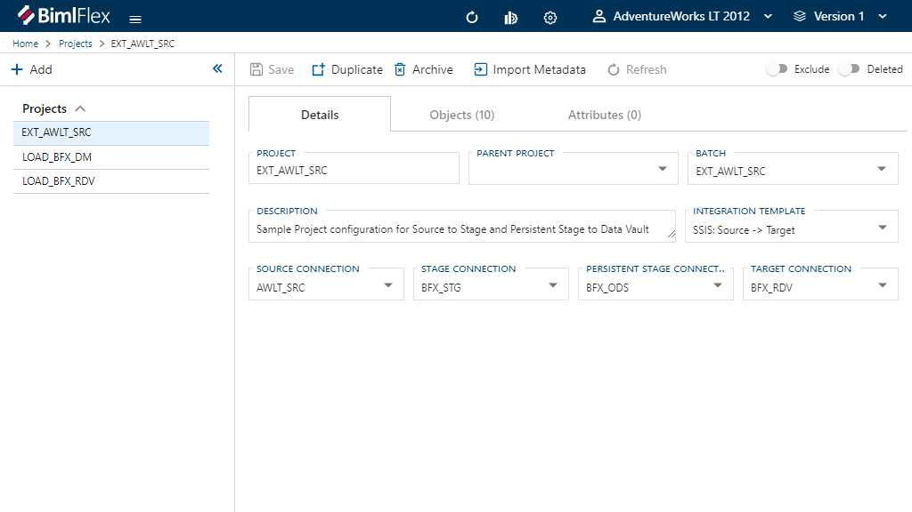

# Projects Editor

BimlFlex `Projects` group and help to define an ETL/ELT workload.  They are uses by `Projects` to set execution grouping.

## Editor Overview

The following sections describe the UI elements of the [Projects Editor] and how they are used to author and manage BimlFlex `Projects`.

**Projects Editor**  

## Details Tab

The [Details Tab] focuses on general `Project` information and configuration.  This [Tab] is used to define and create the `Project` itself.

### Details Tab - Action Buttons

|Icon|Action|Description|Additional Dialog|
|-|-|-|-|
|

|Save|This will save the currently set of staged changes.  The [Save] button is will only enable if the `Project` has changes staged and there are no major validation issues with the current `Project` properties.||
|

|Duplicate|This will create a duplicate of the selected `Project`.  A prompt will appear asking for a [New Name] and a new `Project` will be created using all of the selected `Project`'s current properties.||
|

|Archive|This will `hard delete` the selected `Project`.  This will result in the physical removal of the selected record from the metadata database.  The data will no longer be accessible by the BimlFlex app and will require a Database Administrator to restore, if possible.|[Archive Project](#Archive-Project-Dialog-Box)
|

|Import Metadata|This will bring up the [Import Metadata Tool].  Refer to the [[Import Metadata from Source Database]](../concepts/importing-metadata.md) guide for details on use and features.|
|

|Refresh|This will trigger a refresh of the metadata for the selected `Project`.||
|

|Exclude|This will remove the `Project` and all associated entities from processing and validation.  This is designed to be paired with the [Use My Exclusions (Locally)] global setting to allow for multiple developers to work on different functional areas without deleting or globally excluding entities.||
|

|Deleted|This will `soft delete` the currently selected `Project`.  This will remove the `Project` and all associated entities from processing and validation.||

[//]: # (TODO: Find a switch SVG to use for Deleted)

>[!TIP]
>
> #### How To Restore An [Excluded] or [Deleted] Entity
>
> A [Deleted] entity can be restored by flipping the [Deleted] flag back to `false`.  To view a [Deleted] entity go to your [BimlFlex Options] (1), enable [Show Deleted] (2) and click [Apply] (3).  This will now allow [Deleted] entities to appear.  Please ensure that the option is disabled again once the deleted member has been restored.  
>
> 

### Additional Dialogs

[!include[Archive Project Dialog Box](_dialog-archive-project-single.md)]

### Details Tab - Fields

|Field|Description|Validation|
|-|-|-|
|[Poject]|The name of the BimlFlex `Project`.  This is the value will be appended by '_Project` and used as the name of the SSIS Project when using [Project Deployment].  It is also used as a prefix in the naming of the individual DTSX packages (SSIS) or associated Pipelines (ADF).|String|
|[Parent Project]|The parent `Project` for the current `Project`.  This is used when a `Project` requires more than one `Source Connection`, common amognst processing flat files as each file requires a seperate `Connection`.  This allows for multiple child `Projects` to functionally operate as a single `Project`.|Dropdown (Existing `Projects`)|
|[Batch]|The BimlFlex `Batch` to use when building out the project.|Dropdown (Existing `Batches`)|
|[Description]|Optional metadata to provide description.|String|
|[Integration Template]|Name of Integration template to apply.  This is used to determine the primary orchestration engine (SSIS or ADF).|[Dropdown](#Contrained-List-Integration-Template)|
|[Source Connection]|The source or starting `Connection` of the integration project.|Dropdown (Existing `Connections`)|
|[Stage Connection]|If a `Staging Area` is enabled, the `Connection` that should be used for staging.  This list only contains `Connections` with the [Integration Stage]='Staging Area'.|Dropdown (Filtered Existing `Connections`)|
|[Persistent Stage Connection]|If a `Persistent Staging Area` is enabled, the `Connection` that should be used for staging.  This list only contains `Connections` with the [Integration Stage]='Persistent Staging Area'.|Dropdown (Filtered Existing `Connections`)|
|[Target Connection]|The target or ending `Connection` of the integration project.|Dropdown (Existing `Connections`)|

### Constrained Lists

[!include[Integration Template Constrained List](_enum-integration-template.md)]

## Objects Tab

The [Objects Tab] provides quick access to all `Objects` included in the `Project`.

[!include[Objects Tab](_tab-objects.md)]

## Attributes Tab

The [Attributes Tab] provides a view of any `Configurations` or `Settings` overrides that have been applied to the directly to the selected `Project`.  

>[!NOTE]
> This is exclusive to the `Project` level.  Additional overrides may be present on any grains higher or lower than the `Project`.

[!include[Attributes Tab](_tab-attributes.md)]
