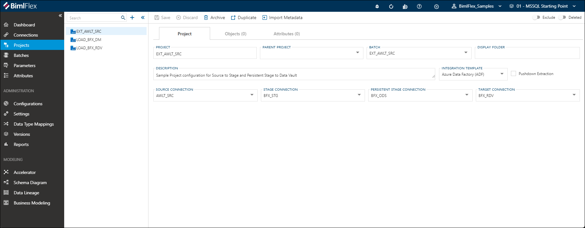

# Projects Editor

BimlFlex **Projects** group and help to define an ETL/ELT workload. They specify the primary orchestration engine (SSIS or ADF) and define the  Connections for the Source to Target pipeline.

## Editor Overview

The following sections describe the UI elements of the **Projects Editor** and how they are used to author and manage BimlFlex **Projects**.

## Details Tab

The **Details Tab** focuses on general **Project** information and configuration.  This tab is used to define and create the **Project** itself.

### Details Tab - Action Buttons

|Icon|Action|Description|
|-|-|-|
|

|Save|This will save the current set of staged changes.  The **Save** button is will only enable if the **Project** has changes staged and there are no major validation issues with the current **Project** properties.|
| 

 | Discard | This will **Discard** any unsaved changes and revert to last saved form. |
|

|Archive|This will hard delete the selected **Project**.  This will result in the physical removal of the selected record from the BimlFlex Database.  The data will no longer be accessible by the BimlFlex app and will require a Database Administrator to restore, if possible. Clicking **Archive** will cause a [Archive Project Dialog](#archive-project-dialog-box) to appear.|
|

|Duplicate|This will create a duplicate of the selected **Project**.  A prompt will appear for creating a new **Project** using all of the selected **Project**'s current properties.|
|

|Import Metadata|This will bring up the **Import Metadata Tool**.  Refer to the [Import Metadata from Source Database](../concepts/importing-metadata.md) guide for details on use and features.|
|

|Exclude|This will remove the **Project** and all associated entities from processing and validation.  This is designed to be paired with the `Use My Exclusions (Locally)` global setting to allow for multiple developers to work on different functional areas without deleting or globally excluding entities.|
|

|Deleted|This will soft delete the currently selected **Project**.  This will remove the **Project** and all associated entities from processing and validation.|
<!--
|

|Refresh|This will trigger a refresh of the metadata for the selected **Project**.|
-->
[//]: # (TODO: Find a switch SVG to use for Deleted)

[!include[Restore Entities Tip](_tip-restore-entities.md)]

### Additional Dialogs

[!include[Archive Project Dialog Box](_dialog-archive-project-single.md)]

### Details Tab - Fields

|Field|Description|
|-|-|
| Project |The name of the BimlFlex **Project**.  This is the value that will be appended by "_Project" and used as the name of the SSIS Project when using [Project Deployment].  It is also used as a prefix in the naming of the individual DTSX packages (SSIS) or associated Pipelines (ADF).|
| Parent Project |The parent **Project** for the current **Project**.  This is used when a **Project** requires more than one **Source Connection**, common amongst processing flat files as each file requires a separate **Connection**.  This allows for multiple child **Projects** to functionally operate as a single **Project**.|
| Batch |The BimlFlex **Batch** to use when building out the project.|
| Description |Optional metadata to provide description.|
| Integration Template |Name of Integration template to apply.  This is used to determine the primary orchestration engine (SSIS or ADF). Must be a valid [Integration Template](#integration-templates).|
| Source Connection |The source or starting **Connection** of the integration project.|
| Stage Connection |If a **Staging Area** is enabled, the **Connection** that should be used for staging.  This list only contains **Connections** with the *Integration Stage* set to `Staging Area`.|
| Persistent Stage Connection |If a **Persistent Staging Area** is enabled, the **Connection** that should be used for staging.  This list only contains **Connections** with the *Integration Stage* set to `Persistent Staging Area`.|
| Target Connection |The target or ending **Connection** of the integration project.|

### Allowed Values

[!include[Integration Templates](_enum-integration-template.md)]

## Objects Tab

The **Objects Tab** provides quick access to all **Objects** included in the **Project**.

[!include[Objects Tab](_tab-objects.md)]

## Attributes Tab

The **Attributes Tab** provides a view of any **Configurations** or **Settings** overrides that have been applied to the directly to the selected **Project**.  

>[!NOTE]
> This is exclusive to the **Project** level.  Additional overrides may be present on any grains higher or lower than the **Project**.

[!include[Attributes Tab](_tab-attributes.md)]
