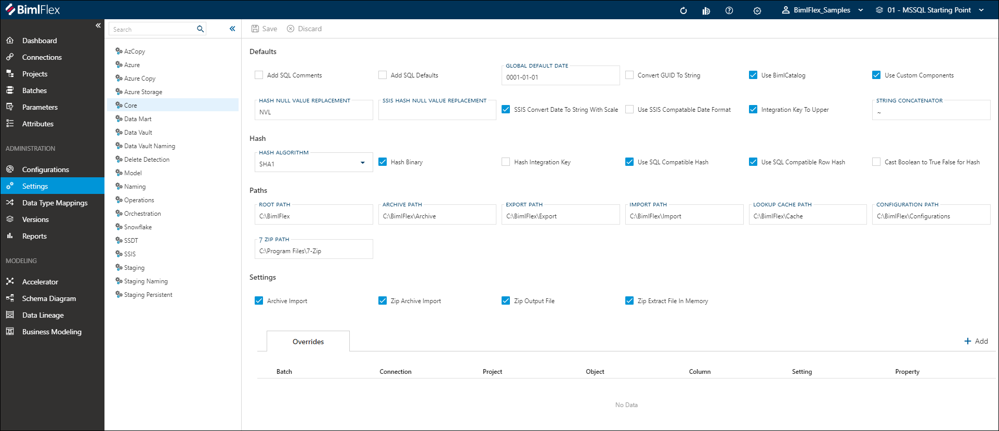
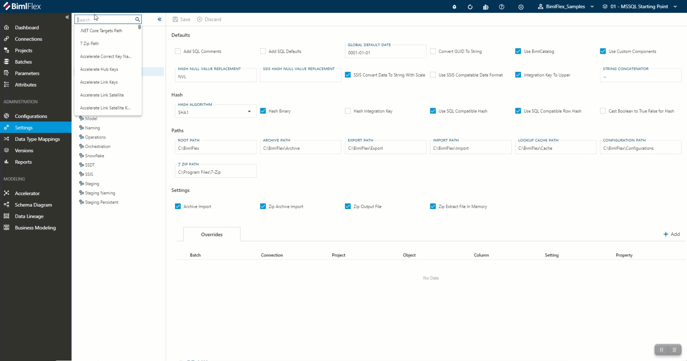
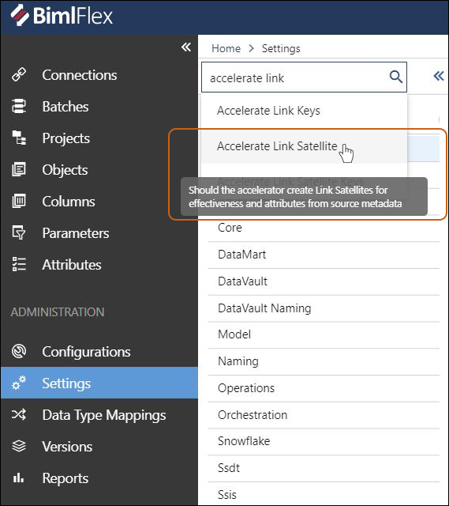

# Settings

The **Settings Editor** is used to manage metadata and framework settings in the BimlFlex App.
By changing settings, the produced artifacts can adapt to specific requirements for file locations, naming conventions, data conventions, etc.
Align these settings with the organizations best practices and environmental requirements.

 **Settings** can be found under Administration in the application menu.

> [!TIP]
> The [Setting Reference Document](../reference-documentation/metadata-settings.md) serves as a complete guide for all settings available in the BimlFlex App.

## Settings Groups

Settings within the BimlFlex app are organized into essential categories, **Setting Groups,** such as Azure, Core, DataVault, Snowflake, etc., with each category containing options within, relevant to its parent category.

Hovering the mouse pointer over individual settings will display tooltips relating to same, along with brief explanation(s) as to how settings will change a project.

The Settings Group also contains a global Search field.
The Search field contains a drop down menu of all settings, organized alphabetically by **Setting Group**, and allows users to search directly for specific settings.
Searching for a specific setting will automatically navigate the user to the respective **Setting Group** and highlight the specific option within, guiding the user to the exact location needed.

When utilizing the Search bar, if a user hovers over a specific search term the tooltip relating to that setting will be displayed.
The information displayed in the tooltip from the global search bar will the same as if the user hovered over the actual setting field, as referenced above.

> [!TIP]
> For users who are unsure of the *specific* setting they need, beginning a search with "*" will allow users to search setting descriptions as well as setting titles.
> This will assist in guiding users to their desired setting based on associated terminology used in their search.

When applicable, settings that involve editing SQL code will appear in a window that mirrors standard SQL input styling and syntax.

Settings that are "Yes or No" selections will be presented with a checkbox UI to indicate their setting.

Settings that contain required values will be outlined in red.

## Command Bar Buttons

The buttons in the command bar allow actions to be taken on the setting that is active in the editor.

<!--

-->

| Icon                                                                       | Action  | Description                                                                                                                        |
| -------------------------------------------------------------------------- | ------- | ---------------------------------------------------------------------------------------------------------------------------------- |
| 

    | Save    | This will save any changes displayed in the Settings editor. The **Save** button is only enabled if there are changes in the form. |
| 

 | Discard | This will **Discard** any unsaved changes and revert to last saved form. |

## Setting Overrides

**Setting Overrides** are used to override Setting Values.
Setting Overrides can be added and referenced in the Settings editor.
All overrides applied to the Setting are listed in the Overrides section of the editor.

Clicking the links in the Overrides table will navigate to the item listed.
To edit or delete the Setting Override, click the value in the Key column.

Setting Overrides are saved in BimlFlex as **Attributes**.
The [Attributes Documentation](attributes.md) provides information on **Attributes** and how to manage them.

### Add a Setting Override

To add a setting override, click  Add in the top right of the Overrides section and fill out the Add Attribute form.

[!include[Add Attribute Dialog](_dialog-add-attribute.md)]

The Attribute fields are used as the Setting Override as defined in this table.

| Attribute Field Name | Setting Field Name | Description                                                                                                              |
| -------------------- | ------------------ | ------------------------------------------------------------------------------------------------------------------------ |
| Attribute Type       |                    | Defines the scope for when the override is applied.                                                                      |
| Attribute            |                    | Defines the Setting field that will be overridden. The **SettingValue** should always be the Attribute being overridden. |
| Attribute Value      | Setting Key        | The Setting Key for the Setting that is being overridden.                                                                |
| Attribute Property   | Setting Value      | The override for the Setting field defined in Attribute.                                                                 |
| Description          |                    | Description of the Setting Override.                                                                                      |

### Edit or Delete a Setting Override

**Setting Overrides** are managed as **Attributes** in BimlFlex.
To manage a setting override, click the value in the Key column of the Overrides table.
The [Attributes Documentation](attributes.md) provides information on **Attributes** and how to manage them.
