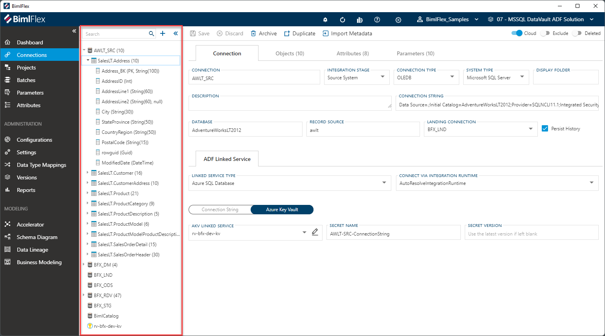

# BimlFlex Treeview

The **Treeview** is one of the core ways of navigating through, and interacting with, the design metadata captured in BimlFlex.

The treeview is a context-sensitive visual representation of the relationships between metadata components. Where a component contains child components, it can be collapsed or expanded. It is located in the left-side navigation panel, between the menu items and the metadata editors.

In the treeview, the total number of items within an individual component will be displayed next to the object name. The treeview is expandable/collapsible by clicking the  /  icons.

Any instance of the  icon will serve as a Global Navigation Transition.
Clicking this icon will navigate the user directly to the referenced **Project**, **Connection** or **Object**.

## Context Sensitive

### Connection Treeview

Depending on which menu item is selected, the treeview may show a different hierarchy of items.

For example, when the **Connections** are selected, the top level of the treeview will display the available **Connections**. These can be expanded to show the **Objects** that are associated to each connection, as well as the **Columns** belonging to each object.

Clicking on any of the items will open the corresponding editor. In the example above, this means that the **Connection Editor**, **Object Editor** and **Column Editor** can be accessed via the treeview in the connections menu.

The following menu items use the Connections Treeview:

* Connections
* Accelerator
* Schema Diagram
* Data Lineage

### Batch and Project Treeview

For **Batches** and **Projects**, only the top-level component is visible. No child items will be visible in the treeview. Clicking on an item in the treeview here will open the **Batch Editor** or **Project Editor** respectively.

### Parameter and Attribute Treeview

For **Parameters** and **Attributes** the object will not show its columns, but it's relevant parameters and attributes instead. By clicking on any of these, the corresponding editor will be opened.

## Search

The search control at the top of the treeview can be used to limit the visible components. The search field will only present items containing the term being searched, and will automatically expand if matched items are found.
