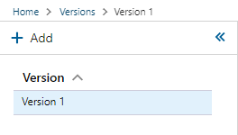
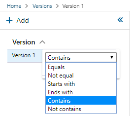

# Versions

The `Versions` module is used to manage versions of the Metadata and BimlFlex versions for the active customer. Versions allow for changes in metadata or versions over time.

 `Versions` can be found under Administration in the application menu.

## Versions Navigation List

Vrsions are listed in the versions navigation pane on the left side of the window. For ease of navigation, versions can be sorted or filtered by version name.

### Versions List Sorting

To sort the versions navigation list, click the Version Name column header. The list of versions will be sorted in ascending order. Click the column header a second time to sort in descending order; and a third time to restore default sorting.

### Versions List Filtering

To filter `Versions` by name, hover over Version Name column header and click the menu icon then enter the text you would like to filter by.

`Versions` can be filtered using a few methods. Use the dropdown in the filter menu to change the method used.

### Versions Navigation List Buttons

The Version Navigation List buttons are located at the top of the Versions Navigation pane.

|Icon|Action|Description|
|-|-|-|
|

|Add Action|[Add] will create a blank `Versions` form for adding a new `Version`. |
|

|Collapse Action|[Collapse] will hide the Versions Navigation Pane.|
|

|Expand Action|[Expand] will reveal the Versions Navigation Pane after it has been hidden.|

## Command Bar Buttons

The buttons in the command bar allow actions to be taken on the selected `Version`.

|Icon|Action|Description|
|-|-|-|
|

|Save|This will save any changes displayed in the Versions form.  The [Save] button is only enabled if there are changes in the form.|
|

|Duplicate|This will create a duplicate of the selected `Version`.  A prompt will appear where the source and target `Version` information can be entered. The new `Version` will be created with all of the same values as the source `Version`. [Duplicate] can not be used if there are unsaved changes in the form.|
|

|Refresh|This will trigger a refresh of the metadata for the selected `Version`. The [Refresh] button is only enabled if there are unsaved changes in the form. Any unsaved changes will be lost when the form is refreshed. |
|

|Deleted|This will soft delete the currently selected `Version`. This version will only be visible if "Show Deleted" is enabled in BimlFlex settings.|

## Versions Form

The `Versions` form is used to manage all `Versions`. The fields in the form are defined in this table along with the validation rules.

|Field|Description|Validation Rules|
|-|-|-|
|Version|The `Version` name is used as a unique name for the `Version`.|Version name is required. Version name must be unique.|
| Effective From Date |The Version Value defines the value applied to the associated Version Key. The expanded editor can be used with Version Value. |YYYY-MM-DD Format|
|Effective To Date|The Version Type defines the type of data stored in Version Value. Version Type can be JSON, SQL, or Text.| YYYY-MM-DD Format|
|Is Current| The Is Current toggle should be enabled for active `Versions`||
|Comments|Comments can be included to describle the state of the metadata when the `Version` was made or the purpose of the `Version`.||

## Related Items

Below the `Version` form are tabs that will display items related specifically to the selected `Version`. The tabs will display Configurations, Data Type Mappings, and Settings as they relate specifically to the selected version.

[//]: # (TODO: Include a better description of what the related item tabs do.)