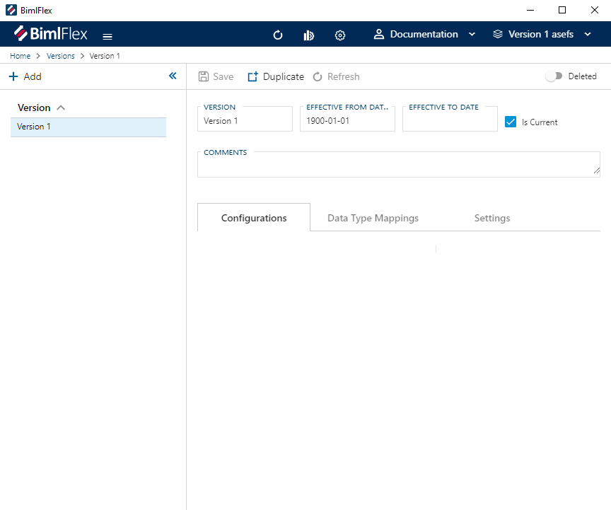
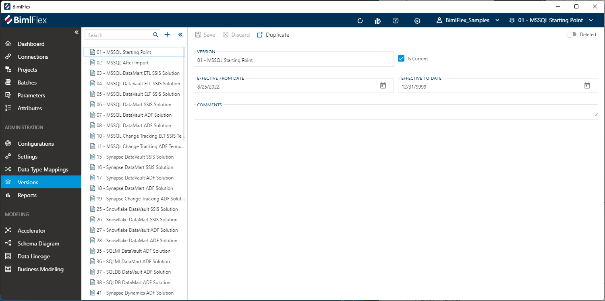
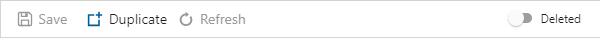

# Versions

The **Versions Editor** is used to manage versions of the Metadata and BimlFlex versions for the active customer. Versions allow for changes in metadata or versions over time.

 **Versions** can be found under Administration in the application menu.

<!--

-->

## Command Bar Buttons

The buttons in the command bar allow actions to be taken on the selected **Version**.

<!--

-->

|Icon|Action|Description|
|-|-|-|
|

|Save|This will save any changes displayed in the Versions form.  The **Save** button is only enabled if there are changes in the form.|
| 

 | Discard | This will **Discard** any unsaved changes and revert to last saved form. |
| 

 | Duplicate | This will create a duplicate of the selected **Version**.  A Duplicate Parameter Dialog will appear asking for a *Version Name* and a new **Version** will be created using all of the selected **Version**'s current properties. |
|

|Deleted|This will soft delete the currently selected **Version**. This version will only be visible if *Show Deleted* is enabled in BimlFlex settings.|

## Versions Form

The **Versions** form is used to manage all **Versions**. The fields in the form are defined in this table along with the validation rules.

|Field|Description|
|-|-|
|Version|The **Version** name is used as a unique name for the **Version**. Version name is required. Version name must be unique.|
| Effective From Date |The Version Value defines the value applied to the associated Version Key. The expanded editor can be used with Version Value. YYYY-MM-DD Format|
|Effective To Date|The Version Type defines the type of data stored in Version Value. Version Type can be JSON, SQL, or Text. YYYY-MM-DD Format|
|Is Current| The Is Current toggle should be enabled for active **Versions**|
|Comments|Comments can be included to describe the state of the metadata when the **Version** was made or the purpose of the **Version**.|

<!--
## Related Items

Below the **Version** form are tabs that will display items related specifically to the selected **Version**. The tabs will display Configurations, Data Type Mappings, and Settings as they relate specifically to the selected version.

[//]: # (TODO: Include a better description of what the related item tabs do.)
-->