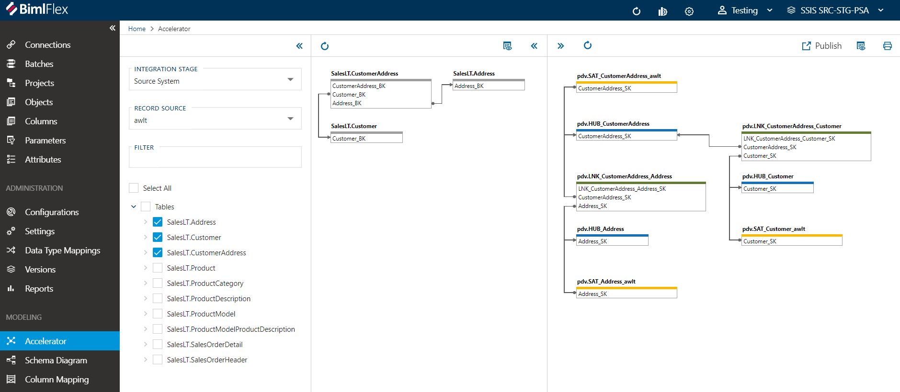
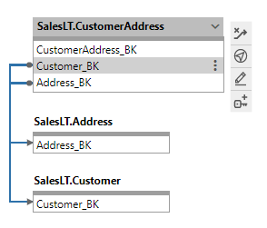
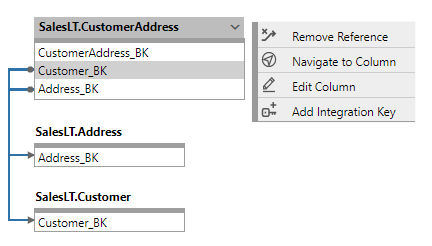
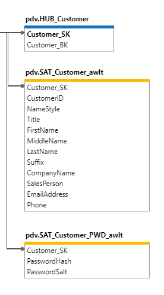
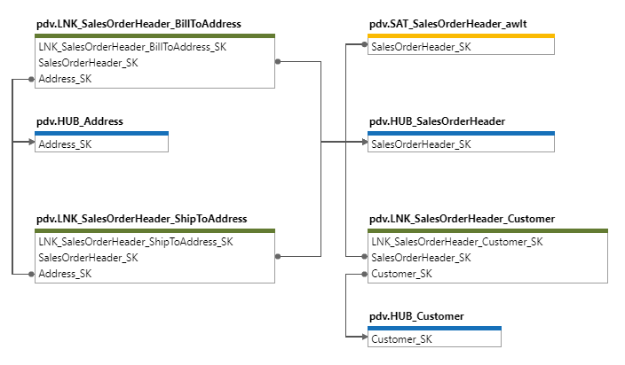
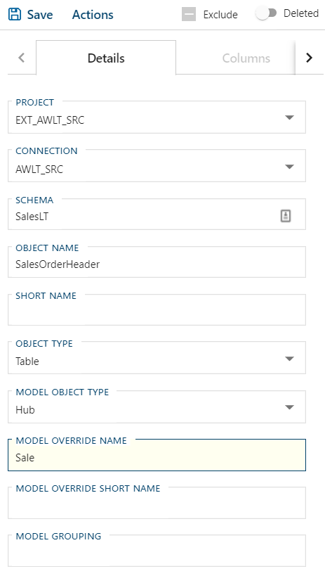
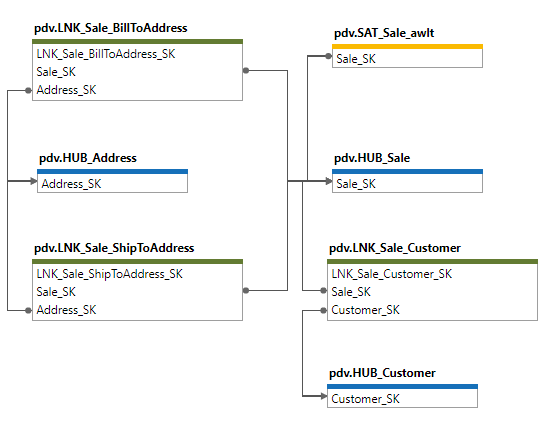
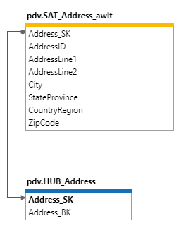
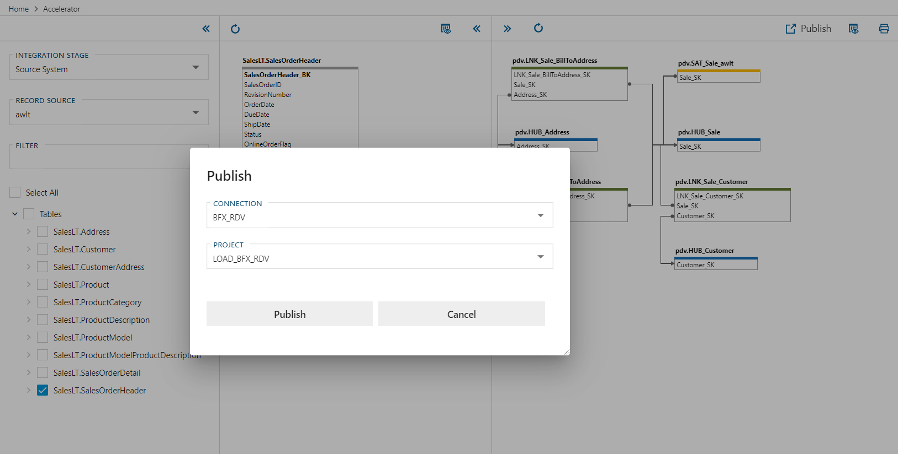

# Data Vault Accelerator

## On Data Vault modeling

This guide provides information on the Accelerator but assumes a sound understanding of the Data Vault modeling approach.

### Watch Recordings

#### BimlFlex - Data Vault Accelerator

This session cover the various Data Vault modeling and configuration options available in BimlFlex.

### Introduction to the Accelerator

The Accelerator provides a quick-start opportunity with a best effort, technical modeling of Data Vault constructs out of the source metadata. It is configurable and provides a preview that can be rerun as many times as necessary so that the initial Data Vault modeling can be completed faster than through manual metadata modeling.

It is important to remember that the Data Vault modeling approach is based around **Core Business Concepts** (CBC) that are built upon **Enterprise-Wide Business Keys** (EWBK) to allow for intra-systems integrations. The Accelerator does it's best to derive this from the source metadata but there is a need for a modeler with enterprise knowledge to translate the data and events into a source-system agnostic model. The Accelerator makes it easy to get started and iterate through variations so that the analysts and subject matter experts can validate and tune the model to best match business processes.

### Starting Point

The starting point for the examples in this document is when all source metadata has been imported for the AdventureWorks LT database, the Source to Staging and Persistent Staging has been completed and it is time to start integrating the staged data into the Raw Data Vault.

Follow the guide for [Source To Staging](../concepts/source-to-staging-templates.md) and import all SalesLT tables from the AdventureWorksLT source.

More about [Import Metadata](../concepts/importing-metadata.md).

### The Source and Target model

Before starting the integration and acceleration of the technical artifacts, it is important to have an understanding of the expected target model and how the data from the source model can be loaded into this target. The source model is defined by the source. In most cases, the source model is not directly transposable to the target model so some analysis and modelling are required. The technical implementation in the source is then tweaked to match the expected Data Vault model.

Once the target model is drafted, compare the accelerated metadata with the expected outcome and tweak accordingly.

### Prerequisites

This guide builds on the other guides in the series and assumes that the environment has been set up and configured, source metadata has been imported and that the source to staging process has been modelled and completed.

### The BimlFlex Workflow

The Accelerator integrates into and is part of the normal BimlFlex workflow.

[//]: # (TODO: New Image for UPDATED BimlFlex workflow)

The workflow uses the BimlFlex App to model and manage all metadata. The data can be pushed and updated from both Excel and the BimlFlex App. BimlFlex Excel is useful for bulk changes on multiple columns.

See more info about the [BimlFlex Excel Add-In](../bulk-edit-metadata/excel-add-in.md)

## Accelerate the Model

Based on the source metadata and the source database, the source model can be used to relate the data in the staging area. Based on information gained from the business process a user can derive a target data model that:

* Is source agnostic
* Is aligned with the business process
* Is based on Core Business Concepts
* Describes events and transactions through the relations between the Core Business Concepts.

The accelerator will use the metadata in the source for the project to derive the potential Hubs, Links and Satellites. The derived Data Vault model is available to preview and refine through editing the metadata and updating the preview.

The workflow where metadata is updated and tweaked and reprocessed through the Accelerator into the Data Vault preview allows a rapid design cycle of the Raw Data Vault.

Once the Accelerator preview matches the model expectations the metadata can be published to the repository and become part of the normal metadata set.

### Sample workflow

The following narrative will guide us through the Accelerator process end to end. It is part of the overall BimlFlex workflow described earlier.

1. Run the metadata import for the source system if not done already. This import identifies source tables as a base for either Hubs, Links or Satellites
1. Open the Accelerator, specify the record source and select objects to accelerate
1. Preview the Accelerated Schema
1. Review and tweak the metadata
1. Publish the preview to the metadata repository by selecting the target Connection and Project
1. Build the database artifacts and SSIS artifacts in BimlStudio from the newly published Data Vault metadata

### The Accelerator User Interface

In the preview, it is also possible to filter the tables used for the preview from the source. This is useful where the full set of source tables have been included but the Data Vault is built piece by piece. Starting to source and persist changes from the source without having to consider the Data Vault process means the Staging part of the solution can be completed sooner.

Constraining the Data Vault Acceleration to a subset allows for a more agile delivery where valuable parts of the solution can be put to good use as soon as they are done.

The Accelerator shows the source and preview side-by-side with options to collapse each pane or to resize the panes by dragging the splitter.

| Icon | Description |
| ---- | ----------- |
| 

 | Show all the columns and/or data types on both the source and preview panes by clicking the View Options Icon. |
| 

 | Download a printable Database Schema Diagram svg image which details the tables and their relationships in an easy to review diagram. |
| 

 | Refresh the whole layout or you can change the layout as you like by dragging tables. |
| 

 | Publish the accelerated schema after tweaking the Metadata to fit the business process. You will be able to revisit the model and iteratively make more changes as required. |

Iterating through the metadata and updating the model to better support the target Data Vault model, each time a user should set the updated metadata to be persisted to the Metadata Database. This will create all Data Vault tables and columns as well as the Source To Target mappings needed to populate the Data Vault from the chosen source.

If there is a need to update the model and rerun the preview, it can be done at any time. Once the metadata from the preview has been published, all metadata will be available in the BimlFlex App Object and Column screens for direct manipulation there. It will also be available in the Excel metadata editor for bulk updates. The pattern of tweaking the Metadata to fit the business process and target model can be repeated however many times needed before publishing.

Note that the accelerator will not resurface any entities already accelerated and marked as excluded or deleted. To see these entities, include them in the project by removing the excluded/deleted flag.

## Updating the metadata to meet requirements

There are numerous options for manipulating the source metadata so that the Accelerator will produce the desired Data Vault model. Some of the common requirements include:

* Choosing the Integration Key used for the Hubs. By analyzing business processes and the source data it is possible to find EWBK's that aren't the technical source keys
* Pulling disparate information stored in complex relationships in the source into a Satellite connected to the relevant Hub. For information, such as addresses there is normally no need to maintain complex relationships from the source. An address is just an attribute of the entity with a location
* Adjusting the grain in UOW's so that the correct Hubs are included in Links
* Separating out data into different Satellites based on rate of change, storage requirements or similar
* Reviewing Driving Key relationships for Links where there is no one FK relationship in the source

## The Analyze Rules for BimlFlex Accelerator

There are a set of rules applied through the Accelerator to make it perform what it does.

The first rule applied is using the source metadata to derive the Table type. By using relationships defined in the source and imported through the source metadata import a user can run the following table logic.

### Mark potential satellite tables

Every table with no incoming foreign keys and only one outgoing foreign key with all the referencing columns also primary key columns and no other columns are part of the primary key is a candidate to become a Satellite source table.

### Mark as links

Every table with no incoming foreign keys and more than one outgoing foreign key with all the referencing columns also primary key columns is a candidate to become a Link source table.

### Mark as hubs

Tables that don't fit any of the categories above are going to be Hub source tables.

If the source doesn't have relationships defined, such as flat files, these needs to be added to the metadata for the Accelerator to derive the table types.

## Acceleration

All acceleration uses default naming conventions so basic names for Hubs and Satellites will be derived automatically according to the **Configurations** and **Settings**

### Context Aware Actions

There are convenience actions available on most of the tables and columns in both the source and preview panes.

By clicking on a Table or Column a user gets a pop up of all the actions buttons available. The first click will show a minimized view with only the icons with tooltips.

By clicking the ellipsis a user may see the maximized view which contains the words alongside the icons.

| Icon | Action | Description |
|--- |--- |--- |
|

 | Add Reference | Source action to add a reference. This can also be done by dragging a column onto the target table. |
|

 | Remove Reference | Source action to remove a reference. This action removes the reference link, not the column. |
|

 | Navigate | Source action to navigate to table or column. The current Accelerator layout will be persisted in memory for you to come back to. |
|

 | Edit | Source action to open a pop over a side panel to edit the table or column. This can also be a bulk action when multiple columns are chosen while holding Ctrl key. |
|

 | Add Integration Key | Source action to add an integration key using the selected columns. |
|

 | Show Related | Source action to add all the related tables by interrogating the direct references. |
|

 | Bulk Delete | Source or Preview bulk action when multiple columns are chosen while holding Ctrl key. Delete or Archive source columns. Exclude preview columns. |
|

 | Spit | Preview action to split columns from a Satellite. |
|

 | Revert Spit | Preview action to revert columns that were split from a Satellite or to revert a Unit of Work. |
|

 | Append Record Source | Preview action to appended record source to a Satellite name. |
|

 | Remove Record Source | Preview action to remove appended record source from a Satellite name. |

### Drag and Drop Actions

By dragging and dropping certain columns or tables users can affect the metadata in various ways:

1. Change Ordinal - Drag a source column up or down in the same table to change the ordinal.
1. Add Reference - Drag a source column onto another table to add a reference.
1. Unit of Work - Drag a Link onto another Link with the same Source Table to create a Unit Of Work.

### Layout Drag Options

Tables can be dragged around on the screen to make the layout easier to view. There are four ways to drag tables around.

1. Drag - Drag an individual table to another location
1. Ctrl Drag - Drag a Hub and it's Satellites
1. Shift Drag - Drag all selected tables and their Satellites
1. Ctrl+Shift Drag - Drag all selected tables and their referenced tables and Satellites

### Accelerate Satellites

The first Acceleration step is to accelerate tables defined as Satellites. It will look for the defined Integration key and use it as the Surrogate Key for the connection to the Hub. Once the Key to use is defined and added as the hashed surrogate key the rest of the columns in the Satellite table are added as Satellite attributes.

It is possible to split Satellite columns into separate Satellites. This is useful for when part of the data in the source table changes more frequently. Behind the scenes the ModelGrouping name will be added to the end of the Satellite name and the data from the source will go into this separate Satellite as well as the main Satellite.

The sample above shows how the "Customer" source table Accelerated into a "HUB_Customer" and two separate Satellites. Notice the "pdv" schema shows that this is a preview. Once published the existing table will have an "rdv" schema.

### Accelerate Links

The Link tables in Data Vault are many to many relationship tables. Instead of having one-way foreign keys in the entities the relationship between entities is defined in a separate table.

The tables identified as Links by the Accelerator will be similar. They already have the relationships between the source tables defined and technical keys to the surrounding tables. The Foreign Keys will be translated into Surrogate Keys linking to the respective Hubs.

All created Links will have an effectiveness Link Satellite added.

Any attributes left in the source Link Table will be added to the default Link Satellite. They can be separated out into their own Satellites if needed using the ModelGrouping override.

It's worth noting that if there are source system applied rules for relationships (such as a product can only be in one category) they will need to be specified as Driving Keys in the Accelerated Link unless the Accelerator can derive the behavior from relationship constraints.

For Hub tables that have Foreign Key relationships defined the Accelerator will generate Links for each Foreign Key between the defined Integration Keys. These Links will need to be reviewed as the UOW they describe might not align with the business process.

### Accelerate Hubs

Any remaining tables and Integration Keys will be used to create Hubs. The defined Integration Key for the table will be used for the Hub Attribute and this attribute will be hashed into the Hub Surrogate Key.

### Reviewing Unit of Work

The UOW defines the granularity of the relationship between the entities. It is vital that the granularity is correct and that it properly describes the business process a user is interested in.

Using the ModelGrouping attribute, a user can define the granularity from the source table to group multiple Foreign Key relations into a single Link

Watch the video to see how to group the 3 Links above into a single Unit Of Work:

<iframe width="500" height="281" src="https://www.youtube-nocookie.com/embed/w1UTANpF_ug?start=275&amp;rel=0&amp;showinfo=0" frameborder="0" allowfullscreen></iframe>

## Adjusting Model Overrides

The columns in BimlFlex Excel that start with Model are used only by the Data Vault Accelerator. By updating the metadata with model information, a user can drive the behavior of the Accelerator to generate the Data Vault model needed.

There are overrides for Objects as well as Columns

### Object Overrides

#### Object ModelOverrideName

This column contains the actual table name to be used as after the solution is modelled.

If a source system has entity names like "GL002" and the actual business name is "GeneralLedger" the Accelerator will convert this to "[HUB_GeneralLedger]" and "[SAT_GeneralLedger]"

The image above shows the previous Unit Of Work example with "SalesOrderHeader" overridden with "Sale"

#### ModelOverrideShortName

This column contains the short name to be used for Links and Link Satellites after the solution is modelled.

A Link between "GeneralLedger" and "ChartOfAccounts" will use the default name "[LNK_GeneralLedger_ChartOfAccounts]".

Defining the value "GL_COA" here will generate the name "[LNK_GL_COA]" providing easy naming flexibility through metadata when modelling more complex relationships.

#### ModelObjectType

Interpreted when importing metadata from source and can be overridden after additional analysis. The rules defined above uses the keys and relationships to derive Hub, Link or Satellite as the type.

Please note that this attribute is only relevant when using BimlFlex to generate a Raw Data Vault model.

### Column Overrides

#### Column ModelOverrideName

This is used to define the business attribute name.

While the same column names are used in source to staging to persistent staging, it is usually advisable to use actual business process aligned names in the Data Vault.

If a source system has column names like "GL002CD123" and the actual business name is "GeneralLedgerCode" the Accelerator will convert this to "[GeneralLedgerCode]"

The image above shows "PostalCode" overridden with "ZipCode".

#### ModelGrouping

This attribute is used to group columns and split them into separate Satellites and to group columns defining a Unit of Work for Links. 

#### ModelReference

This attribute is used to define the Link and Link Satellite concatenated table name. It is required when multiple table references exist on the source table.

An example would be the "SalesOrderLine" source table where the "ShippingAddress" and "BillingAddress" both reference the "Address" table.

Two relationships will be created with the ModelReference forming part of the name. This attribute is auto-generated when importing metadata and can be overridden.

## Final review and preview publish

Once the metadata has been modelled and the preview represents the target model a user will then publish the metadata to the metadata repository.

### Publishing the final preview

By clicking the Publish DV Import the new data will be committed to the Metadata database and made available as a persisted Schema Diagram, in the application screens for edit and in BimlFlex Excel for bulk edit.

The target Connection and Project will be automatically selected based on your configuration and you may change the Project if you have multiple eligible target projects.

Once the Metadata is published it is possible to update the metadata in various ways:

1. BimlFlex App Object and Column Screens - for quick review and individual updates
1. Schema Diagram - for viewing the persisted RDV schema
1. Accelerator - for further modeling
1. Mapping Diagram - to verify source to target column mappings
1. BimlFlex Excel - for bulk editing actions

Once reviewed it is possible to generate all Tables and database structures as well as SSIS packages based on the Accelerated metadata from within BimlStudio.
