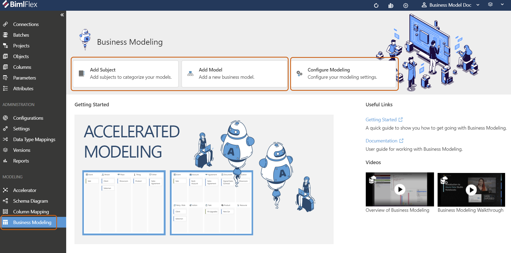
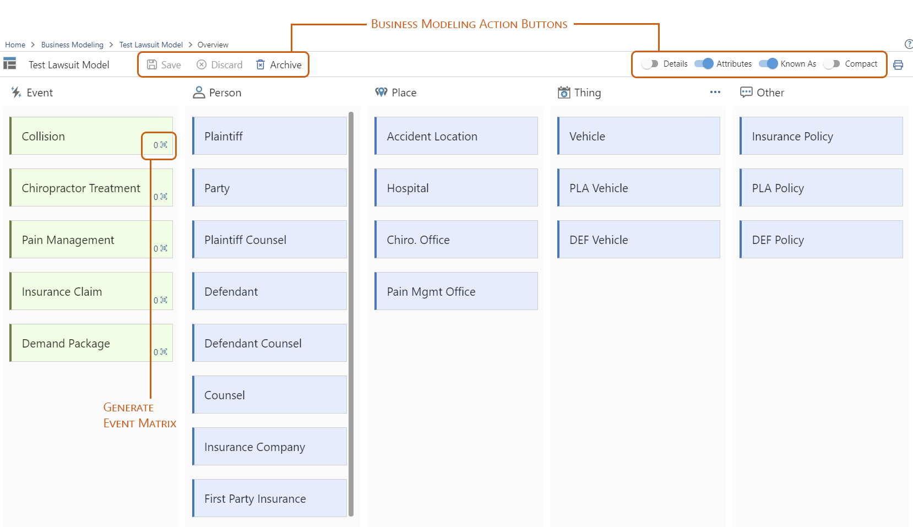
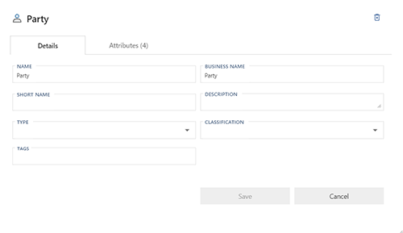

# Business Modeling

## Business Modeling Conceptually

Business Modeling is an approach to Data Vault modeling wherein an agile, scalable model is designed around Core Business Concepts (CBC) and and Natural Business Relationships (NBR), as opposed to creating a Data Vault from an already existing source of data.
This method is generally employed by a team of business representatives working in conjunction with technical (IT and/or data analysts or consultants) to detail the primary aspects of a business' interactions, objectives, and relationships.  
Business Modeling in this respect, also referred to as Ensemble Logical Modeling (ELM), is traditionally performed in small technical sessions devoid of computers.
Using whiteboards and Post-Its, small groups track, alter, and modify relationships paramount to the business operation.
Business representatives will detail core aspects of the business, tracking who interacts with what, while data analysts and consultants will monitor the IT and technical aspects of those relationships.
It is a system that is propagated by interaction, collaboration, and discussion.

## Business Modeling Digitally

The Business Modeling feature within BimlFlex seeks to take the trusted aspects of traditional Business Modeling, collaborating on Core Business Concepts prior to considering any form of data management, and allow teams to share, present, and discuss.
Model metadata, containing any changes, can be easily shared between team members.
Events and Entities can be rearranged as easily as Post Its on a whiteboard.
Details, such as attributes and liking similar entities, can be added to cards, combined, or separated, with less effort than reorganizing Post-Its on a whiteboard.

## Business Modeling in BimlFlex

The Business Modeling feature is accessible from the main BimlFlex side menu.

Models may be created either by adding Subjects (People, Place, or Things) or from a top-down perspective by creating an overall model (Sales, Lawsuit, etc.) and adding subjects and events subsequently.

Model settings can be configured through the `Configure Model` button.
Users may alter whether to create their model using either Ensemble Logical Modeling or Party & Party Role Model.
Other settings allow users to modify default entity types, business types, and business classifications.

## Creating a Business Model

After deciding on the best basic model settings, the process can be started by clicking `Add Model` (or `Add Subject` alternatively).
A dialog box requiring a Name and Subject is all that is required to proceed with building out a model. 

Next, users are presented with the interface to build their Business Model.

Events are the primary relationships and interactions between business entities.
Events will be modeled as a Link.  
Entities such as Person, Place, Thing, and Other will be modeled as Hubs.
Entities added to the overview are not categorized in any methodical method.  
The overview is simply a place for teams to add all of the individual parts of their model, with organization to follow.

### Business Modelling Action Bar

| Icon | Action | Description |
|----|-|--------|-------------|
| Save | Save | Save any staged changes to the model |
| Discard | Discard | Revert any unsaved changes to the model |
| Archive | Archive | Remove any selected entity from the model entirely. This option cannot be undone. |
| Details | Details | Toggle to show or hide any details from the Entity cards, including any entered Business Names, Short Names, Descriptions, or Tags |
| Attributes | Attributes | Toggle to show or hide any attributes added to any Entity cards. There is no limit to the attributes that can be added to the Entities.
| Known As | Known As | Toggle to show or hide any "Known As" elements to any Entity cards. Any number of entities may be dragged into another. |

### Attributes and "Known As" Fields

Similar entities may simply be dragged onto one another, for grouping and tracking different entities under one uniform Entity.

>[!NOTE]
> In the above example, "Plaintiff" and "Defendant" are both a "Party" to the accident. However, they could be tracked in the same Hub as "Party." As such, "Plaintiff" and "Defendant" were combined with "Party," as that Hub would track the two entities independently.

If alterations are needed, clicking the `X` next to any "Known As" will remove the entity from the grouping and return it to the overview as an individual entity.  
Clicking the `X` next to any attribute will remove it from that card.  
Clicking the `...` will allow users to Edit the card's details, or remove the card from the overview entirely.

### Creating an Event Matrix

Clicking the `Generate Event Matrix` button in the lower-right corner of an Event will take users to the Matrix for that Event only.
From here, users will manually remove and edit Entities that only relate to that Event.

Any edits that are made to Entity cards in a Matrix view will be match in the Overview.
This allows edits to be made "across the board," and to maintain parity between the Business Model overview and individual Event matrices.

As users go through all of the created events, edits and alterations to each Matrix should be performed to only have relevant Entities exist within that Matrix.
As changes are made, metadata relating to the model may be easily shared with team members for approval or subsequent edits.

### Relationship Modeling (Coming Soon!)

Relationship Modeling is the next step of the Business Modeling process, though not included in the application features currently.  
From the Relationship Modeling screen, users will be able to drag Hubs and Links, while indicating relationship interactions between entities, as well as create additional relationships that may or may not have been intended or recognized from the initial model creation.

## Business Modeling Endgame

Creating an agile data warehouse through Business Modeling changes the focus from optimizing data to ensuring that all of the proper business relationships and entities are accounted for.
Once a business model has been created, tweaked, and agreed upon by both business professionals and IT/technical consultants, the data is then loaded into those Hubs and Links based on the agreed upon design.
Creating a functional business model puts the onus on accurately organizing data before loading it, rather than conversely trying to organize an entire source database of data into proper Hubs and Links.