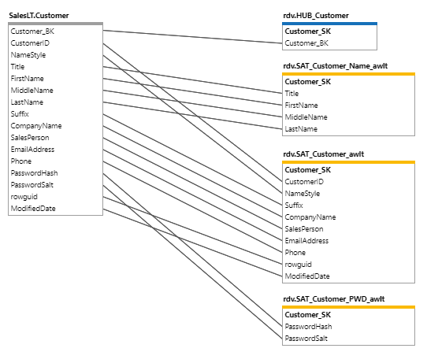

# Column Mapping

In this document, we show how the Column Mapping tool can be used to review and update your Column Mappings in an easy graphical interface.

## Column Mapping Overview

The Column Mapping Diagram provides an view of one or more mapping relationships. It allows a user to get a quick view of mappings in a graphical interface. It allows the developer to easily add or remove mappings using column drag and drop. It also provides some of the most common actions that make sense in the context of data mapping.

### Starting Point

The starting point for the examples in this document is when all source metadata has been imported for the AdventureWorksLT database, the Source to Staging and Persistent Staging has been completed and the Raw Data Vault has been published via the Accelerator.

[//]: # (TODO: Link to UPDATED Source To Staging document)

Follow the guide for [Source To Staging](../concepts/source-to-staging-templates.md) and import all SalesLT tables from the AdventureWorksLT source.

Follow the guide for [Data Vault Accelerator](accelerator.md) to get a Raw Data Vault schema which will be used in this guide.

The screenshot above shows the Column Mapping of some Source Tables to  their Target Raw Data Vault as mapped during the Data Vault Accelerator publish.

### Context Aware Actions

There are convenience actions available on all of the tables and columns.

By clicking on a Table or Column a user gets a pop up of all the actions buttons available. The first click will show a minimized view with only the icons with tooltips.

There are a few new actions available that are only applicable to the Column Mapping diagram which will be highlighted below.

By Clicking the ellipsis a user may see the maximized view which contains the words alongside the icons.

| Icon | Action | Description |
|--- |--- |--- |
| 

 | Remove Mapping | **Mapping Diagram Action**. This removes the mapping between columns. |
| 

 | Show All Mappings | **Mapping Diagram Action**. Add all the mapped tables to the view by interrogating the source or target mappings. |
| 

 | Hide Table | **Mapping Diagram Action**. Remove the table from the view. Convenience action which is the same as deselecting a table on the source or target selection list.  |
| 

 | Navigate | Navigate to table or column. The current schema diagram layout will be persisted in memory for you to come back to. |
| 

 | Edit | Open a side panel to edit the table or column. This can also be a bulk action when multiple columns are chosen while holding `Ctrl` key.|
| 

 | Add Integration Key | Add an **Integration Key** using the selected columns. |
| 

 | Bulk Delete | Bulk action when multiple columns are chosen while holding `Ctrl` key. Delete or Archive the selected columns. |
| 

 | Create Pit | Action available on HUB tables to create an Point in Time table. |
| 

 | Create Bridge | Action available on HUB tables to create a Bridge table. |
| 

 | Spit | Split columns from a Satellite. |
| 

 | Revert Spit | Revert columns that were split from a Satellite. |

### Drag and Drop Actions

By dragging and dropping certain columns users can affect the metadata in various ways:

1. Change Ordinal - Drag a source column up or down in the same table to change the ordinal.
1. Add Mapping - Drag a source column onto a target column to add a mapping.
1. Move Satellite Columns - Drag a satellite column onto another satellite which shares the same source to move the column between satellite.

### Layout Drag Options

Tables can be dragged around on the screen to make the layout easier to view.

### Filtering Tables

Use filtering in the Selection pane to see only specific tables in your view. There are two Selection Panes in the Column Mapping diagram. The Source and Target selection panes are related and have certain rules which are enforced:

1. The target pane can not show source **Integration Stages**.
1. The target pane has to have a **Integration Stage** that is down-stream from the source **Integration Stage**, i.e. if the source is an RDV, then the target cannot be RDV, but can be Data Mart.

### Auto Selection of Mapped Tables

The Column Mapping auto selects all the direct mapped tables when a user makes a selection. This can be utilized by users to easily select the views they are interested in.

Examples:

* When a user selects a source table in a SRC => RDV schema it will automatically select the HUB, LINK(s) and SAT(s).
* To view only SRC => HUBs a user can select the Hubs in the target pane.
* To view only SRC => LNKs a user can select the Links in the target pane.
* To view only SRC => SATs a user can select the Satellites in the target pane.
* To view only SRC => HUBs and LNKs a user can select the Hubs and Links in the target pane.

The example above shows Source to Hub mappings.

### Auto De-Selection of Mapped Tables

When a user de-selects a table the Column Mapping diagram will also remove the mapped table if it is the last mapping.

When a user de-selects a table the Column Mapping diagram which is not the last mapping the mapped table will not be removed.

To illustrate this, see the image below.

* If a user de-selects the HUB it will only remove the HUB, but if he de-selects the HUB and the SAT it will also remove the Source table.
* If a user de-selects the Source table it will also remove the HUB and the SAT tables.

### Moving Columns between Satellites

Splitting a satellite starts off the same way as in the Accelerator, but in the Column Mapping tool users also have the ability to easily move columns between satellites.

Drag a satellite column onto another satellite which shares the same source to move the column between satellite.

The images of the Customer table mapping below illustrate this action:

* Start by splitting out the Name columns into a Name Satellite:

* This is what it looks like after splitting out the Name Satellite:

* Now, drag the Title column into a Name Satellite:

* You should end up with the Title column in the Name Satellite:

