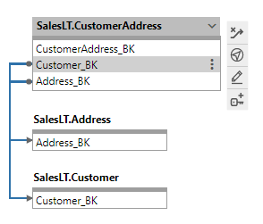

# Schema Diagram

In this document, we discuss the Schema Diagram tool with reference to how it provides a simple view of your data and accelerates your development tasks.

## Schema Diagram Overview

The Schema Diagram provides an entity relation view of any set of metadata based on the integration stage. It allows a user to get an overview of what the metadata looks like in an easy to understand view. It also helps the developer to execute the most common actions on the data in a graphical interface.

### Starting Point

The starting point for the examples in this document is when all source metadata has been imported for the AdventureWorksLT database, the Source to Staging and Persistent Staging has been completed and the Raw Data Vault has been published via the Accelerator.

[//]: # (TODO: Link to UPDATED Source To Staging document)

Follow the guide for [Source To Staging](../concepts/source-to-staging-templates.md) and import all SalesLT tables from the AdventureWorksLT source.

Follow the guide for [Data Vault Accelerator](accelerator.md) to get a Raw Data Vault schema which will be used in this guide.

The screenshot above shows the Schema Diagram of a subset of the Raw Data Vault data as generated during the Data Vault Accelerator guide.

### Difference between the Data Vault Accelerator and Schema Diagram

While the two tools look similar it is important to understand that there is a difference between them in that the Accelerator works with the Preview Data Vault. Actions on the Preview side of the Accelerator actually affect the Source tables and columns whereas actions in the Schema Diagram affects the actual metadata for those tables.

An example of this is; If you want to split a Satellite, the appropriate place to do that is in the Accelerator. If you make the required changes in the rdv schema, they may be overridden the next time someone publishes the accelerator data unless the source data has been updated to reflect the target schema.

As such the Context Aware Actions are slightly different than the Accelerator Actions.

### Context Aware Actions

There are convenience actions available on most of the tables and columns.

By clicking on a Table or Column a user gets a pop up of all the actions buttons available. The first click will show a minimized view with only the icons with tooltips.

By Clicking the ellipsis a user may see the maximized view which contains the words alongside the icons.

| Icon | Action | Description |
|--- |--- |--- |
| 

 | Add Reference | Add a reference. This can also be done by dragging a column onto the target table. |
| 

 | Remove Reference | Remove a reference. This action removes the reference link, not the column. |
| 

 | Navigate | Navigate to table or column. The current Schema Diagram layout will be persisted in memory for you to come back to. |
| 

 | Edit | Open a side panel to edit the table or column. This can also be a bulk action when multiple columns are chosen while holding Ctrl key. |
| 

 | Add Integration Key | Add an integration key using the selected columns. |
| 

 | Show Related | Add all the related tables to the view by interrogating the direct references. |
| 

 | Bulk Delete | Bulk action when multiple columns are chosen while holding Ctrl key. Delete or Archive the selected columns. |
| 

 | Create Pit | Action available on HUB tables to create an Point in Time table. |
| 

 | Create Bridge | Action available on HUB tables to create a Bridge table. |

Note the new Actions available on the Raw Data Vault Hubs.

### Drag and Drop Actions

By dragging and dropping certain columns or tables users can affect the metadata in various ways:

1. Change Ordinal - Drag a source column up or down in the same table to change the ordinal
1. Add Reference - Drag a source column onto another table to add a reference

### Layout Drag Options

Tables can be dragged around on the screen to make the layout easier to view. There are four ways to drag tables around.

1. Drag - Drag an individual table to another location
1. Ctrl Drag - Drag a Hub and its Satellites
1. Shift Drag - Drag all selected tables and their Satellites
1. Ctrl+Shift Drag - Drag all selected tables and their referenced tables and Satellites

### Filtering Tables

Use filtering in the Selection pane to see only specific tables in your view. There are selection fields for *Integration Stage*, *Record Source* and *Model Grouping* which allow fine grain filtering of tables. Note that the *Record Source* and *Model Grouping* fields will be hidden if there are no options to filter by.

### Data Vault Backbone

The default schema will allow all tables to be selected. By selecting only the Hubs and Links in the filtering pane a user can view the Data Vault Backbone and review the CBC's and UOW's.
