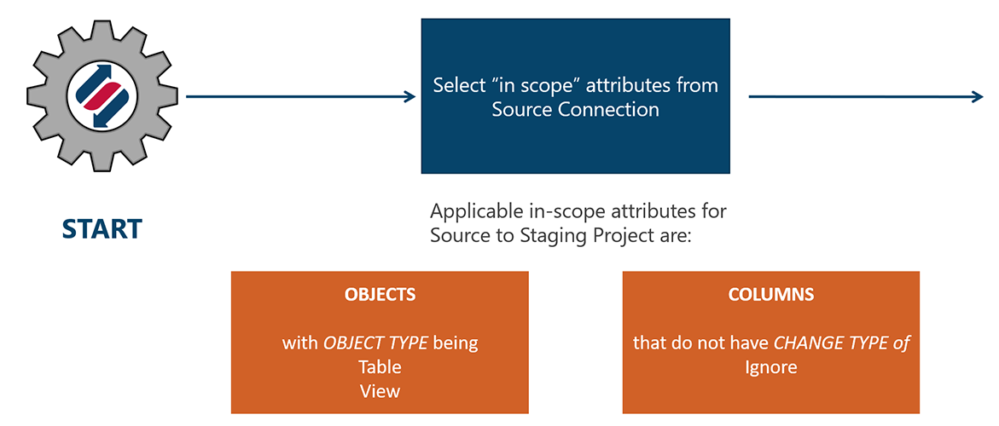
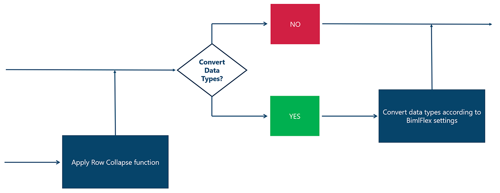
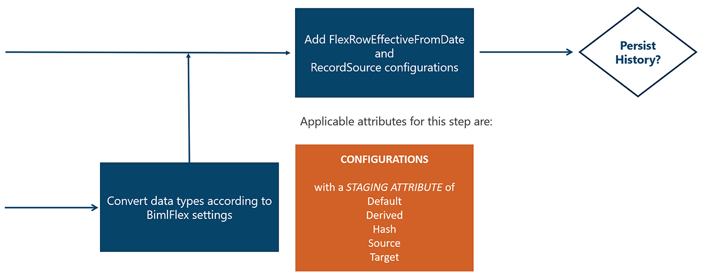

---

---

# Source to Staging Project Pattern

The following pattern, outlined below, details the customary route to establish a Source to Staging workflow within the BimlFlex application.

The pattern provided is fundamental in scope.
The pattern attempts to address deviations from a "standard" Source to Staging workflow by indicating what settings can be modified to alter the workflow to fit your organization's intended data solution(s).

## Pattern Requirements

The sole requirement for this pattern is that the Project Source connection is of *INTEGRATION STAGE* `Source System`.

Configure the *INTEGRATION STAGE* by first selecting **Connections** from the left side menu, selecting your source connection from the navigation tree, and then the *INTEGRATION STAGE* dropdown menu in the Details tab.

## Source to Staging: Start

Begin by selecting in-scope attributes from the Source Connection.
"In-scope" attributes include adding applicable **Objects** and **Columns.**

Configure *OBJECT TYPE* by selecting **Objects** from the left side menu:

Configure *CHANGE TYPE* by selecting **Columns** from the left side menu:

## Source to Staging: Decision Points

The next setting to consider when designing your Source to Staging architecture is whether to collapse rows.Collapsing rows is a form of "de-duping" records that do not show a delta.

Configure the setting to collapse rows by selecting **Settings** from the left side menu, and then navigating to the **Staging** Setting Group. *SELECT STAGE ROW DISTINCT* can be toggled from this menu.

The next setting to consider is whether to convert data types according to BimlFlex settings. **Data Type Mappings** are applied when the **Column** has a *DATA TYPE MAPPING* value.

Configure this setting within BimlFlex by selecting **Columns** from the left side menu then selecting a column from within the navigation tree. *DATATYPE MAPPING* can be applied from this screen. 

## Source to Staging: Additional Configurations

Next, set additional configurations regarding FlexRowEffectiveFromDate and RecordSource.

Configure *STAGING ATTRIBUTE* by selecting **Configurations** from the left side menu.
Various configuration settings can be selected from the navigation tree.

## Source to Staging: Persist History Options

The Source to Staging pattern can go in multiple directions based on your organization's decision regarding whether to persist the history of your Staging Area.

If it has been decided that you **will** persist history of your Staging Area, reference the pattern for Persistent Staging Area here: **insert link**

The Persistent Staging Area pattern usage is dictated by the *PERSISTENT STAGE CONNECTION* setting.
Configure this setting by selecting **Projects** from the left side menu.

