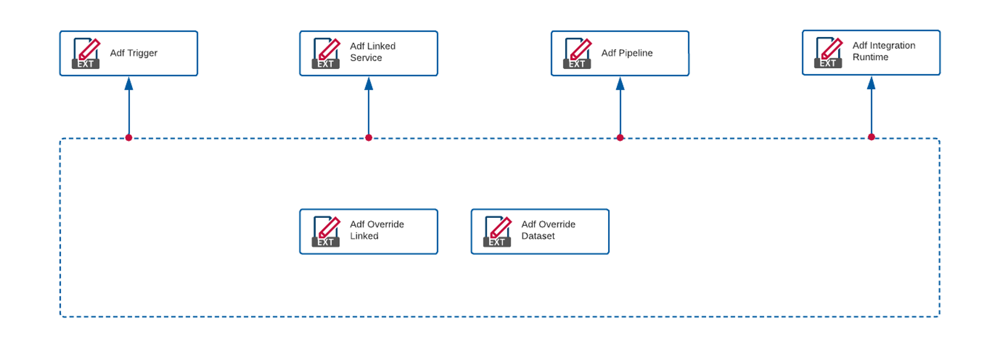
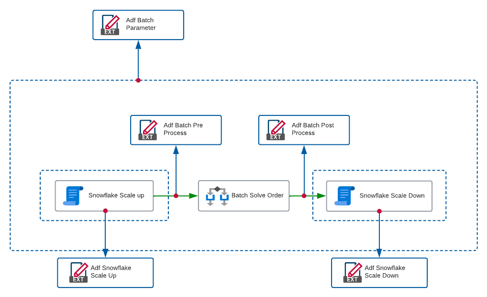
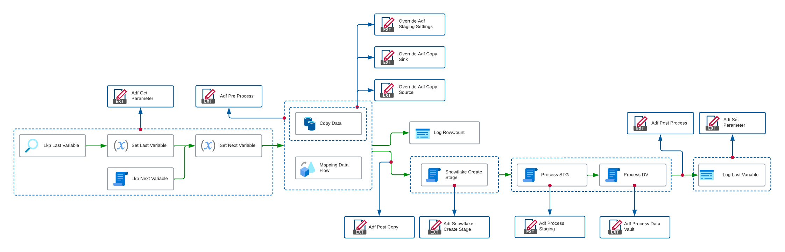
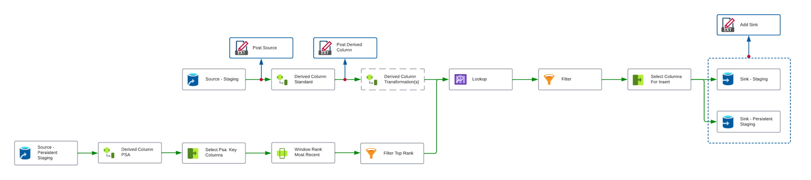

# Extension Points

This page lists the available Extensions Point for each category.

> [!NOTE]
> The Extension Point concept is explained in detail in the [Extension Point](xref:bimlflex-concepts-extensionpoints) documentation.
 
## Overview
  
| 
Category
 | Description |
| --------- | ----------- |
|[Global](xref:bimlflex-reference-documentation-global-extensionpoints) | Internal global Extension Point to control environment settings.|
|[Project](xref:bimlflex-reference-documentation-project-extensionpoints) | Extension Points that target a Project configuration for SSIS.|
|[Connection](xref:bimlflex-reference-documentation-connection-extensionpoints) | Extension Points that target a Connection configuration for SSIS.|
|[Batch](xref:bimlflex-reference-documentation-batch-extensionpoints) | Extension Points that target a Batch container concept, for process orchestration purposes in an SSIS context.|
|[Object](xref:bimlflex-reference-documentation-object-extensionpoints) | Extension Points that target an Object as defined in BimlFlex metadata.|
|[Staging SQL](xref:bimlflex-reference-documentation-staging-sql-extensionpoints) | Extension Points that allow modification of SQL code at various places in the process of loading data from source to staging.|
|[Data Vault](xref:bimlflex-reference-documentation-data-vault-extensionpoints) | Extension Points that allow modification of steps and logic in Data Vault related processes.|
|[Data Mart](xref:bimlflex-reference-documentation-data-mart-extensionpoints) | Extension Points that can modify the approach to load Data Marts.|
|[Data Factory](xref:bimlflex-reference-documentation-data-factory-extensionpoints) | Extension Points specifically catering for Azure and Data Factory.|
## Diagrams

Various diagrams have been created to facilitate better understanding where certain extension points apply in addition to the reference documentation provided in this section.

Each diagram covers the extension point as they target specific parts of the generated patterns and infrastructure.

### Azure Data Factory

The following Extension Points target the Azure Data Factory as a whole. These are part of the [Data Factory](xref:bimlflex-reference-documentation-data-factory-extensionpoints) Extension Point group.

### ADF Orchestration Batch Pipeline

The following Extension Points target the orchestration Batch as generated by BimlFlex. These are part of the [Data Factory](xref:bimlflex-reference-documentation-data-factory-extensionpoints) Extension Point group.

### ADF Individual Process Pipeline

The following Extension Points target the execution Pipeline that acts as the modular data logistics component as generated by BimlFlex. These are part of the [Data Factory](xref:bimlflex-reference-documentation-data-factory-extensionpoints) Extension Point group.

### Mapping Data Flow Individual Process

The following Extension Points target a Source-to-Staging Mapping Data Flow that acts as the modular data logistics component as generated by BimlFlex. These are part of the [Mapping Data Flows](xref:bimlflex-reference-documentation-mapping-data-flows-extensionpoints) Extension Point group.

