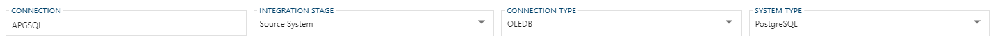
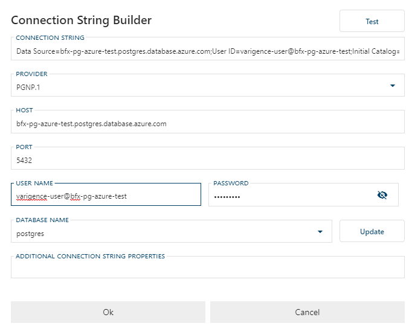
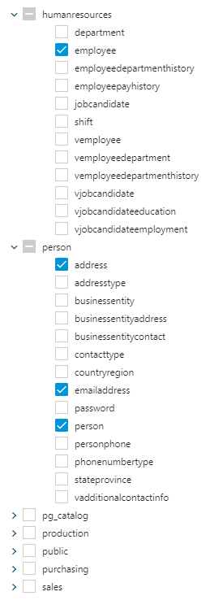
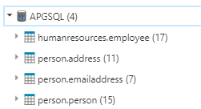
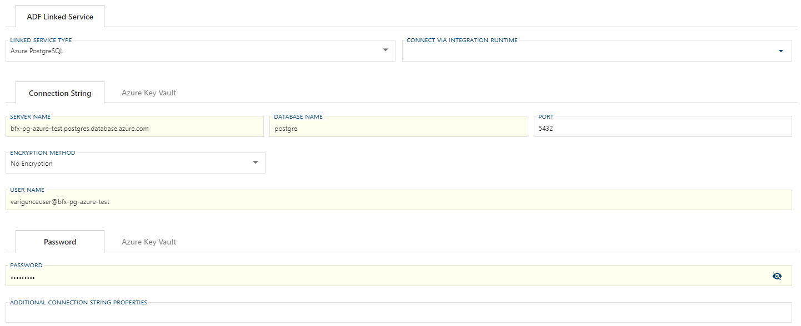

# Using Azure PostgreSQL Sources in BimlFlex

This section covers importing metadata from an Azure PostgreSQL ('Postgres') database, so that this metadata becomes available in the BimlFlex app to further generate Azure Data Factory (ADF) and SQL Server Integration Services (SSIS) assets.

For the purpose of this example, we use an Azure PostgreSQL database server that has been populated with the [AdventureWorks for Postgres Database](https://github.com/lorint/AdventureWorks-for-Postgres).

## Setup Connection in BimlFlex App

1. Enter the [`Connection Name`](xref:bimlflex-connection-editor), for this example we will use `APGSQL`.
2. Select `Source System` for the Integration Stage.
3. Select `OlEDB` for the Connection Type.
4. Select `PostgreSQL` for the System Type.

## Connection String Editor

The next part is to configure the connection string. This is used to connect to the Azure Postgres database for importing your metadata. If you are using an Integration Stage that emits SSIS assets, this connection string is also used in those source components.

The following properties of the Connection String are configurable:

**Provider** - This value is only used in an SSIS context. The [Intellisoft OLE DB Provider for PostgreSQL](https://www.pgoledb.com/index.php/component/filecabinet/?Itemid=111) is used here for connecting to Azure Postgres. In order to emit a working SSIS source component, the *PGNP.1* provider must be specified. It is not needed for the metadata import or for ADF sources.

**Host** - This is the URL of your Azure PostgreSQL database server. The URL can be found by checking the database in Azure Portal.

**Port** - The default value is 5432. This is typically only relevant for an on-premises scenario.

**User Name** - The fully qualified user id that will be connecting to the Azure PostgreSQL database. Note that the database server identifier (the part before the .postgres.database.azure.com of the host address) is required.

**Password** - The password used to log in the specified user.

**Database Name** - The name of the database that you wish to connect to. In this case, our database is named `Postgres`.

Once this information is filled out, you can click `[Test]` and verify that you have a working connection.

## Importing Metadata

Once a working connection string is established, it is possible to import metadata. Click the `[Import Metadata]` button at the top of the connection screen.

Once taken to the new screen, click `[Connect To Database]`. If you have a working database connection you will then see a list of Schemas / Tables for you to select for importing.

For this example, we are only interested in three tables from the Person schema (Address, Person, and EmailAddress) and one table from the HumanResources schema (Employee). Our tree view would look like this:

Now click `[Import Metadata]` and wait for the success message. You can now go to your connection and see your imported metadata.

 
You can now use this metadata similar to any other data source in BimlFlex.

## SSIS Projects for Postgres

 In order to generate working SSIS components, you must have a working OleDb PostgreSQL driver installed on your machine that works with your target SSDT version.

In this example we are using the [Intellisoft OLE DB Provider for PostgreSQL](https://www.pgoledb.com/index.php/component/filecabinet/?Itemid=111), note that they have a free version.

## Azure Data Factory Projects

 In the top right corner of the Connection editor, select the `[Cloud]` toggle button to enable the Linked Service connection editor:  

**Linked Service Type** - Choose between an AzurePostgreSQL linked service or a PostgreSQL linked service. This will be the type of ADF linked service that will be emitted.  
**Connection String** - You have the option of providing an Azure Key Vault reference that contains your connection string, or manually entering the properties that will be used to create the ADF connection string.

### Connection String Properties

**Server Name** - This is the URL of your Azure PostgreSQL database server. The URL can be found by checking the database in Azure Portal. If this was on-premise this would be the name of the server.

**Database Name** - The name of the database that you wish to connect to. In this case, our database is named `Postgres`.

**Port** - The default value is 5432. This is typically only relevant in an on-premise scenario.

**User Name** - The fully qualified user id that will be connecting to the Azure PostgresSQL database. Note that the database server identifier (the part before the .postgres.database.azure.com of the host address) is required.

**Encryption Method** - The method the driver uses to encrypt data sent between the driver and the database server. The options are None, SSL, and RequestSSL.

**Validate Server Certificate** - Determines whether the driver validates the certificate that's sent by the database server when SSL encryption is enabled. Note an Encryption Method must be set to access this property.

Once you have these properties configured to your liking, you can now generate deployable Azure PostgreSQL linked services to ADF.