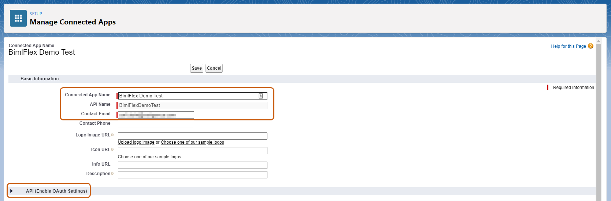
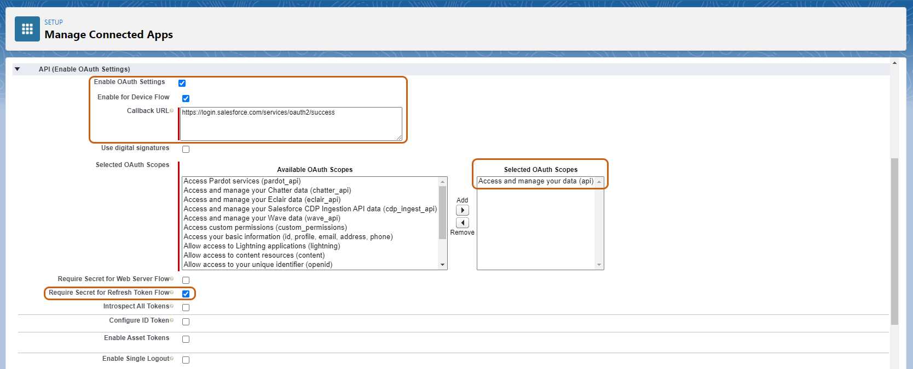

# Connecting to Salesforce REST API

BimlFlex can load and ingest data from Salesforce into the data warehouse using the `REST API` Connection Type.

This document reviews the metadata configuration and considerations for connecting to Salesforce as a Source Connection.

## Salesforce

Add the Source connection metadata through the BimlFlex App

### New Connection Metadata from Sample Snapshot

From the BimlFlex dashboard, click **Load Sample Metadata** under the **Getting Started** section.
Within the **Load Sample Metadata** dialog, depending on your intended data solution, select either:

- Snapshot 42 - Synapse Salesforce ADF Solution, or
- Snapshot 43 - Synapse Salesforce SSIS Solution

Select your *Customer* and *Version Name* from their respective drop down menus. Check the box under **Confirm to Replace** and click *Ok.*

The sample metadata progress bar will complete with a toast notification advising that the sample metadata was imported successfully.

From the BimlFlex menu, click **Connections** and select "SFDC_SRC" from the navigation tree.

Under the **Connection** tab, ensure the following settings are set as indicated:

- *Integration Stage* is `Source System`  
- *Connection Type* is `Rest API`  
- *System Type* is `Salesforce`  
- *Enable for Cloud* is `enabled`

By default, when using Snapshot 42 or 43, these settings will already be set.

### New Connection Metadata from Blank

Alternatively, if not using the Sample Snapshots, a new Salesforce REST API connection can be created from within the **Connection** menu.

Click `+` from the navigation tree and in the **Add Connection** dialog, fill in the respective data fields with the information as indicated above.

Click *Save* and refresh for your new connection be reflected within the navigation tree. 

### Additional Required Connection Settings

Additional **Connection** data fields that are required to connect to Salesforce are:

- *Username*
- *Password*
- *Consumer Key*
- *Consumer Secret*

The mechanism used to connect to Salesforce is OAuth 2.0.

This mechanism only allows access through a connected APP, NOT a connected USER.  
This distinction is why Consumer Key and Secret are required in addition to simply one's Username and Password.

### Obtaining Consumer Key and Consumer Secret

It is first required to log in to your [Salesforce Lightning Developer](login.salesforce.com) account.

Once logged in and on the Salesforce Lightning Developer homepage, in the sidebar menu, navigate to *Platform Tools* > *App* > *App Manager.*  
Click *New Connected App* (top right).

The required fields in the **New Connected App** screen are:

- *Connected App Name*
- *API Name*
- *Contact Email*

Fill in these fields with your organization's information, and click *Enable OAuth Settings* underneath **API (Enable OAuth Settings)**

In the **API (Enable OAuth Settings)** menu ensure that the following required fields are set as follows: 

- *Callback URL* is `https://login.salesforce.com/services/oauth2/success`
- *Selected OAuth Scopes* is `Access and manage your data (api)`
- *Require Secret for Refresh Token Flow* is `enabled`

Click *Save* once completed.
Note that Salesforce advises that changes can take up to ten (10) minutes to take effect.

Users should then be redirected to the **Manage Connected Apps** menu for the newly created App, with the following information populated in their respective fields:

- *Consumer Key*
- *Consumer Secret*
- *Callback URL*

The information above can be copied and pasted into the BimlFlex **Connections** tab to complete connecting to Salesforce as a Source.

Double-clicking on the *Connection String* field will bring up a dialog box that allows users to enter their Username and Password into individual fields, instead of editing the entire string.

The *Catalog* is where Users will define their schema. Salesforce itself does not have the concept of schema, but when imported, it does exist within the realm of relational databases. 

Click *Save.*

If all information was entered accurately, Users should be able to click *Import Metadata* to complete the process.