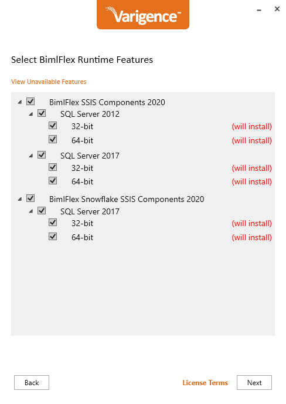

# Server Installation

For SSIS Server installations, the Varigence Custom SSIS components used in BimlFlex generated SSIS packages are required to be available on the server.

This installation is required for SQL Server Integration Services (SSIS) Servers that run BimlFlex created packages. These custom components are also required when opening and running the generated packages in Visual Studio.

## Installation Media

The Varigence BimlFlex custom SSIS Components are part of the BimlFlex installation and can be installed either from the BimlFlex installer or the BimlFlex runtime installer.

The latest installer is available here: [BimlFlex Release Notes](xref:bimlflex-release-notes)

## Installation

Run the installer on the SSIS Server and install the BimlFlex SSIS custom components version matching the SSIS Server version and target architecture.

For Snowflake, install both the BimlFlex SSIS Components 2020 and the BimlFlex Snowflake SSIS Components 2020 for your SSIS and SQL Server version.

> [!NOTE]
> Only run one of the installers. For minimal installation on a server, only install the components from the Runtime installer

## Uninstallation

Use the normal **Apps & Features** or **Programs and Features** application management features in Windows to uninstall the Custom SSIS Components.
