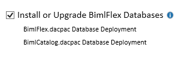
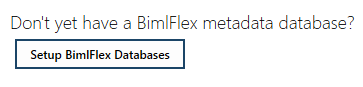
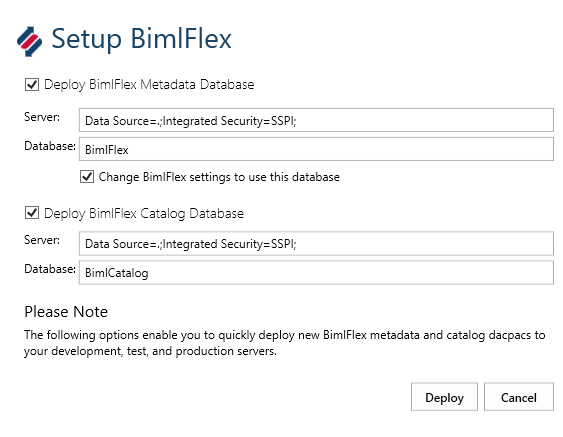

# BimlFlex Metadata Database Installation

BimlFlex data warehouse automation metadata is stored in the BimlFlex metadata database

More information: [BimlFlex Metadata Database](../metadata-databases/bimlflex-database.md)

Operational data, audit information and logging data is stored in the BimlCatalog Database

More information: [BimlCatalog Database](../metadata-databases/bimlcatalog-database.md)

There are two different methods used to install these databases. The first option is to use the BimlFlex installer. The second option is to use BimlStudio. 

## BimlFlex Installer Setup

### Enable the Database Installation

On the first pane of the installation process, there is the option to setup and install the BimlFlex and BimlCatalog databases. Check this box before continuing.

### Setting the Connection Strings

Proceed through the setup until you reach this screen:

>[!NOTE]
> Click `Test` to test the target connection and ensure that it is valid.

This represents the location(s) that the BimlFlex database will be installed. Once you have a working connection string, click the `Add` button to finalize your configuration.

The desired installation location is now saved and will be used to install the database.

  

>[!IMPORTANT]
> It is important to back up any databases prior to an upgrade.

Now press `Next` to repeat this same configuration process for **BimlCatalog**.

Before finalizing your upgrade or installation, examine the *Pending Actions* list. Ensure that there is a pending action that corresponds to the desired database installation.

Now press `Upgrade` or `Install`. Congratulations, the BimlFlex database is now installed or upgraded.

## BimlStudio Setup

### Open the Project in BimlStudio

It is also possible to install the databases from the BimlFlex project in BimlStudio.

In order to setup the databases, first create a [BimlFlex project for BimlStudio](xref:bimlflex-setup-bimlstudio-project)

When the BimlFlex project is opened in BimlStudio, the metadata database setup option is available in the BimlFlex Ribbon.

  

### Setting the Connection String

Set up the databases through the **Setup BimlFlex** dialog

Configure the connection string to point to the database instance where the database should be created

> [!NOTE]
> Change the name of the databases from their defaults, **BimlFlex** and **BimlCatalog**, as needed

### Deployment

Click **Deploy** to deploy the databases

Once setup completes, configure the BimlFlex Project and BimlFlex App metadata connections to use the new **BimlFlex** database. Configure The project and the Operational Reports to use the **BimlCatalog** database
