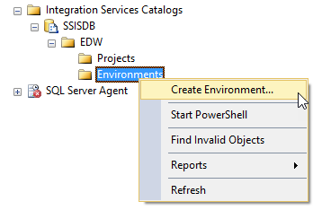
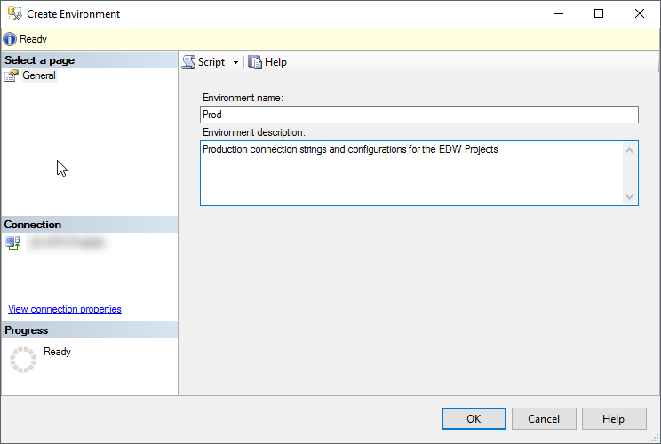
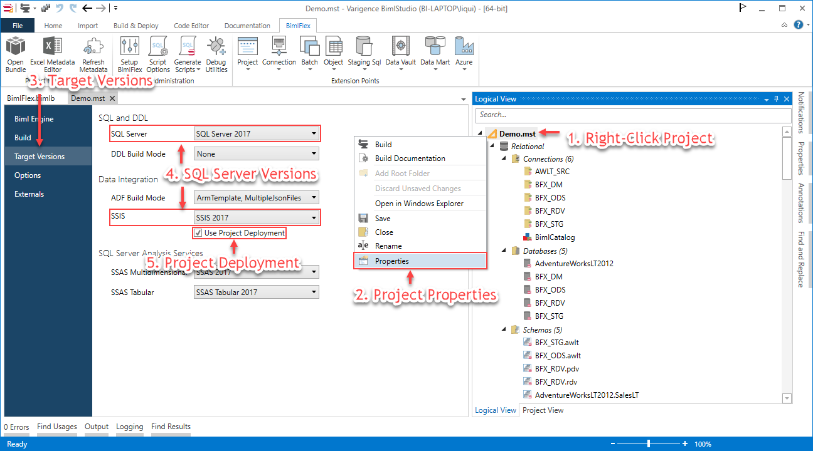
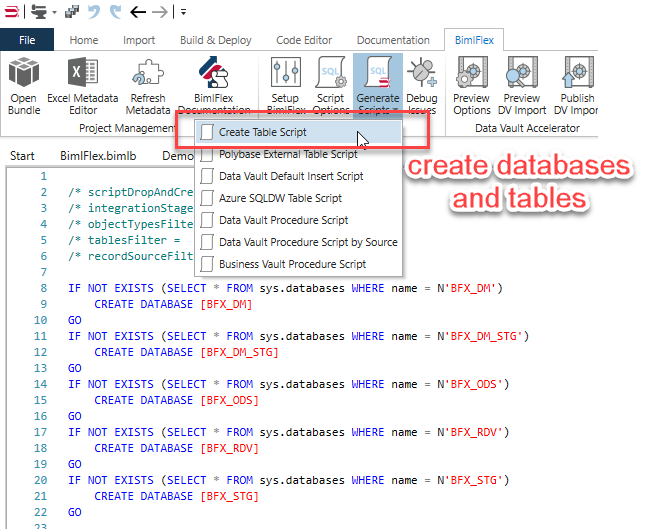
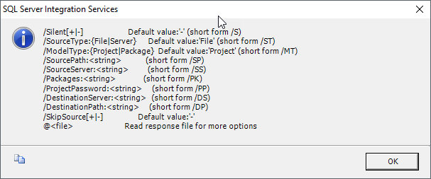
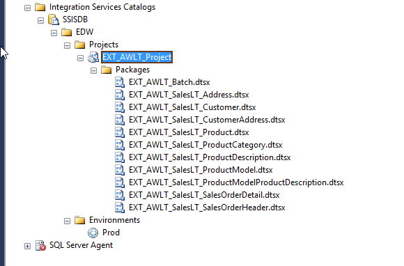
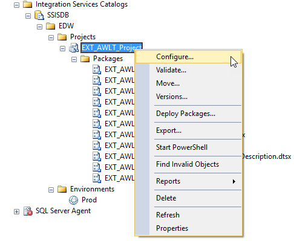
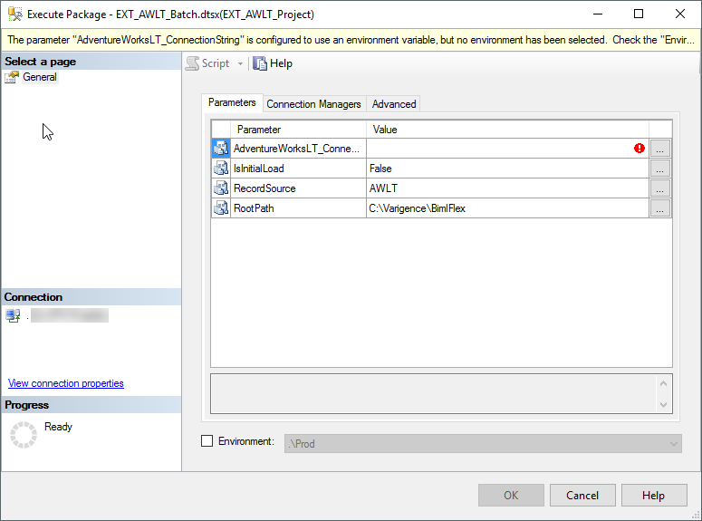

# SSIS Deployment Guide

Modern versions of SQL Server (2012+) supports project configurations and deployments to the SSIS Catalog. This document details how to use the project deployment model in BimlFlex and how to align that deployment to the SSIS Catalog environments for variable assignments. This can be used to populate passwords and connection strings for connections and inject them when the package is running on the SSIS Server

BimlFlex also supports the legacy package based deployment and its configuration approach.

It is a recommendation to:

* Use a modern, supported version of SQL Server
* Use the project configuration model
* Deploy the solutions to the SSIS Catalog
* Use Environments to configure connection strings and other parameters and configurations.

> [!NOTE]
> SQL Server Integration Services is only one of the options for orchestrating you data warehouse environment.
> To learn more about another option see the [Azure Data Factory Deployment Guide](xref:bimlflex-ssis-deployment-guide).

## Validating the Catalog in the target server

A catalog needs to be created if the catalog node in Management Studio is empty for the target server. The mandated name for the Catalog and corresponding database is SSISDB.



Once a catalog is available it is possible to create a folder for the projects. Multiple projects can be deployed to the same folder. The folder provides a common set of environments for all its projects.

In general, it makes sense to deploy all projects related to the Data Warehouse to the same folder so that they can share all connection string and other configuration information. It is possible to test deploy new versions to a separate folder if there is no separate test environment.


For each folder, it is possible to create one or more Environments. The environments can be for testing/production distinction for jobs or for different sets of configurations needed.



Variables can be defined in the environment once it is created. These normally correspond to the parameters and connection strings defined in the SSIS project. Retaining names across the locations makes it easy to know what is what. The default name for a connection string in the SSIS project, when defined as a parameterized connection manager is

`<connection name>_ConnectionString`

in this case, the default name for the source is

`AdventureWorksLT_ConnectionString`

By naming the environment variable the same it is easier to match them up later.


Once the variables are defined the SSIS Project needs to be deployed for the connection to be configured.

## Custom SSIS Components used in BimlFlex

BimlFlex uses several custom SSIS components in the generated packages. These components are specific to the SQL server version used and need to align with both the SQL Server and the Project versions that are deployed. This is part of the installation and setup process and assumed installed on the destination server for the process described in this document.

If the project is deployed using the wrong Visual Studio SSIS Target Server/Version specification there will be errors when running these components.

> [!TIP]
> For additional details on installing SSIS Custom Components refer to the below guide:  
> BimlFlex Docs: [BimlFlex SSIS Custom Components](xref:bimlflex-ssis-custom-components)  

## Project Deployment for SQL Server 2017 Using the Catalog

As a demonstration project, a new BimlStudio project called Demo located in the `c:\Varigence\` folder will be used. The project will create a folder called Demo for the BimlStudio project contents.

This project will have a single integration to read from the AdventureWorksLT source to the Staging Database.

The approach assumes a SQL Server version that supports SSIS Catalog (2012+) and in the document SQL Server 2017 is used.

1. Before deployment, a Catalog must be available in the target SQL Server instance.
1. Once the required metadata is created BimlStudio will build the SSIS Project.
1. Once the build is successful it will be deployed to the SSIS Catalog.
1. Once deployed an environment will be used to override connection strings
1. Once configured SQL Server agent will be used to schedule a batch for a specific environment, using the environments connection strings.

## Create and Build a Demo Project

### Step 1: Create Project

From BimlStudio a project called Demo is created in the `C:\Varigence\Demo` folder.

The project is configured to match the target destination

SSIS 2016 is used in the demo. The Project deployment checkbox is checked so connection strings for the whole project can be maintained through SSIS Catalog environments.



> [!TIP]
> For additional details on configuring a BimlStudio project refer to the below guides:  
> BimlFlex Docs: [BimlFlex - Setup BimlStudio Project](xref:bimlflex-setup-bimlstudio-project)  


### Step 2: Load BimlFlex Sample Metadata

As the demo source is one of the sample sources it is possible to take a shortcut through the sample metadata.  Using BimlFlex load the  `01 - MSSQL Starting Point` sample.  

<!-- TODO: Link (Create?) guide for loading sample metadata -->

### Step 3: Import Metadata

Once the sample metadata is created it can directly connect to the AdventureWorksLT Source to get the required source metadata.

Import the metadata for all tables in scope of the `SalesLT` schema from the from the `AdventureWorksLT` source system.


> [!TIP]
> For additional details on importing metadata project refer to the below guide:  
> BimlFlex Docs: [BimlFlex Importing Metadata](xref:bimlflex-importing-metadata)  

### Step 4: Create Databases and Tables

Create all DW databases and tables from the BimlStudio generated scripts output.



> [!TIP]
> For additional details on generating the DDL refer to the below guide:  
> BimlFlex Docs: [BimlFlex Generating DDL](xref:bimlflex-generating-ddl)  

### Step 5: Define Project Parameters

Define project parameters and connection expressions for all relevant connections in the BimlStudio solution.

There are many ways of maintaining the connection strings and required configurations in SSIS and SQL Server. BimlStudio provides several easy ways to manage and maintain whatever is chosen for an environment. For this demo, deployment is done to the catalog and a Catalog environment variable is used to define the connection string. For the parameterized connection string to be available in the generated SSIS project it first needs to be defined through an Extension Point. The approach needs one Extension Point for the Project parameter and one for the connection string parameterization.

```biml
<#@ extension bundle="BimlFlex.bimlb" extensionpoint="ProjectParameter" target="EXT_AWLT_Project" #>

<Parameter Name="AdventureWorksLT_ConnectionString" DataType="String" IsRequired="true">Data Source=.;Initial Catalog=AdventureWorksLT2012;Provider=SQLNCLI11.1;Integrated Security=SSPI;</Parameter>
```

The project parameter target is the SSIS project it will be used in. In this case, the `EXT_AWLT_Project` where project parameters will be used to define connection strings

```biml
<#@ extension bundle="BimlFlex.bimlb" extensionpoint="ConnectionExpression" target="AdventureWorksLT" #>
<#@ property name="connection" type="BimlFlexModelWrapper.ConnectionsWrapper" #>

<Expressions>
	<Expression ExternalProperty="ConnectionString">@[$Project::AdventureWorksLT_ConnectionString]</Expression>
</Expressions>
```

The connection expression connects the target property, in this case, the target connection manager `AdventureWorksLT` and the ConnectionString property with the defined Project parameter.

When the project is opened in Visual Studio the project connection manager can be verified as parameterized to use the project parameter.

Extension Point files should be named using a consistent naming convention. These files form part of the source code for the project itself and need to be maintained as such. The contents of the Extension Point files are not maintained in the metadata database.

> [!TIP]
> For additional details on project parameters and extension points refer to the below guides:  
> BimlFlex Docs: [BimlFlex Parameters](xref:bimlflex-metadata-parameters)  
> BimlFlex Docs: [BimlFlex Extension Points](xref:bimlflex-extension-points)  

### Step 6: Build the Projects in BimlStudio

Build command buttons


> [!TIP]
> For additional details on the different build methods refer to the below guides:  
> BimlFlex Docs: [BimlFlex Interactive Build](xref:bimlflex-interactive-build)  
> BimlFlex Docs: [Building Using the Command Line](xref:bimlflex-command-line-build)  

### Step 7: Review the Generated SSIS Projects

The default destination for the output is a folder called output in the project folder. In this case `C:\Varigence\Demo\Output\`

This location can be defined and changed in the project settings.


Once the build completes there will be a number of folders for the complete solution in the output folder. The folders in the screenshot above contain:

* BFX\_ODS, an SSIS project to create all tables defined in the BFX\_ODS database
* BFX\_STG, an SSIS project to create all tables defined in the BFX\_STG database
* Database, SSIS Projects to create all databases in the solution
* Documentation, generated documentation for the solution
* EXT\_AWLT, the generated SSIS project to source the data from the AdventureWorksLT source to the Staging and Persistent Staging databases
* PackageConfigurations, dtsConfig files for projects that use PackageConfigurations
* Schema, SSIS projects to create all Schemas defined in the databases

The `EXT_AWLT` folder is named after the project name in the metadata and contains all packages defined in the project.

In the `EXT_AWLT` folder (and in all SSIS folders) are both the SSIS project with the individual DTSX files and a sub folder called bin that holds the compiled ISPAC deployment file.

It is possible to deploy either the ISPAC file or the project to the catalog. ISPAC files are great for automated deployment and command type approaches. Opening the project in Visual Studio allows manual, visual review, manual running of the process and manual deployment from Visual Studio to a destination Catalog.

## Deploying the Generated ISPAC File to the SSIS Catalog

For ISPAC files when there is a requirement to automate the deployment using command line tools in an automated fashion. This can be done either through a locally set up deployment pipe or through automation tools for server based automated deployments.

When deploying to the catalog the projects are deployed into folders. This means it is easy to organize projects. It also means different versions can be deployed to different folders if there is a need to maintain different sets of packages on the same server for testing.

There are 3 main ways of deploying to the SSIS Catalog:

1. Through the `isdeploymentwizard.exe` command line tool (using the ISPAC file)
1. Through Visual Studio (using the SSIS project)
1. Through Management Studio (using the ISPAC file)

> [!TIP]
> For additional details on deployment of SSIS projects and packages refer to the below guide:  
> Microsoft Docs: [Deploy Integration Services (SSIS) Projects and Packages](https://docs.microsoft.com/en-au/sql/integration-services/packages/deploy-integration-services-ssis-projects-and-packages)

## Deploying through the Command Line

From the command prompt, run `isdeploymentwizard.exe` from the `%ProgramFiles%\Microsoft SQL Server\130\DTS\Binn`. Folder (Note the path is SQL Server version specific) with the required parameters for either interactive or silence deployments



For this example, to deploy the generated ISPAC quietly to the local server EDW folder run:

```batch
C:\Program Files\Microsoft SQL Server\130\DTS\Binn>isdeploymentwizard /S /SP:"C:\Varigence\Demo\output\EXT_AWLT\bin\EXT_AWLT_Project.ispac" /DS:localhost /DP:"/SSISDB/EDW/Projects/"
```

The Visual Studio deploy wizard review dialog also provides the command line parameters it uses in case there is a need to mimic its behavior.

For automated deployments, this would normally be defined through a script file or a deployment tool.

> [!TIP]
> For additional details on deployment methods refer to the below guides:  
> BimlFlex Docs: [Deployment Through the SSIS Deployment Wizard](xref:bimlflex-ssis-deployment-wizard)  
> BimlFlex Docs: [Deployment Through PowerShell](xref:bimlflex-ssis-using-powershell)  

## Opening the Project in Visual Studio 2015 and Deploying to the Catalog

BimlStudio generates SSIS projects but not solutions. The default behavior for a project file (`.dtproj`) is not associated with Visual Studio SQL Server Data Tools for Business Intelligence so in a new environment it will need to be opened from Visual Studio or the extension needs to be associated to open with SSDT BI.

An option to consider is to create an empty Visual Studio Solution in the output folder and add all projects to this solution for easy access to all artifacts from one location.

Once the project is opened in Visual Studio the packages can be reviewed and tested.

For Visual Studio, it is important to match the Visual Studio version to the destination SQL Server.  Refer to the below table to ensure compatibility between SQL Server, Visual Studio and SSDT.

Since the default behavior in Visual Studio versions vary as to what SQL Server version is used by default, it is common for issues to occur when deploying to earlier versions of SQL Server.

| SQL Server Version | Minimum Visual Studio Version | BIDS / SSDT Needed for SSIS        |
| ------------------ | ----------------------------- | ---------------------------------- |
| 2008 (or 2008 R2)  | 2008                          | BIDS                               |
| 2012               | 2010                          | SSDT                               |
| 2014               | 2013                          | SSDT-BI                            |
| 2016               | 2015                          | SSDT                               |
| 2017               | 2015                          | Visual Studio\* or Standalone SSDT |
| 2019               | 2019                          | Visual Studio\*                    |
| Azure SQL DB       | 2017                          | N/A                                |
| Azure Synapse      | 2019                          | N/A                                |

> [!NOTE]
> \*: Starting with Visual Studio 2017 SSDT was integrated as selectable option during installation.


Once the project is ready to be deployed to the SSIS catalog either use the Deploy option from the Project menu can be chosen, or right-click on the project in Solution explorer and Deploy.

## Reviewing the project in the Catalog

Once the project is deployed to the target server and the chosen folder it is available for review through SQL Server Management Studio



## Configuring the Environment and connecting the project to it

Once the project is in the Catalog it can be configured.



For the environment to be available to the project it needs to be associated

From the configuration dialog, the project can be configured directly and associated with an environment. Enable the project to be configured from the created environment.


From the references tab, add a reference to the Local Folder Prod Environment.

Once the reference is added, configure the parameters to be overridden from the environment.


Once the project is configured to use an environment it will always require an environment specification to run, both through SQL Server Agent and the Catalog



## Creating an Agent Job and Configure it to Run the Batch with a Configured Environment

Once the project is configured and ready to be scheduled a SQL Server Agent Job can be created to run the projects batch package.

When configuring the job, specify the environment it will use when running.


Specifying the environment through the Agent job also means different scheduled jobs can be run using different environment configurations.

As an example, a scheduled job every 2 minutes for incremental loads can use one environment and another agent job running once a day for full loads can use another environment with different variable values configured.

## Closing Remarks

There are many ways to configure and run projects for SSIS using package or project configurations, the Catalog or other storage mechanisms, using environments or other configuration mechanisms etc.

For a new SQL Server project, it is recommended to use the project deployment methodology and the SSIS catalog with environments as described here.

This document used the Management Studio UI to detail the steps, there are ways to script this that works better in an automated deploy pipeline.

Once the environment is set up and project configured it is not necessary to reconfigure when new deploys are made. So, this setup is normally a one-time exercise.

There are many other considerations with regards to SSIS deployments and Catalog configurations, such as security definitions for environments, that have been considered out of scope for this guide.
