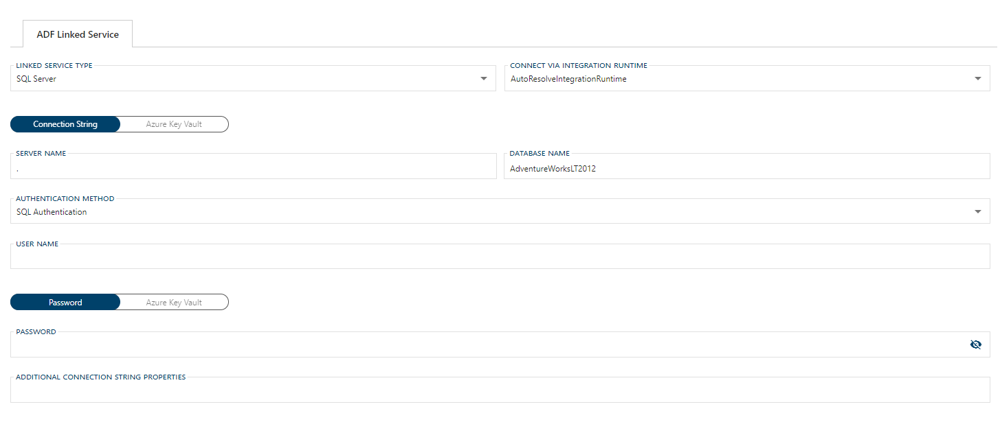

# Configuring an ADF Linked Service Connection for SQL Server

> [!NOTE]
> For information on how to enable a connection for use with linked services, see [Configuring a Linked Service Connection](xref:create-linked-service-connection).

[//]: # (TODO List of stages, connection types, and system types that can use SQL Server)

After selecting `SQL Server` from the Linked Service Type dropdown, the form required for creating a SQL Server Linked Service will appear.

## Required Fields

The required fields are:

- [Configuring an ADF Linked Service Connection for SQL Server](#configuring-an-adf-linked-service-connection-for-sql-server)
  - [Required Fields](#required-fields)
    - [Connect via Integration Runtime](#connect-via-integration-runtime)
    - [Connection String](#connection-string)
    - [Authentication Method](#authentication-method)
    - [User Name](#user-name)
    - [Password](#password)
    - [Additional Connection String Properties](#additional-connection-string-properties)
  - [Azure Data Factory Linked Service Additional Information](#azure-data-factory-linked-service-additional-information)

Optional fields are:

+ [Additional Connection String Properties](#additional-connection-string-properties)

### Connect via Integration Runtime

Connect via Integration Runtime is required for a SQL Server Linked Service connection.
The default value is `AutoResolveIntegrationRuntime`.
To use a custom runtime, type the name into the editable dropdown or select from the Azure Integration Runtimes saved in BimlFlex settings.
The custom values that appear in this dropdown can be maintained in Settings under Azure - AzureIntegrationRuntime.

### Connection String

A connection to a SQL Server linked service requires a connection string.
The required properties for the connection string are Server Name, Database Name, User Name, and Password.
The Linked Service connection form will provide text boxes for these values and will use them to construct the connections string.

> [!NOTE]
> It is suggested that [Azure Key Vault](linked-service-azure-key-vault.md) be used in place of manually entering Connection String details.

### Authentication Method

The SQL Server Linked Service connection can use SQL Authentication or Windows Authentication.
When a key vault is used in place of a connection string, SQL Authentication details should be stored in the connection string key vault and will not be required in the BimlFlex form.
If Windows Authentication is used, User Name and Password are still required.

### User Name

User Name will be used by the Linked Service form for SQL Authentication or Windows Authentication with the SQL Server Linked Service.
User Name is required - except when using SQL Authentication with Azure Key Vault in place of a manually entering a Connection String.

### Password

Password will be used by the Linked Service form for SQL Authentication or Windows Authentication with the SQL Server Linked Service.
Password is required - except when using SQL Authentication with Azure Key Vault in place of a manually entering a Connection String.

> [!NOTE]
> It is suggested that [Azure Key Vault](linked-service-azure-key-vault.md) be used in place of manually entering the password.

### Additional Connection String Properties

Any additional properties entered here will be included in the Connection String.
These properties should be entered the same way you want them to appear in the connection string and separated by a semicolon, e.g. `key=value;secondKey=secondValue`.

Values entered in the Additional Connection String Properties textbox will be maintained when changing linked service types.
If a required property from one service type does not have a corresponding text box in the newly selected linked service type, it will appear as an additional property.

## Azure Data Factory Linked Service Additional Information

For additional information on ADF SQL Server Linked Service and its connection requirements see the [Azure Data Factory SQL Server Connector documentation](https://docs.microsoft.com/en-us/azure/data-factory/connector-sql-server).
