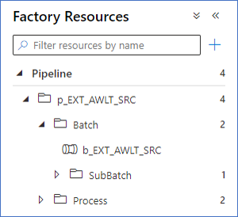

# Projects and Batch structures for ADF

The BimlFlex [Batch](xref:bimlflex-app-reference-documentation-Batches) and [Project](xref:bimlflex-app-reference-documentation-Projects) configuration in the [BimlFlex App](xref:metadata-editors-overview) define the way how data logistics are organized.

In BimlFlex, a Batch definition ultimately governs which data logistics processes are executed in the same group or container. A Batch can belong to more than one Project, and Projects themselves can be configured as a hierarchy (using the Parent Project concept).

The Project property [Integration Template](xref:bimlflex-concepts-integration-template) directs the technical delivery; how data transformation code will be generated, and for what target platform.

This page intends to provide an overview of the concepts at play when building and deploying BimlFlex-generated ADF components, and explain why they appear in ADF the way they do.

## ADF Folder Structure

In the Logical View, the tree of Factory Resources in ADF, the Batches are grouped into a folder that represents the top-level (Parent) Project. Each Batch will be represented as an Execute Pipeline in the 'Batch' folder inside the top-level Project.

If there is no Project hierarchy, the Batch will just be placed in the 'Batch' folder inside a folder with the Project name.

The Batch represents the executable to start the data integration processes, and will start any processes that have been configured for the Batch.

## Individual Processes

In the Logical View a folder 'Process' is also created upon deployment. This folder contains all individual data integration processes that are executed from the Batch.

BimlFlex deploys the ADF processes like this so that it is easy to run individual processes if the need ever arises. Each process is deployed as its own Execute Pipeline that will contain detailed logic depending on the Integration Template / data integration approach selected.

For example, in an ELT approach the Execute Pipeline contains procedure calls to run Stored Procedures as well as a Copy Activity to move the resulting output data to its target location.

In regular operation, the individual processes are not directly used as these are referenced by the Execute Pipeline that represents the Batch.

## Sub-Batches and Solve Order

When building the BimlFlex solution for ADF, the dependencies as defined in metadata are taken into account to ensure correct flow of processing even when data logistics require to be broken up into different executable components. This may happen, for example, due to technical limitations in ADF on the allowed number of properties or objects for a given component or resource.

To guarantee this, BimlFlex creates Sub-Batches that act as intermediate grouping based on dependencies in the Batch.

Sub-Batches are logical constructs that only exist to govern the correct orchestration as defined in the design metadata. In turn, they will call the individual processes for the actual processing of data.

### Primary Solve Order

The primary solve order captures the dependencies defined in the BimlFlex App, in the design metadata. This is driven by the various Degree of Parallelism features of BimlFlex, for example by modifying the `Containers` property at Batch level.

Depending on these settings, one or more Sub-Batches are generated for ADF.

### Secondary Solve Order

The secondary solve order is a feature BimlFlex provides to manage technical limitations in ADF. This solve order is automatically applied during the metadata build.

ADF limits how many objects can exists as part of certain components. BimlFlex creates Sub-Batches when required to ensure all data logistics can still be executed in the right order if technical limitations such as these are encountered.

Similar to the primary solve order, the Sub-Batches only exist to ensure a correct order of processing.

## Overview Diagram

The following diagram shows a logical overview of how Batches and Projects are deployed for ADF, based on Batch and Project definition in BimlFlex metadata.

