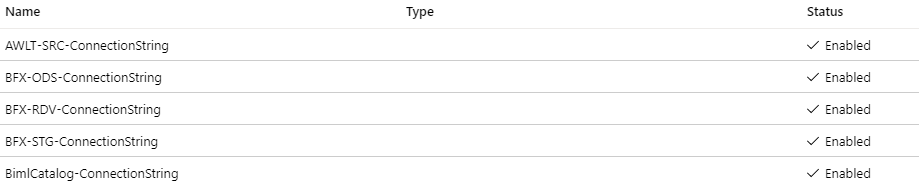

# Sensitive Information Management in Azure Data Factory

## Azure Key Vaults

In certain BimlFlex solutions there are properties that get stored in **Azure Key Vaults** (AKV) for security purposes. AKV is a cloud service that provides secure storage for sensitive information. Users can securely store keys, passwords, certificates, and other secrets. AKVs may be created and managed through the [Azure Portal](https://portal.azure.com).

## Auto-Generated Key Vaults

If the user does not supply an AKV name in the project settings, BimlFlex will generate an AKV for the user. The AKV will be named with the following naming pattern:

`AKV-{Random Hash}`

The first time using BimlFlex, it is recommended that the user allows us to auto-generate their AKV. This will scaffold out the secrets in a way that works with their project. An auto-generated AKV will generate secrets similar to the image below.



>[!IMPORTANT]
> After these secrets are generated, values must still be populated manually.

## AzureKeyVault Property

The name of the AKV that will be used by your project is determined by the `AzureKeyVault` property value in your BimlFlex settings. If you do not populate the `AzureKeyVault` setting in your project, a new AKV will be generated each time the project runs. This is typically undesired. Once you have auto-generated the AKV for the first time, the user should use this AKV name for the `AzureKeyVault` setting, so that this AKV is used going forward.

>[!NOTE]
> It is also recommended that the user renames the AKV, as the current naming pattern does not visually represent anything meaningful. This can lead to mistakes when using multiple AKVs across projects.

## Extension Points

Users can also utilize BimlFlex [Extension Points](xref:bimlflex-concepts-extension-points), in the event that the project need to access secrets that are not generated by BimlFlex. An example of an AKV extension point is provided below:

```biml
<#@ extension bundle="BimlFlex.bimlb" extensionpoint="AdfAzureKeyVault" #>

<AzureKeyVault Name="BimlFlexKeyVault1" Url="https://<azureKeyVaultName>.vault.azure.net"></AzureKeyVault>
<AzureKeyVault Name="BimlFlexKeyVault2" Url="https://<azureKeyVaultName>.vault.azure.net"></AzureKeyVault>
```
