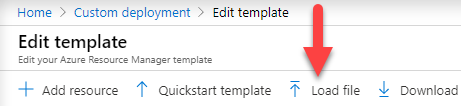
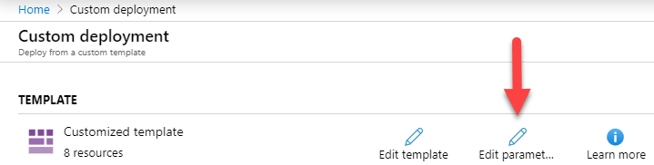

# Deployment Through the Azure Portal

<!-- TODO: Now walk-through yet for an ADF Implementation.  
For a walk-through of creating a BimlFlex solution that targets ADF, review the [Synapse ADF Implementation Guide](xref:bimlflex-synapse-implementation).
-->

Once the Azure Data Factory (ADF) artifacts are generated the next step in the process is to deploy them.  Recommended practice is to use the automated deployment process outline in the [PowerShell Deployment Guide](xref:bimlflex-adf-using-powershell) however all assets are provided for a manual deployment via the [Azure Portal].  This document will discusses a manual deployment of the ARM templates using the [Azure Portal](https://portal.azure.com).

[//]: # (TODO: Add a [!NOTE] and link a Microsoft Docs article for the Azure Portal.  Refer to `using-powershell.md` for an example of this pattern.  Also ensure you add the link to the reference of Azure Portal in the paragraph above.)

> [!IMPORTANT]
> PowerShell, along with the Azure cmdlets, is required in order to use the generated PowerShell script. BimlFlex will automatically generate the commands needed to both install the cmdlets and connect to specified environment.  If further details on the generated commands are needed, or to create these commands manually, refer the the article linked below.  
> Microsoft Docs:  
> [Installing PowerShell](https://docs.microsoft.com/en-us/powershell/scripting/install/installing-powershell?view=powershell-7)  
> [Get started with Azure PowerShell](https://docs.microsoft.com/en-us/powershell/azure/get-started-azureps)  
> [Connect-AzAccount](https://docs.microsoft.com/en-us/powershell/module/az.accounts/connect-azaccount)  

[//]: # (What will follow is a series of suggestions for converting this document to a style closer to what everything else is using.  The technical article this was migrated from has many steps that don't need to be explicitly called out as bullet point items and could be casually referenced in a paragraph explaining the step or in the intro block.  Additionally the headers should break into concepts or sections that either highlight a change in process, train of thought or to communicate what BimlFlex helps with or fits in.  A lot of these steps are Azure related and easily batched together.)

[//]: # (## Template Editor)

[//]: # (TODO: Call out the steps to navigate to the editor here.)

[//]: # (## Loading the ARM Template and Parameters)

[//]: # (TODO: Discuss steps to load the file.  Highlight file location here.)

[//]: # (## Confirm, Purchase and Deploy)

[//]: # (TODO: Outline what is being created and to review the scripts for created artifacts.  Close the article out here.)

## Navigate to your Data Factory

1. Go to the [Azure Portal](https://portal.azure.com).

1. Navigate to [Deploy a custom template](https://portal.azure.com/#create/Microsoft.Template).


1. Click **Build your own temple in the editor**


1. Click **Load File**



1. Navigate, within your output folder, to:

    `...\output\DataFactories\<AzureDataFactoryName>\arm_template.json`

   > [!NOTE]
   > If there is no value specified **BimlFlex** will be used for the folder name.  It is important to note though that the actual ADF Data Factory Name will be a something like `ADF-<RandomHashValue>`.  It is recommended that you populate the configure your `Settings` and input an [AzureDataFactoryName] prior to building your ADF.

1. Click **Save**.

1. Click **Edit parameters**.



1. Click **Load File**.


    > [!NOTE]
    > Remember the value for the **keyVaultName**.  We will need to update BimlFlex with this value after deployment.

1. Navigate to:

     `...\output\DataFactories\<AzureDataFactoryName>\arm_template_parameters.json`

1. Click **Save**.

1. Choose **Resource Group**.

1. Review and agree to the terms and conditions.

1. Click **Purchase**.

1. Wait for deployment to complete.

The deployment of the ADF assets using the `Azure Portal` should now be successful. Navigating to the Data Factory and opening the `ADF Authoring Tool` should now show the Pipeline(s) available to be tested and verified as needed.

>[!NOTE]
> Your Data Factory will be either be named `ADF-<HashKey>` or it will use the `Settings.AzureDataFactoryName`.

## Post Deployment

Pipeline(s) are now available for verification or running inside the ADF [Authoring Tool](https://docs.microsoft.com/en-us/azure/data-factory/author-visually). Pipelines can either be run manually or are run off of triggers. BimlFlex does not generate triggers by default, leaving the user with two options.

1. Create the Triggers themselves and deploy them to the Data Factory, either in the [Authoring Tool](https://docs.microsoft.com/en-us/azure/data-factory/author-visually) or via PowerShell.

2. Users can take advantage of BimlFlex [Extension Points](/./bimlflex\reference-documentation\extension-point-definitions.md) and create them for each batch. An example extension point that creates an ADF trigger is listed below. This trigger will now be created inside of the ARM template file and deployed with the rest of the ADF assets.

```Biml
<#@ extension bundle="BimlFlex.bimlb" extensionpoint="AdfTrigger" #>
<#@ property name="batch" type="BimlFlexModelWrapper.BatchesWrapper" #>
<Schedule Name="ScheduleTriggerName" Frequency="Hour" Interval="1" Start="2001-01-01" End="2020-12-31">
        <Pipelines>
            <Pipeline PipelineName="0_<#=batch.Name #>_Batch">
                <Parameters>
                    <Parameter Name="IsInitialLoad">false</Parameter>
                </Parameters>
            </Pipeline>
        </Pipelines>
    </Schedule>
```

>[!NOTE]
>This will create a trigger that will run the pipeline, once every hour from January 1st, 2001, to December 31st, 2020.

Once a trigger is deployed, it must be started. Either manually using the [Authoring Tool](https://docs.microsoft.com/en-us/azure/data-factory/author-visually) or by running the following command in PowerShell:

```powershell
Start-AzDataFactoryV2Trigger -ResourceGroupName $ResourceGroupName -DataFactoryName $DataFactoryName -Name "ScheduleTriggerName"
```
